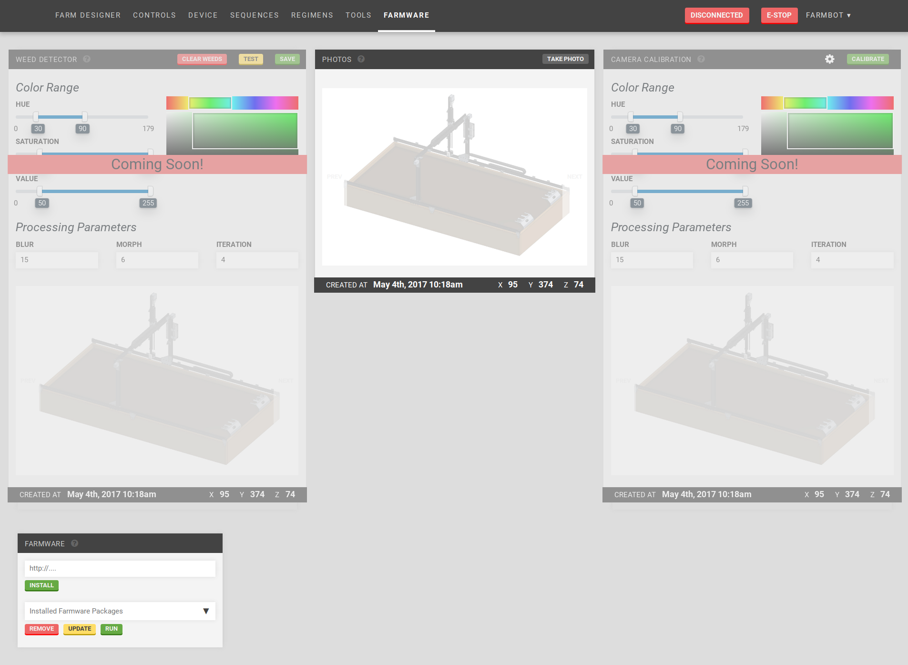
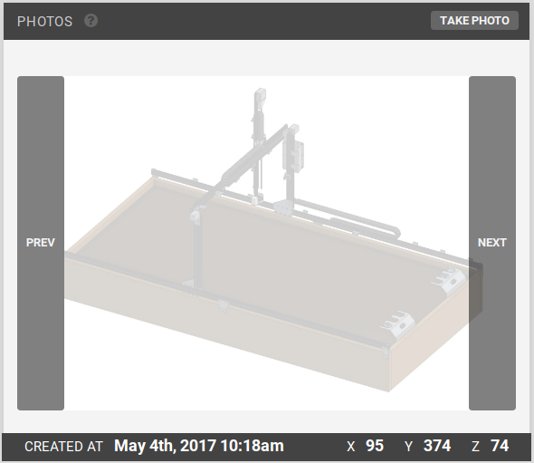
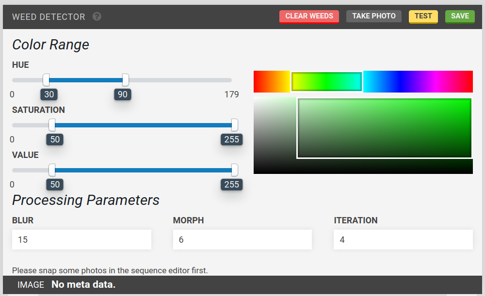

* toc
{:toc}

Widgets on this page:
 * [Farmware](#section-farmware)
 * [Take Photo](#section-take-photo)
 * [Weed Detector](#section-weed-detector)
 * [Camera Calibration](#section-camera-calibration)

  
  
  
  
  

<figcaption class="caption">Click a widget in the image to learn more!</figcaption>

# Farmware

Run a Farmware by selecting it from the list and pressing run. For more information, see [Farmware](../Extras/farmware-dev.md).

# Take Photo

Take photos using FarmBot's camera and view them.

Press take photo to take a photo.

Use the `PREV` and `NEXT` buttons to navigate through previously taken images.



# Weed Detector



Select hue, saturation, and value ranges to cover the colors you want to detect using the sliders. The color boxes will give an indication of the range selected.

Change the blur, morph and iteration processing parameters if desired.

Press test to detect weeds in FarmBot camera's current view. The weeds will appear in the [Farm Designer](../The FarmBot Web App/farm-designer.md). Press clear weeds to delete them from the map.

Weed removal is performed by creating a weed removal sequence using the weeding tool and applying it to the weeds in the Farm Designer. For more information on the weed detection process, see [Weed Detection](../The FarmBot Web App/farmware/weed-detection.md).

# Camera Calibration

Coming soon.
