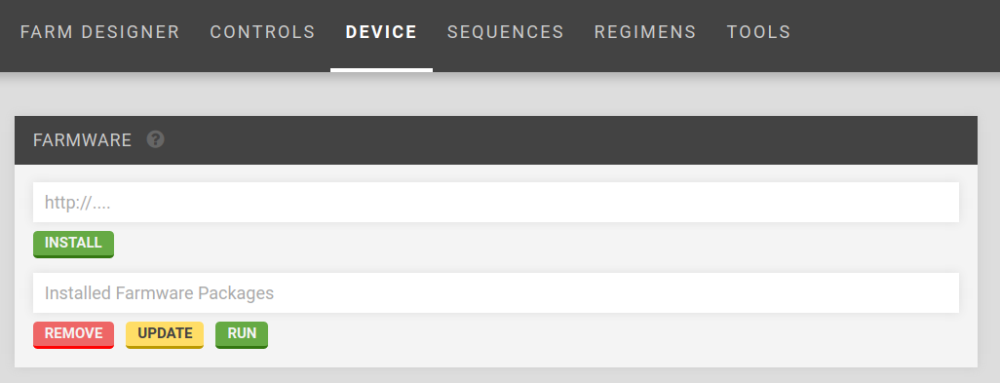

* toc
{:toc}




# First-Party Farmware

Some Farmware has been created by FarmBot.io and comes pre-installed:

* __Take Photo__ - take a photo and upload it to the web app
* __Plant Detection__ _(coming soon)_ - detect weeds

# Installing Farmware

To install new Farmware, use the __Farmware__ widget, currently located on the __Device__ page of the FarmBot Web App. ([Link to web app device page](http://my.farmbot.io/app/device))



Installation is performed by entering the URL of the _manifest.json_ file for the Farmware.

For example, entering `https://raw.githubusercontent.com/FarmBot-Labs/farmware_manifests/master/packages/take-photo/manifest.json` and clicking install would install the `Take Photo` Farmware, whose source code is located at the GitHub project [here](https://github.com/FarmBot-Labs/Take-Photo). See [Farmware manifest](#farmware-manifest) for more information.

# Developing Farmware

Farmwares can connect with FarmBot in the following ways:

## API

_Use: long term information storage_

Farmwares can access the FarmBot Web App API by using the token stored in the `API_TOKEN` environment variable. The API is used to access the database (plants, sequences, points, etc.).


__GET: Python example using 'requests' and 'json':__

```python
import os
import requests
import json

headers = {'Authorization': 'Bearer ' + os.environ['API_TOKEN'],
           'content-type': "application/json"}
response = requests.get('https://my.farmbot.io/api/points', headers=headers)
points = response.json()
```


__POST: Python API request example:__

```python
import os
import requests
import json

headers = {'Authorization': 'Bearer ' + os.environ['API_TOKEN'],
           'content-type': "application/json"}
data = json.dumps({'pointer_type': 'Plant', 'x': 100, 'y': 200})
response = requests.post('https://my.farmbot.io/api/points',
                         headers=headers, data=data)
new_plant = response.json()
```


__Response of POST:__

```json

  "pointer_type": "Plant",
  "name": "Unknown Plant",
  "openfarm_slug": "not-set",
  "created_at": "2017-06-22T15:14:55.652Z",
  "updated_at": "2017-06-22T15:14:55.652Z",
  "meta": {},
  "radius": 50,
  "y": 200,
  "x": 100,
  "z": 0,
  "id": 101,
  "device_id": 1
```

## Environment Variables

_Use: credentials and locations_

Environment variables are used to get credentials (tokens) and special locations.


__Python example:__

```python
import os

API_TOKEN = os.environ['API_TOKEN']
FARMWARE_URL = os.environ['FARMWARE_URL']
FARMWARE_TOKEN = os.environ['FARMWARE_TOKEN']
IMAGES = os.environ['IMAGES']
```

## Redis

_Use: bot status_

Information about the device status is accessed via Redis. See [redis.io](https://redis.io/).


__Python example using 'redis':__

```python
import redis

r = redis.Redis()
device_current_position_x = r.get('BOT_STATUS.location_data.position.x')
device_current_position_y = r.get('BOT_STATUS.location_data.position.y')
device_current_position_z = r.get('BOT_STATUS.location_data.position.z')
```


__Information available through redis:__

```text
BOT_STATUS
             configuration
                                      distance_mm_x        3000
                                      distance_mm_y        1500
                                      distance_mm_z        800
                                      os_auto_update       false
                                      steps_per_mm_x       5
                                      steps_per_mm_y       5
                                      steps_per_mm_z       25
                                      timezone             America/Los_Angeles
             informational_settings
                                      commit               4148a81
                                      controller_version   3.0.7
                                      firmware_version     4.0.2
                                      locked               false
                                      sync_status          synced
                                      target               rpi3
                                      busy                 false
             location_data
                                      position
                                                    x           110
                                                    y           220
                                                    z           -100
             pins
                                      13
                                                    mode        0
                                                    value       0
```

## Celery Script

_Use: real-time web app communication and bot actions_

Celery Script is JSON sent to FarmBot OS to perform actions such as device movements and setting environment variables.

Send Celery Script [available actions](https://github.com/FarmBot/farmbot-js/blob/master/dist/corpus.d.ts) by posting to the farmware URL (see [Environment Variables](#environment-variables)).

See the [Celery Script developer documentation](https://github.com/FarmBot/farmbot-js/wiki/Celery-Script) for more information.


__Python example using 'json':__

```python
import os
import requests
import json

send_message = {
  "kind": "send_message",
  "args": {
    "message": "Bot is at position {{ x }}, {{ y }}, {{ z }}.",
    "message_type": "success"
  },
  "body": [
    {
      "kind": "channel",
      "args": {
        "channel_name": "toast"
      }
    }
  ]
}


headers = {
  'Authorization': 'bearer {}'.format(os.environ['FARMWARE_TOKEN']),
  'content-type': "application/json"}
payload = json.dumps(send_message)
requests.post(os.environ['FARMWARE_URL'] + 'celery_script',
              data=payload, headers=headers)
```

# Currently supported languages and packages
 * __Python__: opencv, numpy, redis-py, requests

# Farmware manifest

To [install a Farmware](#installing-farmware), you need to create a `manifest.json` file and host it.


__Farmware Manifest Example:__

```json

 "package": "take-photo",
 "language": "python",
 "author": "Farmbot.io",
 "description": "Take a photo using a USB or Raspberry Pi camera.",
 "version": "1.0.0",
 "min_os_version_major": 3,
 "url": "https://raw.githubusercontent.com/FarmBot-Labs/farmware_manifests/master/packages/take-photo/manifest.json",
 "zip": "https://github.com/FarmBot-Labs/Take-Photo/archive/master.zip",
 "executable": "python",
 "args": ["Take-Photo-master/take_photo.py"]
```

`zip` points to the hosted source code zip file. Github makes this easy: just add `/archive/master.zip` to the end of the GitHub repository URL, and insert `<repository name>-master/` to the beginning of the script filename to run, as seen in the manifest example above.
