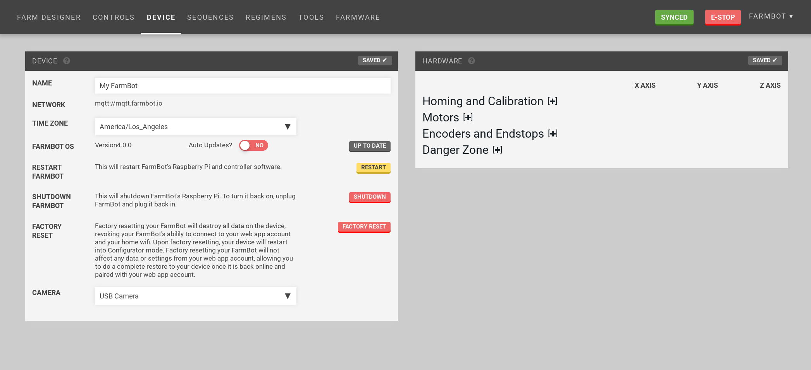

* toc
{:toc}

Widgets on this page:
 * [Device](#device-widget)
 * [Hardware](#hardware-widget)

  
  
  

<figcaption class="caption">Click a widget in the image to learn more!</figcaption>

# Device Widget

 * Give your device a name
 * Set the device's timezone
 * View the FarmBot OS version and update it
 * Restart FarmBot OS
 * Shutdown FarmBot OS
 * Factory reset FarmBot OS
 * Select camera type

## Camera selection

Select the type of camera you are using in the camera selection dropdown. Choices are `USB Camera` and `Raspberry Pi Camera`. Defaults to `USB camera`. Test by using the `Take Photo` button in the [Take Photo](../Web-App/farmware.md#take-photo) widget.

# Hardware widget



## Homing and Calibration

### Homing
Homing an axis instructs FarmBot to find the home (minimum) position by moving towards home until an endstop or encoder signals that the end of the axis has been reached. Homing can only be performed if endstops or encoders are enabled. See [Calibration and Homing](../Additional-Information/calibration-and-homing.md) for further details.



### Calibration
Calibrating an axis instructs FarmBot to find the minimum (home) position, then find the maximum position, and also measure the distance between the two positions, which is the length of the axis. Calibration can only be performed if either endstops or encoders are enabled. See [Calibration and Homing](../Additional-Information/calibration-and-homing.md) for further details.





### Set zero position
Pressing the Zero X, Zero Y, and Zero Z buttons allows you to *manually* set FarmBot's current location as zero for that axis. This is used for *manually* setting the Home position (0, 0, 0) when you do not have endstops or encoders enabled.

However, because stock FarmBots have encoders, it is recommended to instead use the [Homing](#homing) function for *automatically* finding the Home position of each axis and setting that position to zero.

So in general, the Set Zero buttons should not be regularly used because it does not make sense to change your zero position once you have your garden growing, and because all FarmBots should have either encoders or endstops enabled which allows for automatically finding and setting the Home position.

These buttons may come in handy though when playing around with experimental sequences or exploring alternate coordinate system configurations for your FarmBot.

### Find home on boot
Enabling this setting will run a homing command for each axis upon boot. This is most useful for allowing FarmBot to recover and resume operations after a power outage. Note that this requires encoders or endstops to be enabled.

### Stop at Home
Enabling software limits for an axis will prevent FarmBot from moving through zero. For example, if an axis is normally moving in positive coordinates, then the software limit will prevent it from moving through zero into negative coordinates. If an axis has **NEGATIVE COORDINATES ONLY** enabled, then it normally moves in negative coordinates and the software limit will prevent it from moving through zero into positive coordinates.



### Stop at Max
If values are inputted using the **Length** setting, FarmBot will stop at the axis maximum.

### Negative coordinates only
This setting will allow movements to only occur in negative coordinates for the chosen axis. This is most useful for the z-axis if you want your home position to be at the highest point and for FarmBot to move down into negative coordinates.

### Length
With these inputs you can manually specify the length in mm of each axis. This is useful if you want to limit your FarmBot's movements along an axis with software rather than a physical hardware stop such as a belt clip or an endstop. For example: you may occasionally want to prevent movements at the far end of your garden because you put a seasonal garden gnome there, but you don't want to adjust the belts and belt clips. You must enable **Stop at Max** for FarmBot to stop at the values inputted.



### Timeout after
This is the amount of time in seconds that the firmware will wait until a movement command times out, or stops executing. The default value for each axis is 120 seconds.



## Motors

### Max retries
The number of times that FarmBot will try to move to a position before stopping and reporting that the movement has failed.

### Max speed
This setting controls the maximum speed in motor steps per second that FarmBot will reach after accelerating.

We recommend using a value between 200 and 1,000 steps/s for each axis. Start with a slower speed and work your way up as you become more comfortable operating your FarmBot. If your FarmBot begins to stutter or stall at higher speeds, reduce the max speed. To achieve higher speeds you may need to adjust some of your hardware, tune your stepper drivers, and/or adjust some additional software parameters such as **ACCELERATE FOR**. Remember though that FarmBot has 24 hours in the day to complete its tasks, so moving rapidly is not necessary.

{%
include callout.html
type="info"
title="Convert Motor Speed into Linear Speed with the following equations"
content="For belt-driven axes (X and Y)
**Linear Speed** = **Motor Speed** / **Motor Resolution** x **Microstepping** x **Pulley Size** x **Belt Pitch**

For leadscrew-driven axes (Z)
**Linear Speed** = **Motor Speed** / **Motor Resolution** x **Microstepping** x **Leadscrew Lead**

For stock FarmBot kits,
**Motor Resolution** = 200 steps/revolution
**Microstepping** = 1 (full steps)
**Pulley Size** = 20 teeth/revolution
**Belt Pitch** = 2mm/tooth
**Leadscrew Lead** = 8mm/revolution

For a Motor Speed of 500 steps/second on the stock belt-driven (X and Y) axes, the equation works out to:
**Linear Speed (mm/second)** = 500 / 200 x 1 x 20 x 2 = **100 mm/s**

For a Motor Speed of 500 steps/second on the stock leadscrew-driven (Z) axis:
**Linear Speed (mm/second)** = 500 / 200 x 1 x 8 = **20 mm/s**"
%}

### Minimum speed
This setting controls the minimum speed in steps per second that FarmBot will move. The recommended default value for each axis is 50 steps/s.



### Accelerate for
This setting controls the number of steps used for the acceleration and deceleration periods of each movement. The recommended default value for each axis is 500 steps. If your FarmBot stutters or stalls during acceleration, you should increase the value of **ACCELERATE FOR** so that FarmBot uses more steps to accelerate and decelerate.

### Steps per mm
This setting tells FarmBot how many motor steps it takes to move 1mm along an axis. The default value is 5 steps/mm for the belt-driven (X and Y) axes, and 25 steps/mm for the leadscrew-driven (Z) axis.

{%
include callout.html
type="info"
title="Steps per mm is calculated with the following equations"
content="For belt-driven axes (X and Y)
**Steps per mm** = **Motor Resolution** x **Microstepping** / **Pulley Size** / **Belt Pitch**

For leadscrew-driven axes (Z)
**Linear Distance** = **Motor Resolution** x **Microstepping** / **Leadscrew Lead**

For stock FarmBot kits,
**Motor Resolution** = 200 steps/revolution
**Microstepping** = 1 (full steps)
**Pulley Size** = 20 teeth/revolution
**Belt Pitch** = 2mm/tooth
**Leadscrew Lead** = 8mm/revolution

For the stock belt-driven (X and Y) axes, the equation works out to:
**Steps per mm** = 200 x 1 / 20 / 2 = **5 steps/mm**

For the stock leadscrew-driven (Z) axis:
**Steps per mm** = 200 x 1 / 8 = **25 steps/mm**"
%}

### Always power motors
Enabling this setting will keep power applied to the motors at all times. This is most useful to prevent the z-axis from slipping down due to the force of gravity when FarmBot is idle. It can also be used to help prevent animals or children from moving one of FarmBot's axes when it is idle.

### Invert motors
This inverts the direction that the motors move for the chosen axis. Changing this setting will usually require you to change the setting of **INVERT ENCODERS** as well. You also might need to use this setting in combination with **INVERT ENDPOINTS** and **NEGATIVE COORDINATES ONLY** to set your FarmBot coordinate system exactly how you want it.

### Enable second x-axis motor
This should be enabled for standard FarmBots that use two motors to drive the x-axis (gantry).

### Invert the second x-axis motor
This setting changes the direction of the second x-axis motor in case you wired it backwards.

## Encoders and Endstops

### Enable encoders
Stock FarmBot kits have rotary encoders built-in. The rotary encoders should be enabled by using these toggles. If you are experiencing troubles with your movements you might try to disable encoders for testing purposes. If you do not have encoders hooked up, you must have encoders disabled here otherwise your FarmBot will think it is stalling with every movement. Note that Homing and Calibration can only be used if encoders (or endstops) are enabled. See [Rotary Encoders](../Additional-Information/rotary-encoders.md) for more information.

### Use encoders for positioning
(Alpha) Use the encoders for calculating movements in addition to using encoders for stall detection.

### Invert encoders
This setting will reverse the direction of encoder position reading. This can be used as a software fix in the event that you wired up an encoder or motor backwards, which causes FarmBot to think it is stalling with every movement because the encoder appears to be going the opposite direction of the motor. This setting is also used in combination with **INVERT MOTOR** if you want to invert a motor's movements using software.

### Max missed steps
Rotary encoders allow your FarmBot to know when an axis has stalled either due to the FarmBot reaching its physical end point or if it hits an obstruction such as a vine, toolbay, or your hand.

The Max Missed Steps setting tells your FarmBot how many motor steps it needs to miss (as determined by the encoder feedback) before the motor is considered to have become stalled. A lower value will allow your FarmBot to stop the motors sooner when it stalls, which is desirable. However, setting the value too low could cause false alarms where FarmBot thinks it is stuck on something even though it is not.

The default value for Max Missed Steps is 5 for each axis. While we have seen successful results with values as low as 2, 1, and the fabled 0, we recommend starting with 10 and slowly bringing the values down. If you start to see false stall alarms (where FarmBot thinks it is stuck on something but it isn't) then increase the value until there are no false alarms.

### Encoder missed step decay
While moving FarmBot at high speeds (greater than 100 steps/s with v3.1.6 firmware and greater than 400 steps/s with v3.1.7+ firmware), FarmBot may not detect every single encoder pulse due to limitations in the clock speed of the Arduino and the speed at which the encoders can be read. Because FarmBot counts the undetected encoder pulses as missed steps, the total number of missed steps can add up over long movements and cause a false stall alarm, even if no steps were actually missed.

The Encoder Missed Step Decay value accounts for this shortcoming of the Arduino when moving FarmBot at high speeds. It works by reducing (decaying) the total count of missed steps by the Encoder Missed Step Decay value every time there is an encoder pulse detected. This allows FarmBot to dismiss the periodic encoder pulses that go undetected (and the corresponding false missed steps) and therefore prevent false stall alarms.

Meanwhile, if the motor does stall, then a bunch of missed steps will happen consecutively without any encoder pulses detected in between. Because no encoder pulses are detected, the total count of missed steps will not decay, and so the motor will be considered stalled once the Max Missed Steps value is reached.

The default Encoder Missed Step Decay value for each axis is 5. Changing this value is only necessary if you are using much higher resolution encoders and/or a slower processor and/or driving FarmBot at very high speeds (greater than 2,000 steps/s), all of which would cause more encoder pulses to go undetected.



### Encoder scaling
The encoder scaling factor is used to match the encoder resolution with the motor resolution. The rotary encoders included with the stock FarmBots are 360 line/revolution. The stock motors are 200 step/revolution and used with full-step microstepping (a value of 1 in the equation below). For more information on microstepping, see [Microstepping](../Additional-Information/microstepping.md).

The encoder scaling factor is calculated as follows, and rounded to the nearest integer.
Encoder scaling = 100 x motor resolution x microsteps / encoder resolution
Encoder scaling = 100 x 200 x 1 / 360 = 56.

### Enable endstops
If using endstops instead of rotary encoders, enable them here. If you do not have endstops hooked up, do not enable this setting.

### Invert endstops
This switches the zero end of an axis to the other end of the axis. This allows you to set your home (0, 0, 0) position to any of the eight corners of FarmBot's working volume. You might need to use this setting in combination with **INVERT MOTORS**, **INVERT ENCODERS**, and **NEGATIVE COORDINATES ONLY** to set your FarmBot coordinate system exactly how you want it.

## Danger Zone

### Reset Hardware Parameter Defaults
This will restore all settings to their default values.
