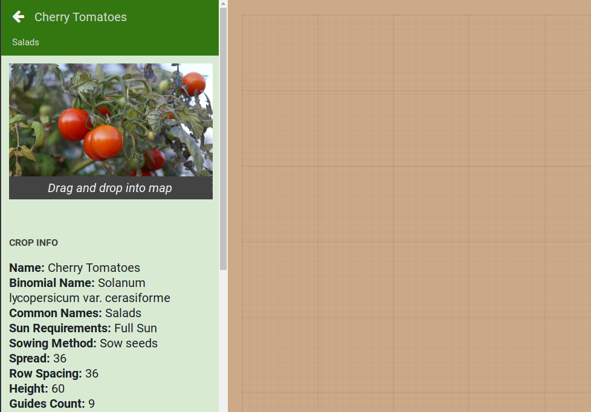

* toc
{:toc}

View and layout your garden in a virtual representation of your FarmBot's bed on this page.

  
  
  

<figcaption class="caption">Click a section in the image to learn more about it!</figcaption>

# Add Plants

Add plants for your FarmBot to grow by pressing the + button and searching for a crop.

Find the crop that you'd like in your garden and click it to bring up the crop information.

Drag the crop image into the [map](#map) to place the crop in your garden.

You now have a plant!

# Move a plant

To move a plant, simply drag the plant to a new location in the [map](#map).

# Remove a plant

If you'd like to delete a plant, click on it to bring up the plant information and press the `EDIT` button.

Press the DELETE button to remove the plant.

# Map

You can view all of your plants in the map, a virtual representation of the FarmBot bed. You can drag plants around to rearrange them by clicking on the plant and pressing `EDIT` in the plants panel.

You can open the map display options menu by pressing the white arrow icon in the upper right.

**Menu options include:**
* Zoom (+/-)
* Plant toggle (enable/disable display of plant icons)
* Point toggle (enable/disable display of points (weeds, etc)
* Spread toggle (enable/disable display of plant spread indicators)
* FarmBot toggle (enable/disable display of tools and the virtual FarmBot)
* Origin selector (click on one of the four quadrants to adjust the map to your viewing angle)

# What's next?

 * [Farm Events](../Web-App/farm-events.md)
