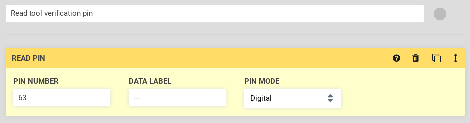
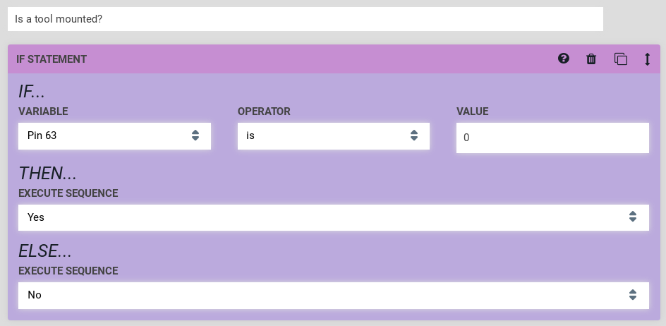
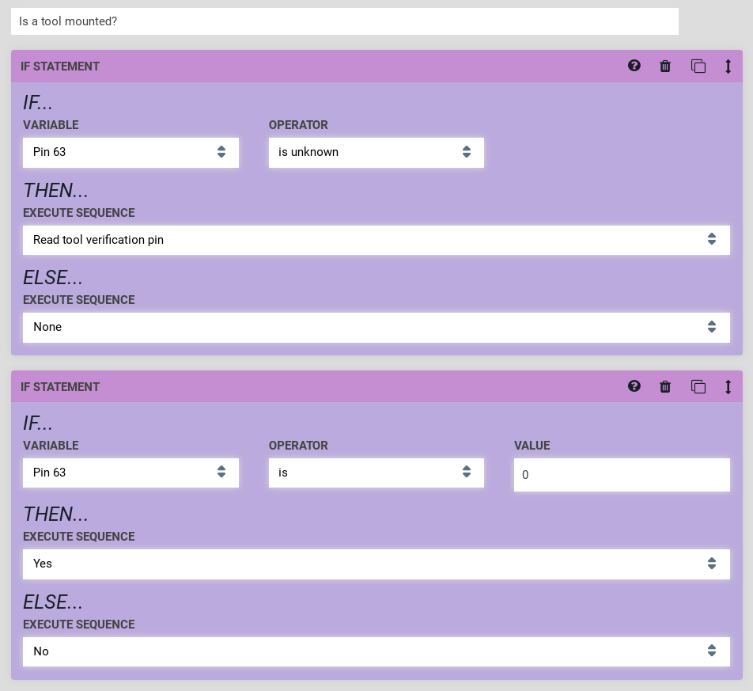
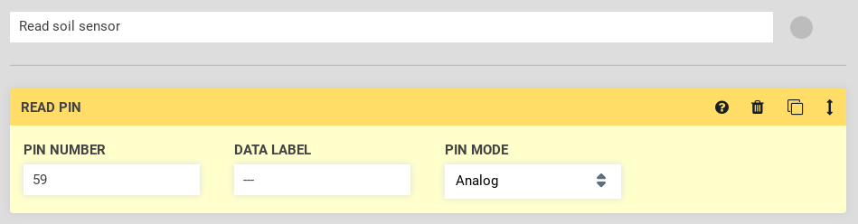
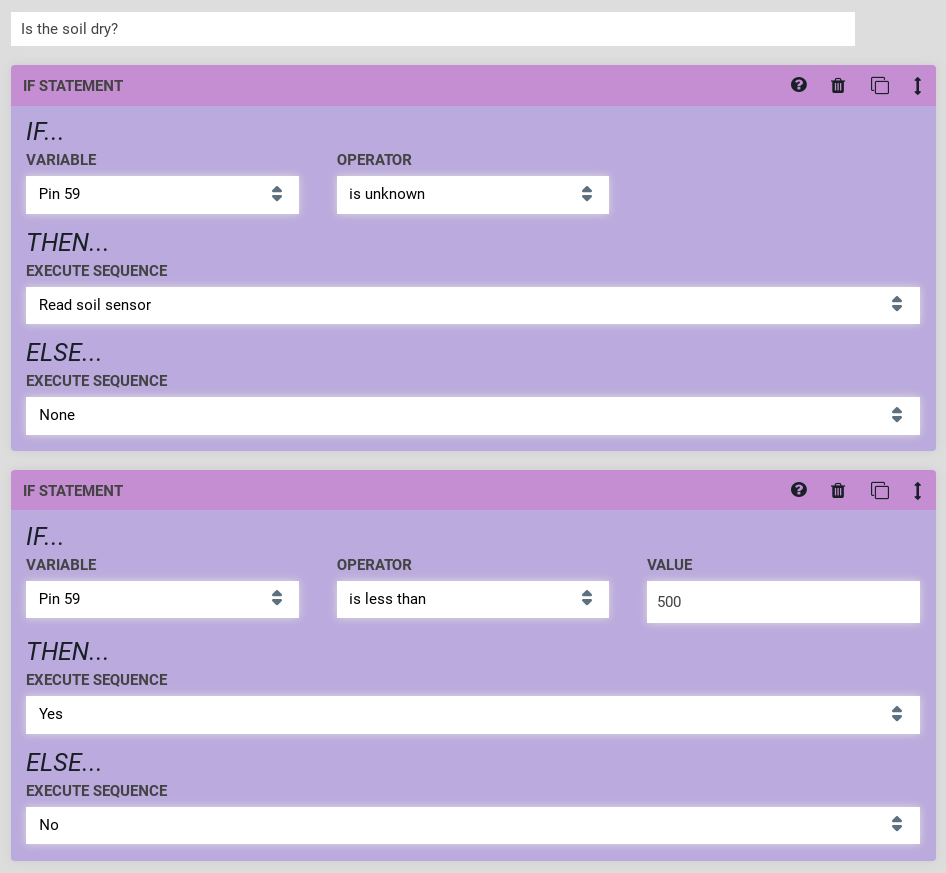

* toc
{:toc}

This section assumes you have wired up your UTM using the [pin mapping](https://genesis.farm.bot/docs/wire-up-the-utm#pin-mapping) table in the [Hardware Docs](../Other-Resources/genesis-hardware-docs.md), and your soil sensor according to the [wiring instructions](https://genesis.farm.bot/docs/soil-sensor#step-5-wire-it-up).

This section also assumes you are familiar with [Sequences](../Web-App/sequences.md).

# Tool Verification

FarmBot can determine if a tool is mounted to the [Universal Tool Mount](https://genesis.farm.bot/docs/utm) by reading the value of UTM pin **C**, which is connected to digital input pin D63.

Using the sequence builder, you can read this pin using a Read Pin command on pin 63 in digital mode.

When executed, a message will appear in the log with the pin value, `Pin 63 is 0` or `Pin 63 is 1`. The Farmbot firmware uses pull-up resistors for all input pins, so a value of `0` means that a tool is connected (pin D63 / UTM pin **C** is connected through the tool pin jumper to UTM pin **B** / ground) and a value of `1` means no tool is connected (pin D63 not connected to ground--UTM pins **B** and **C** are not connected together).

However, usually we will want to check if a tool is mounted before performing an action. We can use the If Statement for this purpose.

`Yes` and `No` in the example are sequences that send a message ("Yes" or "No"), but in practice you may want to perform an action with a tool instead of `Yes` and do nothing instead of `No`.

If the pin has not yet been read, the sequence above will error because the pin value is unknown. We can add another If Statement step before the value check as shown below. `Read tool verification pin` is a sequence consisting of a Read Pin command, as shown in the beginning of this section.

# Soil Sensor

The soil sensor can be read in a similar fashion to the [tool verification pin](#tool-verification). This time, we will use pin 59 (UTM pin **D**) in analog pin mode.

As before, a log message will be sent with the pin value. The value for the soil sensor will be about 250 in dry soil (or no soil), and about 850 in very wet soil (or water). You should verify these values for your soil sensor, and determine the value threshold at which you consider your soil to be dry by reading the value in soil areas with different moisture levels.

After you have calibrated your soil sensor, you can use the threshold you have determined to perform actions, such as water, using the If Statement as shown in the previous section.

