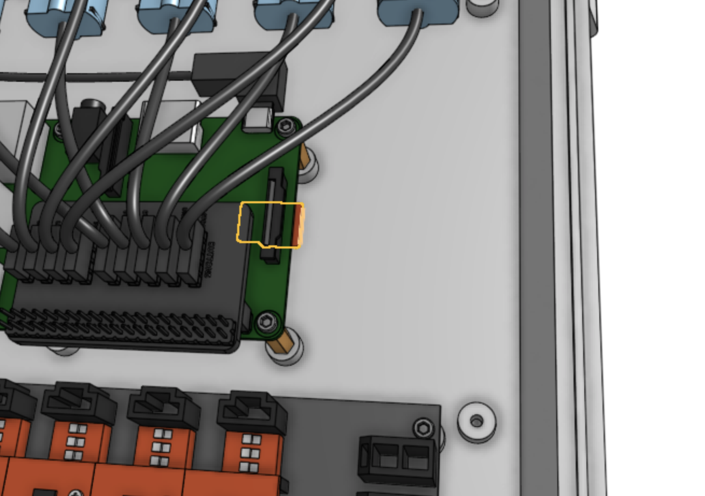

* toc
{:toc}

The Raspberry Pi runs a custom operating system named **FarmBot OS**, allowing FarmBot to:

* Communicate with the web application over WiFi or ethernet in order to synchronize (download) sequences, regimens, farm designs, events, and more; upload logs and sensor data; and accept real-time commands.
* Communicate with the Arduino over USB to send G and F commands and receive sensor and encoder data.
* Take photos with a USB or Raspberry Pi camera, and send the photos back to the web application.
* Get configured over WiFi, mitigating the need to plug in a mouse, keyboard, or screen.



# Installing FarmBot OS



## Step 1: Download FarmBot OS
Download the latest FarmBot OS `.img` file [here](http://os.farm.bot).

## Step 2. Write FarmBot OS to the microSD card
You must use a `.img` tool to write FarmBot OS onto the microSD card. We recommend downloading and installing [Etcher](https://etcher.io/) for this purpose. Once you have Etcher installed, open it up and select the FarmBot OS `.img` file and write it to the microSD card.



# Step 3. Insert the microSD card into the Raspberry Pi
Insert the microSD card into the back side of the Raspberry Pi. *Note: you do not need to remove the Raspberry Pi from the electronics box for v1.4 kits - we have left enough room to the right of the Pi for you to insert the card.*

## Step 4. Turn on the Raspberry Pi
Plug in the power source to the Raspberry Pi. Depending on your setup, power will be coming from either a standard microUSB cable plugged into a standalone power supply (or the Farmduino), from a DC/DC buck converter coming from your RAMPS shield, or from a DC/DC buck converter coming straight from your FarmBot's power supply.

# Raspberry Pi Status LEDs





|RED (power)                   |STATUS                        |TIPS                          |
|------------------------------|------------------------------|------------------------------|
| (solid red)|OK                            |Good to go!
| (blinking red)|Low power                     |Try a more powerful power supply or a different cable.
|  (off)|No power / low power          |Plug in to a 3A power supply.

|GREEN (activity)              |STATUS                        |TIPS                          |
|------------------------------|------------------------------|------------------------------|
| (solid green)|Busy                          |Working/booting
| (blinking randomly)|Busy                          |Working/booting
| (blinking consistently)|Network disconnected or emergency stopped|[Configure FarmBot](../FarmBot OS/farmbot-os/configurator.md), press UNLOCK in the Web App, or check that the network FarmBot is connected to is online.
| (off)|Ready                         |Waiting for the next task

# Electronics Box Status LEDs



The following LEDs are mounted on top of the FarmBot Genesis v1.4 kit electronics box. Alternatively, you can connect an LED to the Raspberry Pi GPIO BCM pin number provided.
See [pinout.xyz](https://pinout.xyz/) for a Raspberry Pi GPIO reference diagram.

## Button 1 LED: E-STOP [red] (Raspberry Pi GPIO BCM pin 17)

|RED (E-STOP)                  |STATUS                        |TIPS                          |
|------------------------------|------------------------------|------------------------------|
| (solid red)|unlocked                      |Ready
| (off)|locked                        |check the button 2 LED status

## Button 2 LED: UNLOCK [yellow] (Raspberry Pi GPIO BCM pin 23)

|YELLOW (UNLOCK)               |STATUS                        |TIPS                          |
|------------------------------|------------------------------|------------------------------|
| (blinking)|locked                        |When safe to do so, press this button to unlock FarmBot.
| (off)|unlocked                      |Ready

## LED 1: Sync status [Green] (Raspberry Pi GPIO BCM pin 24)

|GREEN (sync)                  |STATUS                        |TIPS                          |
|------------------------------|------------------------------|------------------------------|
| (solid green)|Synced                        |Ready
| (blinking slowly)|Needs sync                    |Will not execute any unsynced events or sequences
| (blinking quickly)|Syncing                       |
| (off)|Offline                       |Check the connection status LED

## LED 2: Connection status [Blue] (Raspberry Pi GPIO BCM pin 25)

|BLUE (connection)             |STATUS                        |TIPS                          |
|------------------------------|------------------------------|------------------------------|
| (solid blue)|Connected                     |Working
| (blinking slowly)|Needs configuration           |[Configure FarmBot](../FarmBot OS/farmbot-os/configurator.md), press UNLOCK in the Web App, or check that the network FarmBot is connected to is online.
| (off)|Offline                       |Check your internet connection.

## LED 3: Controllable [white] (Raspberry Pi GPIO BCM pin 12)
Control this LED via the Write Pin Sequence step command.

## LED 4: Controllable [white] (Raspberry Pi GPIO BCM pin 13)
Control this LED via the Write Pin Sequence step command.
