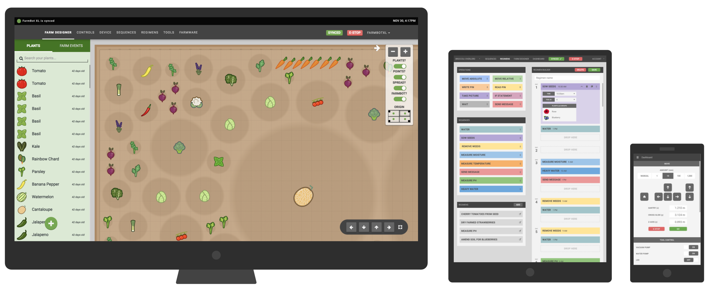

* toc
{:toc}

There are many software systems contributing to FarmBot's functionality. The diagram below shows the different components and how data flows between them. Read the brief descriptions of each component in the following sections to understand the system as a whole, and then dive into setting up the needed components for your FarmBot.

<iframe class="embedly-embed" src="//cdn.embedly.com/widgets/media.html?src=https%3A%2F%2Fwww.youtube.com%2Fembed%2Fvideoseries%3Flist%3DPLMhsMRlKjcNIYlDKDdKvPQuHqBjjS1ZGc&url=http%3A%2F%2Fwww.youtube.com%2Fwatch%3Fv%3DWQvQOfVNQB8&image=https%3A%2F%2Fi.ytimg.com%2Fvi%2FWQvQOfVNQB8%2Fhqdefault.jpg&key=f2aa6fc3595946d0afc3d76cbbd25dc3&type=text%2Fhtml&schema=youtube" width="854" height="480" scrolling="no" frameborder="0" allowfullscreen></iframe>

  

  
FarmBot Software High Level Overview

  
User

  
Farm Design, Commands

  
Logs, Sensor Data, Photos, Video

  
Web

  
  
External Resources

  
OpenFarm.cc

  
(crop database)

  
Local Weather

  
(any source)

  
Rain, temperature, humidity

  
FarmBot Cloud Services

  
Crop Information, growing regimens

  
Farmbot Web App

  
(hosted service at my.farmbot.io)

  
Events, Sensor Data

  
Decision Support System

  
(hosted service at dss.farmbot.io)

  
Commands

  
Logs, Sensor Data, Video, Photos

  
Optimized Events

  
Message Broker

  <!--
(hosted service)
-->
  
Optimized Events, Commands

  
Logs, Sensor Data, Video, Photos

  
FarmBot Device

  
Raspberry Pi

  
(FarmBot OS)

  
Raspberry Pi Controller

  
Video, Photos

  
Webcam

  
FarmBot Configurator

  
WiFi and web app credentials

  
Credentials

  
G and F codes

  
Logs, Sensor (Pin,Encoder) Data

  
Arduino/RAMPS

  
Arduino Firmware

  
Step and Direction Pulses

  
Rotary Encoder Data

  
Stepper Motors and Rotary Encoders

  
Read Pins

  
Write Pins

  
Tools

  
Sensors

  
Seeds

  
Water

  
pH





# FarmBot Cloud Services

## The FarmBot Web Application
The web app allows you to easily configure and control your FarmBot from a web browser on your laptop, tablet, or smartphone. The application features real-time manual controls and logging, a sequence builder for creating custom routines for FarmBot to execute, and a drag-and-drop farm designer so you can graphically design and manage your farm.

## Message Broker
The Message Broker is a cloud application that acts as an intermediary for all messages between the FarmBot web app and FarmBot devices. It handles socket connections, device identification, and authentication.

# Device Software

## FarmBot OS
FarmBot's Raspberry Pi uses a custom operating system named FarmBot OS to maintain a connection and synchronize with the web application via the Message Broker. This allows FarmBot to download and execute scheduled events, be controlled in real-time, and upload logs and sensor data. The OS communicates with the Arduino over USB to send G and F code commands and also receive collected data.

## Configurator
FarmBot OS has a built-in utility named Configurator allowing you to easily enter WiFi and web app credentials from a WiFi enabled device (such as a laptop or smartphone). This is useful for initial setup in order to get your FarmBot connected to your home WiFi.

## Farmbot Arduino Firmware
This software is flashed onto FarmBot's Arduino MEGA 2560 microcontroller and is responsible for physically operating FarmBot's hardware, tools, sensors, and other electronics. It receives G and F codes from FarmBot Raspberry Pi Controller via the USB serial connection, and then moves the motors and reads and writes pins accordingly. It also sends collected data from the rotary encoders and pin reads back to the Raspberry Pi.

# External Resources

## OpenFarm.cc
[OpenFarm](https://openfarm.cc) is a free and open database for farming and gardening knowledge. This service provides crop and growing information to the web app for a streamlined user experienced.

{%
include callout.html
type="success"
title="OpenFarm is built by us too!"
content="[OpenFarm.cc](https://openfarm.cc) was originally conceived as a small component of the FarmBot project. As progress was made, it became clear that OpenFarm had no reason to be tied to FarmBot, but could rather live on its own. In September of 2014, 1,605 people [backed OpenFarm on Kickstarter](https://www.kickstarter.com/projects/roryaronson/openfarm-learn-to-grow-anything/). Today, OpenFarm is a standalone application, non-profit, and community. You can get involved with OpenFarm by joining the [Slack channel](http://slack.openfarm.cc), contributing on [GitHub](https://github.com/openfarmcc), or going to [OpenFarm.cc](https://openfarm.cc) and creating content!"
%}

# License
Please see our [licensing page](https://meta.farm.bot/docs/licensing) to understand how our various works (hardware, software, documentation, etc) are licensed.
