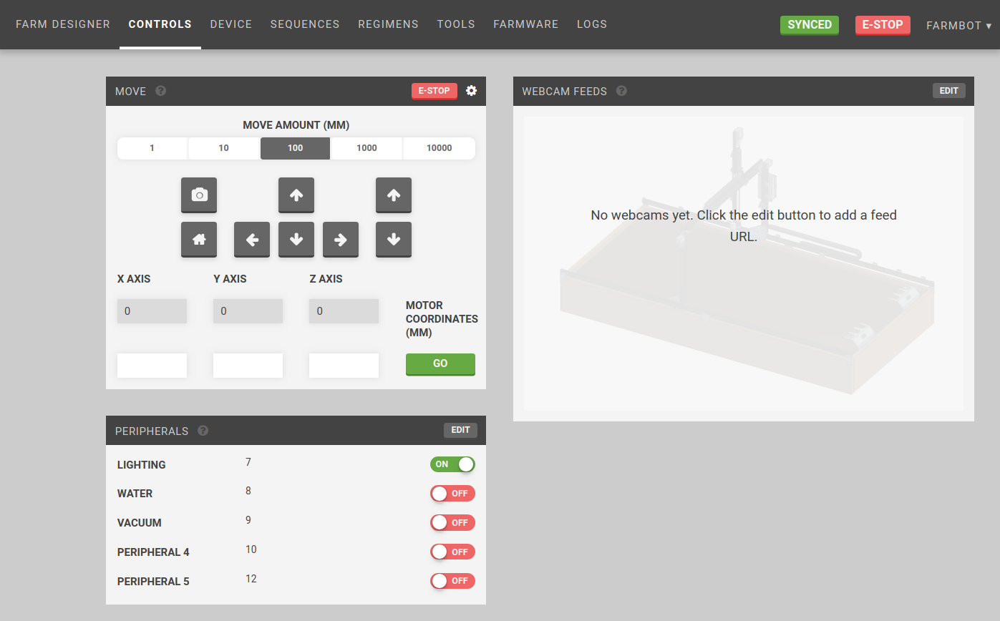
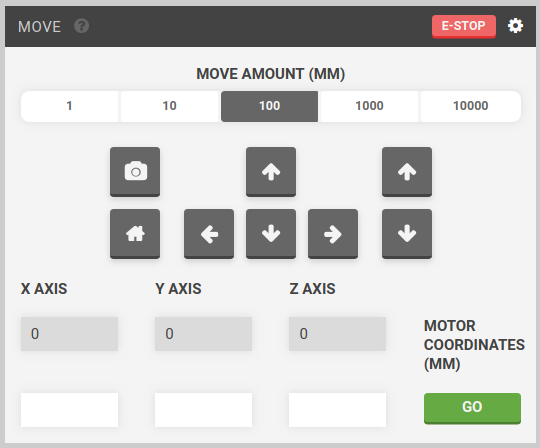
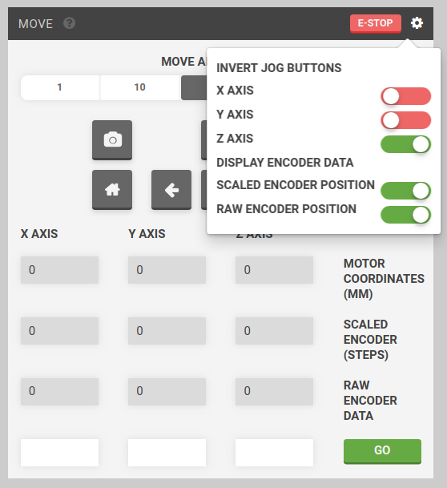
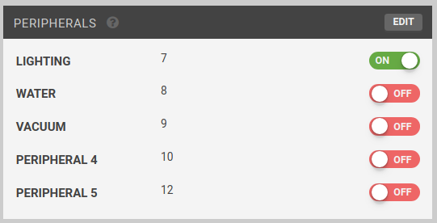
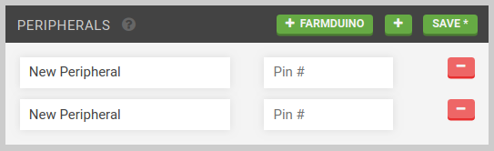
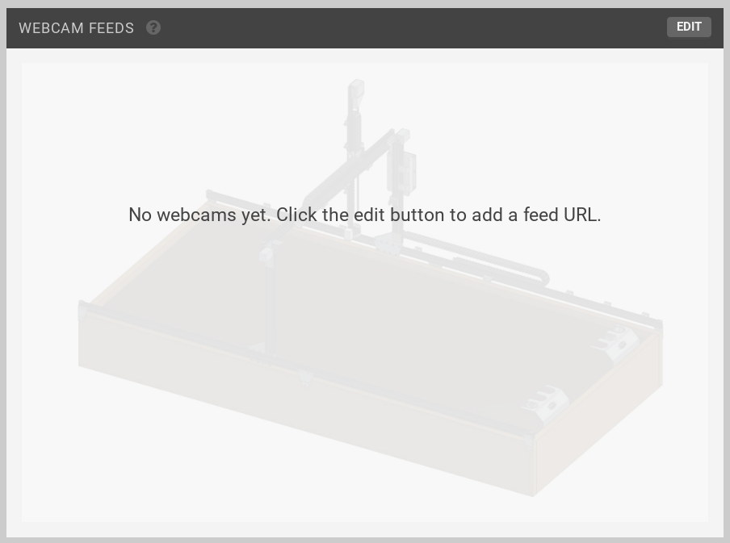
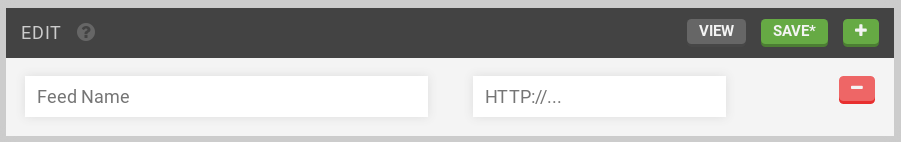

* toc
{:toc}

You generally will not need to manually control FarmBot, since it acts automatically from instructions provided by Farm Events. But in case you want to show off to your friends, you can do that from this page!

## Widgets on this page:
 * [Move](#move)
 * [Peripherals](#peripherals)
 * [Webcam Feeds](#webcam-feeds)

  
  
  
  

<figcaption class="caption">Click a widget in the image to learn more!</figcaption>

<iframe class="embedly-embed" src="//cdn.embedly.com/widgets/media.html?src=https%3A%2F%2Fwww.youtube.com%2Fembed%2Fvideoseries%3Flist%3DPLMhsMRlKjcNIYlDKDdKvPQuHqBjjS1ZGc&url=http%3A%2F%2Fwww.youtube.com%2Fwatch%3Fv%3D5spRMMoocDU&image=https%3A%2F%2Fi.ytimg.com%2Fvi%2F5spRMMoocDU%2Fhqdefault.jpg&key=f2aa6fc3595946d0afc3d76cbbd25dc3&type=text%2Fhtml&schema=youtube" width="854" height="480" scrolling="no" frameborder="0" allowfullscreen></iframe>

# Move

  * The current position of your FarmBot (Motor Coordinates (mm)) is shown in the grey fields directly below the X-AXIS, Y-AXIS, and Z-AXIS labels. This information is updated in real-time.
  * You can move the device a *relative distance* in any direction by using the arrow buttons. The default move amount is 100mm, though you can also select 1, 10, and 1000mm amounts. Depending on your settings in the **Hardware** configuration widget on the [Device](../Web-App/device.md)  page, you may not be able to move to negative coordinates or past the specified axis maximums.
  * The home button will move FarmBot to zero for all axes by first moving the Z axis to zero, then the other axes to zero.



  * The camera button will take a photo at FarmBot's current location using the camera selected in the **Device** widget on the [Device](../Web-App/device.md) page. Photos can be viewed on the [Farmware](../Web-App/farmware.md) page.
  * You can move the device to an *absolute position* by typing in new coordinates to the white input fields labeled X-AXIS, Y-AXIS, and Z-AXIS and pressing GO.
  * If you ever need to immediately halt your FarmBot, press the E-STOP button.
  * You can switch the directions that the jog buttons move by toggling the axis inversion in the settings menu (gear icon () next to the e-stop button). Encoder data can be displayed in the settings menu as well.

# Peripherals

You can manually operate FarmBot's peripherals using the toggle switches in the **Peripherals** widget.

The pins can be changed to the pins used when plugging in the peripherals in [this step](https://genesis.farm.bot/docs/plug-everything-in#step-3-connect-the-peripherals) of the hardware documentation.

Press the toggle switch to turn a peripheral ON or OFF. Peripheral toggles will be disabled when FarmBot is busy moving.

## Edit
To change the peripherals, press EDIT.

Add a new peripheral by pressing the + button and filling out Label and Pin #. To delete a peripheral, press it's - button. When finished editing, press SAVE.

Press + FARMDUINO to add all the [standard Farmduino peripherals](https://genesis.farm.bot/docs/farmduino-peripheral-pin-numbers).



# Webcam Feeds

The __Webcam Feeds__ widget can be used for viewing network webcam streams. You could use a video stream for a view of the entire bot to view movements while controlling it remotely, or you could set up multiple webcams at different angles for viewing plants, etc..

You will need to set up a network webcam, and provide the network stream's IP address to the widget.

## Edit
To add a webcam URL, press EDIT. Press + and enter a `Feed Name` and the URL (with `http://`) and press SAVE. Press VIEW to view the stream.

Multiple webcams can be inputted by pressing + for each new camera.

