View and layout your garden in a virtual representation of your FarmBot's bed on this page.

  
  
  

<figcaption class="caption">Click a section in the image to learn more about it!</figcaption>

<iframe class="embedly-embed" src="//cdn.embedly.com/widgets/media.html?src=https%3A%2F%2Fwww.youtube.com%2Fembed%2Fvideoseries%3Flist%3DPLMhsMRlKjcNIYlDKDdKvPQuHqBjjS1ZGc&url=http%3A%2F%2Fwww.youtube.com%2Fwatch%3Fv%3DGVb4fYaqy2M&image=https%3A%2F%2Fi.ytimg.com%2Fvi%2FGVb4fYaqy2M%2Fhqdefault.jpg&key=f2aa6fc3595946d0afc3d76cbbd25dc3&type=text%2Fhtml&schema=youtube" width="854" height="480" scrolling="no" frameborder="0" allowfullscreen></iframe>

# Add Plants

Add plants for your FarmBot to grow by pressing the + button.

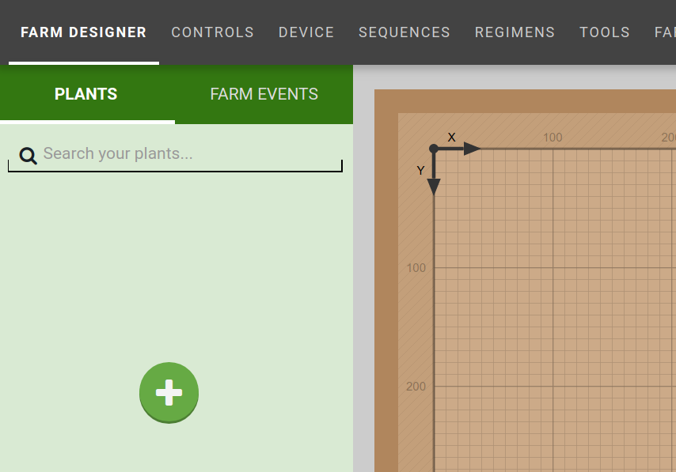

Search for a crop in the panel that appears.

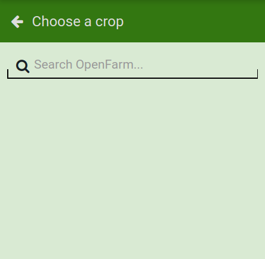

For example, "golden beet."

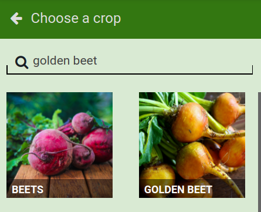

Find the crop that you'd like in your garden and click it to bring up the crop information.

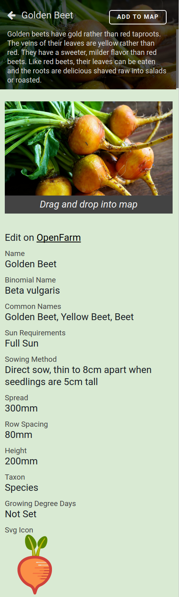

Drag the crop image into the [map](#map) to place the crop in your garden.

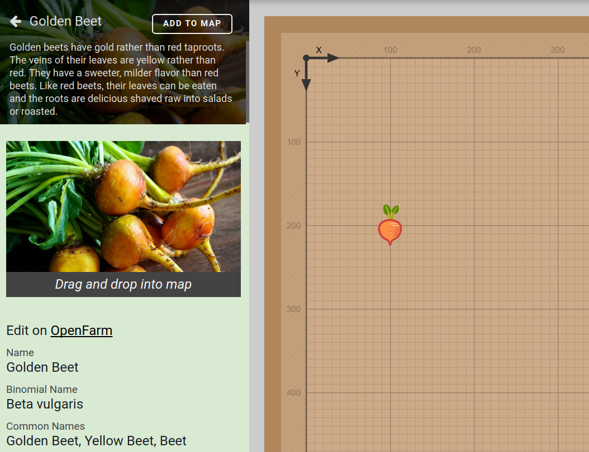

You now have a plant!

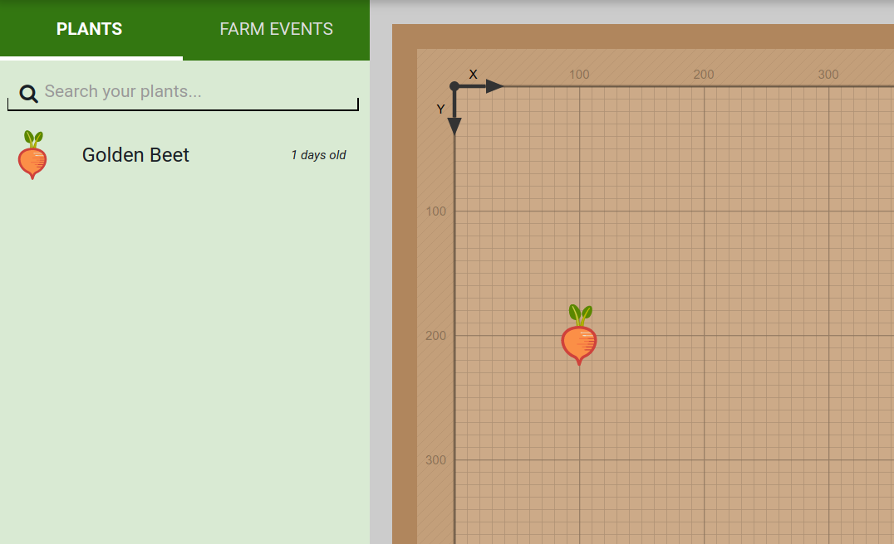



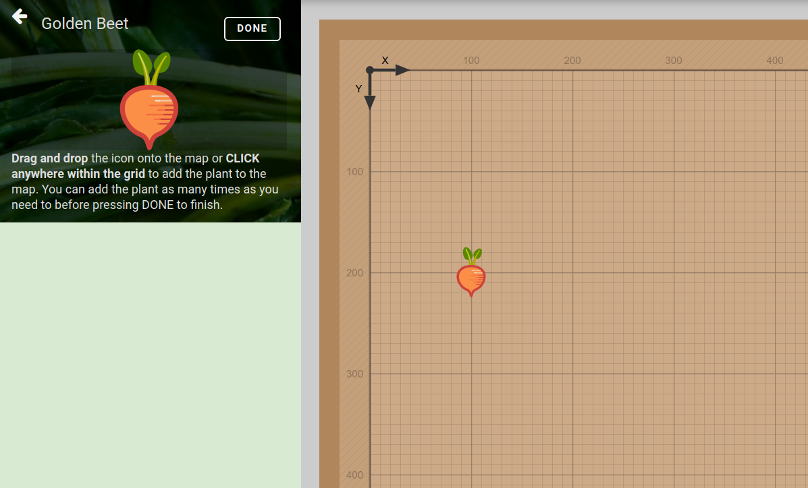

# Move a plant

To move a plant, start by clicking a plant to edit it.

Then click and drag the plant to a new location in the [map](#map).

Visual drag helpers will appear to help guide plant placement:
 * The current coordinate location will appear as `X, Y`.
 * Cross-hairs will appear to help with grid alignment.
 * Short light red dashes will appear around other plants in the map aligned with the current plant.
 * The current plant's spread will appear, along with other plants' spreads if the plants are close by.

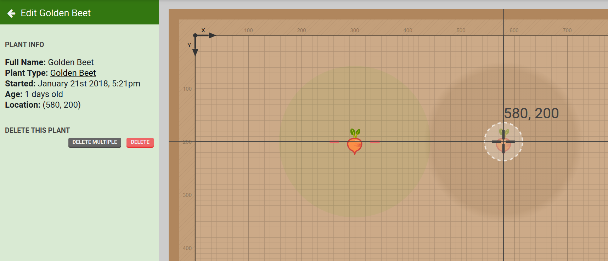

If the current plant's spread overlaps another plant's spread, the other plant's spread will turn colors indicating the degree of overlap. Green indicates a nearby plant spread, yellow is slightly overlapping, and red is severely overlapping.

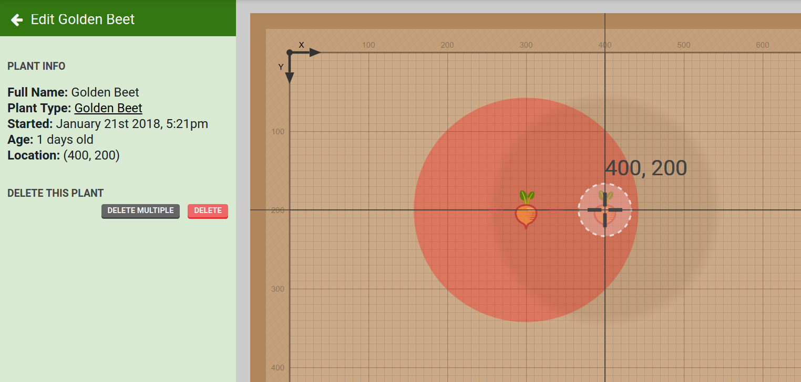

# Remove a plant

If you'd like to delete a plant, click on it to bring up the plant information and press the `EDIT` button.

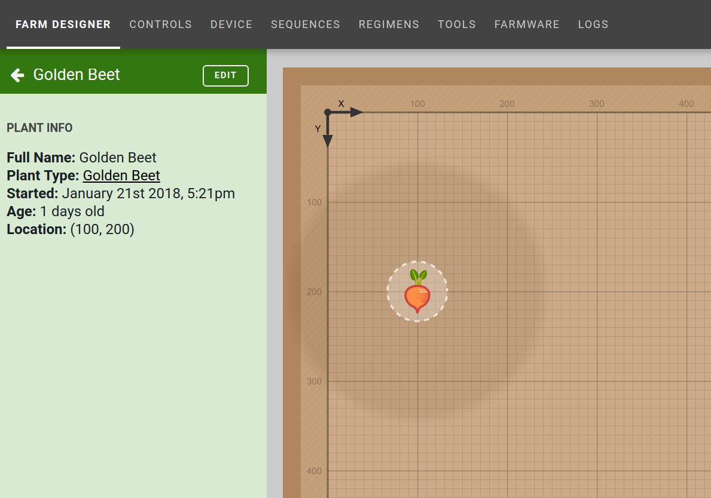

Press the DELETE button to remove the plant.

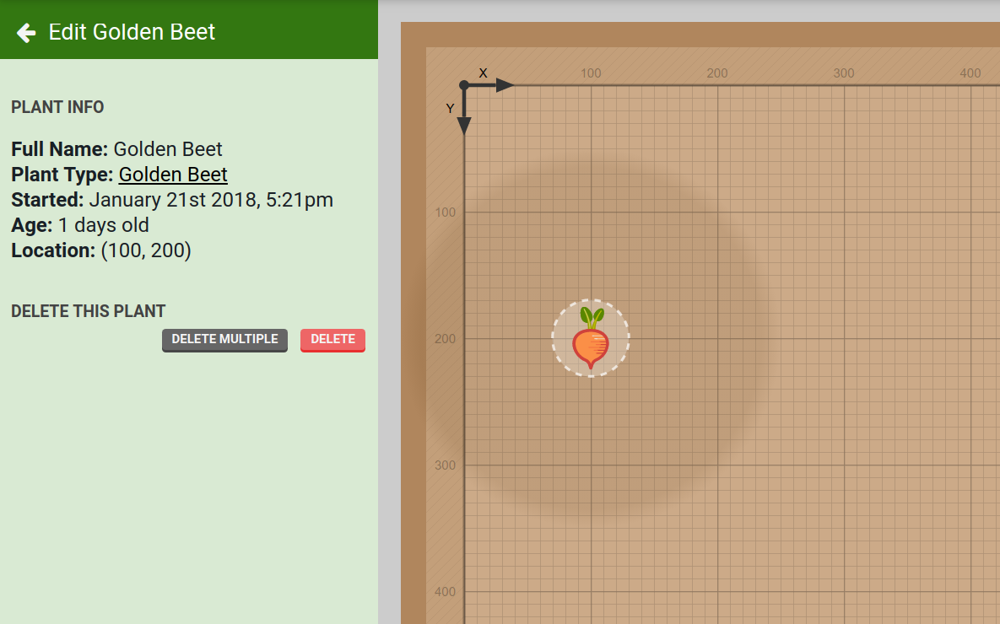

You can also press the DELETE MULTIPLE button to bring up the plant selection interface to delete multiple plants at once.

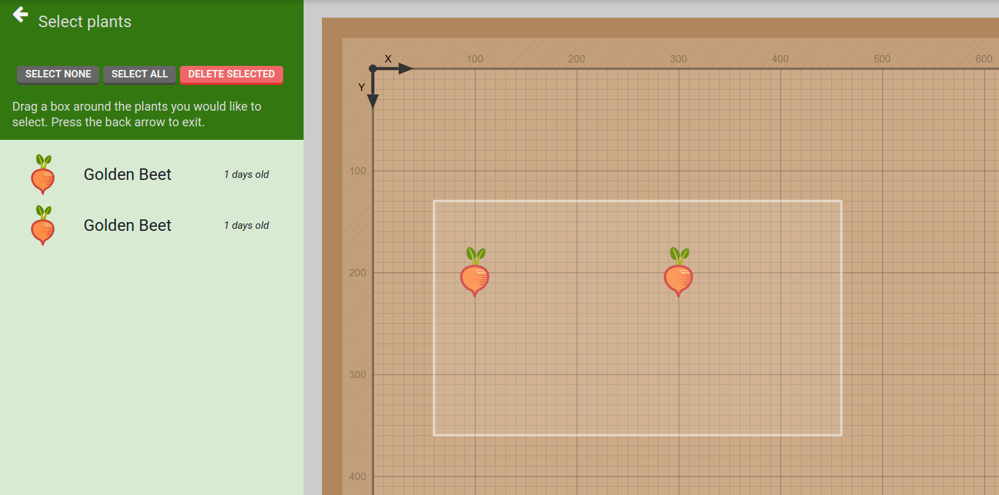

# Map

You can view all of your plants in the map, a virtual representation of the FarmBot bed. You can drag plants around to rearrange them by clicking on the plant and pressing `EDIT` in the plants panel.

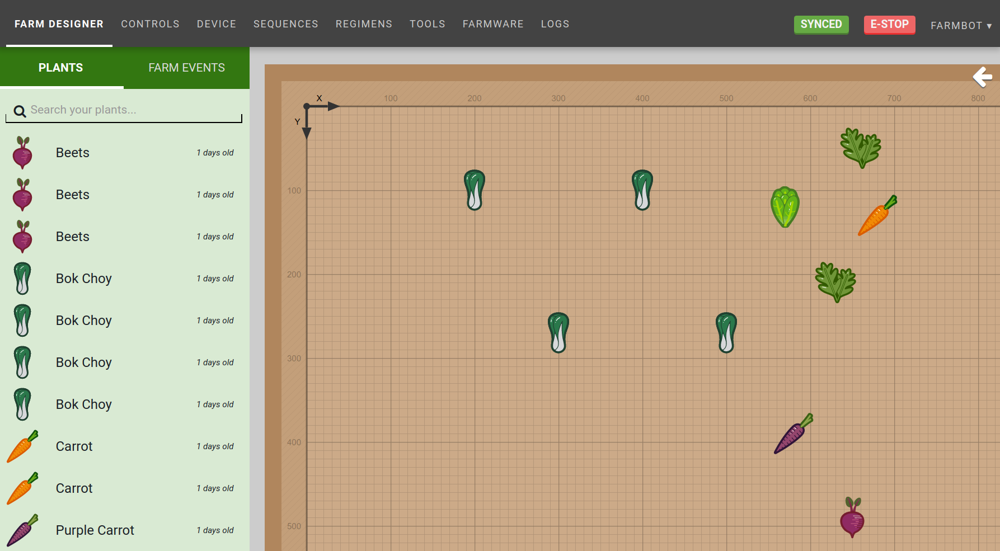

You can open the map display options menu by pressing the white arrow icon in the upper right.

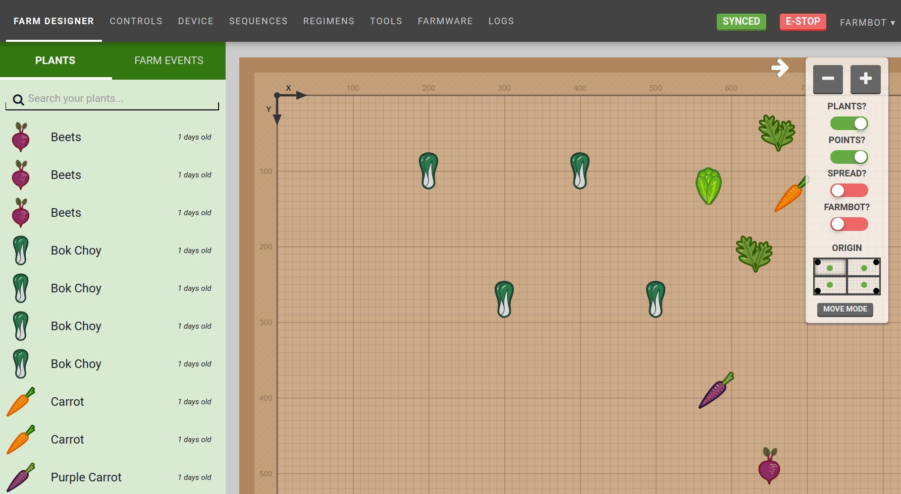

**Menu options include:**
* Zoom (+/-)
* Plant toggle (enable/disable display of plant icons)
* Point toggle (enable/disable display of points (weeds, etc)
* Spread toggle (enable/disable display of plant spread indicators)
* FarmBot toggle (enable/disable display of tools and the virtual FarmBot)
* Origin selector (click on one of the four quadrants to adjust the map to your viewing angle)
* Move mode (open "move to coordinate" mode)

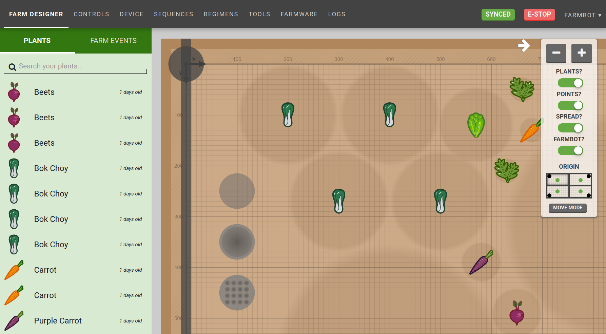

# FarmBot Layer

In addition to showing the current location of FarmBot, the FarmBot layer shows:
 * FarmBot UTM and gantry postion
 * Tools (hover to display tool names)
 * Current status of some peripherals (vacuum pump, water, lights)

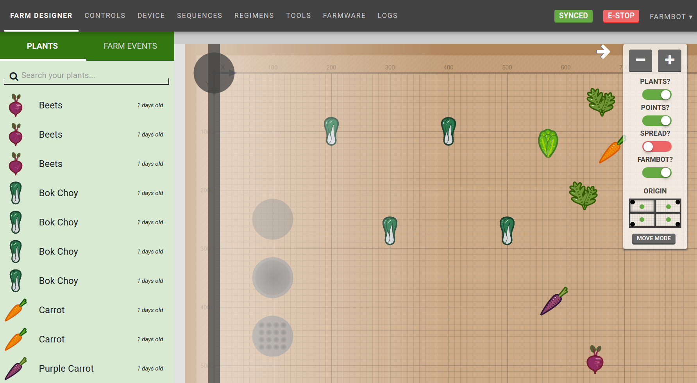

_Lights are on!_

# Move to coordinate mode

Press MOVE MODE in the map menu to enter "move to coordinate" mode:

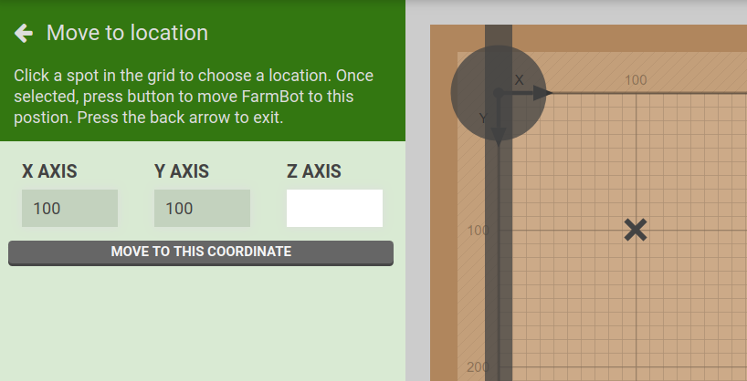

Click any spot within the map grid to mark it with an `X`, and press MOVE TO THIS COORDINATE to send the movement command.

# What's next?

 * [Farm Events](farm-events.md)
