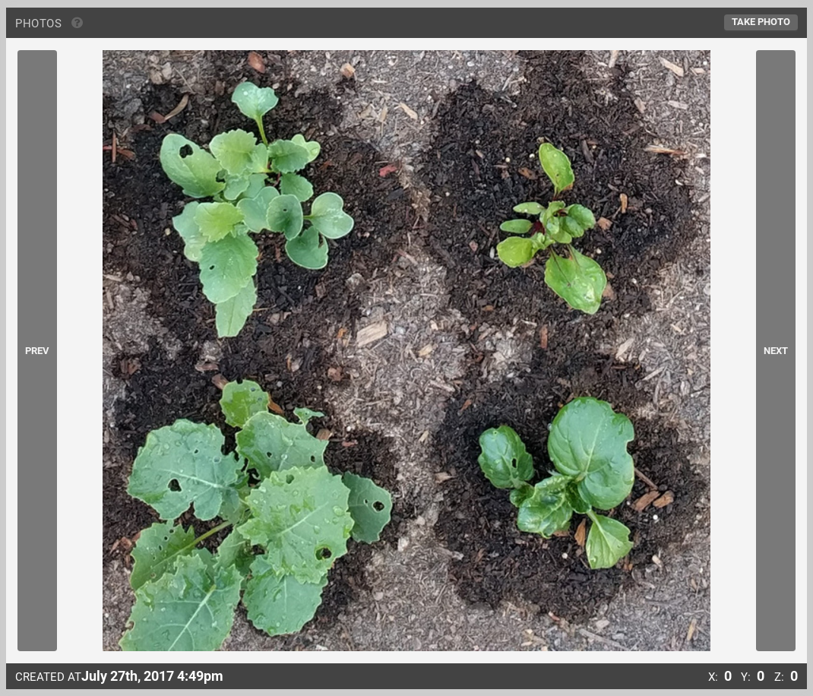
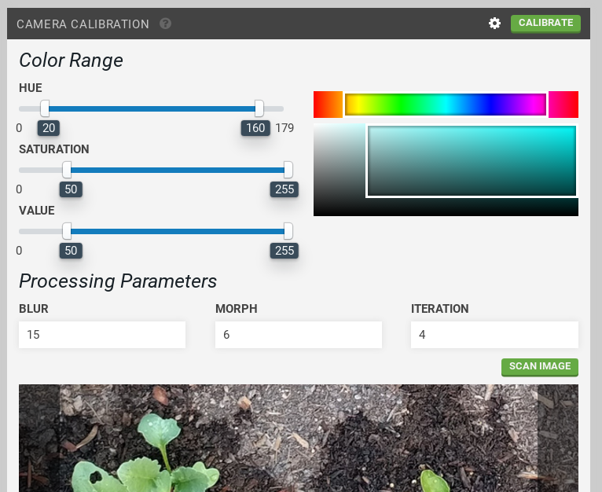
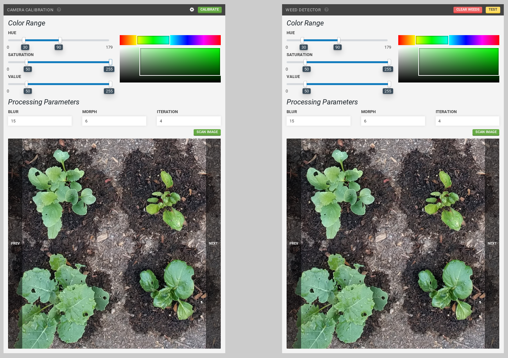

* toc
{:toc}

The following Farmware have been created by FarmBot Inc and are pre-installed:
* __[Take Photo](#take-photo)__ - take a photo and upload it to the web app
* __[Weed Detector](#weed-detector)__ - detect weeds
* __[Camera Calibration](#camera-calibration)__ - calibrate the camera for use in __Plant Detection__

  
  
  
  
  

<figcaption class="caption">Click a widget in the image to learn more!</figcaption>

<!--
farmware_page.png
photo_widget.png
-->

# Farmware

Run a Farmware by selecting it from the list and pressing run.

Press the gear icon () to open the Farmware advanced menu. To show first-party Farmware (pre-installed Farmware) in the Farmware list, enable `SHOW IN LIST`. If a pre-installed Farmware is accidentally deleted, press the `REINSTALL` button.

# Installing Farmware

To install new Farmware, use the __Install__ form in the left panel of the __Farmware__ page of the FarmBot Web App. ([Link to web app Farmware page](http://my.farm.bot/app/farmware))

Installation is performed by entering the URL of the _manifest.json_ file for the Farmware.

# Take Photo

Take photos using FarmBot's camera and view them.

Press take photo to take a photo.
Press delete photo to delete a photo.

Use the `PREV` and `NEXT` buttons to navigate through previously taken images.



# Camera Calibration



Calibrate your FarmBot's camera. See also: [Weed Detector](#weed-detector)

Camera calibration works by using the distance between and orientation of calibration objects placed in the garden bed. Calibration only needs to be performed once.

## Instructions

Place two red objects ([these red markers](https://genesis.farm.bot/docs/miscellaneous#red-markers) are included in kits) on the surface of the soil in your garden bed. The objects should be bright red, and preferably round.

They can be placed anywhere in the bed, but they need to be placed square with FarmBot's tracks and in a location where FarmBot's camera can be moved directly overhead.

Measure the distance from the center of one object to the center of the next. The objects can be separated as far apart as they can while still remaining within the field of view of the camera. 100-200mm is a good starting point. Input the value in millimeters into the `calibration object separation` input box in the **Camera Calibration** widget settings menu (opened by pressing the white gear icon next to calibrate).

Select the axis along which the calibration objects are placed. If you placed them in the direction of the tracks, select `X` in the `calibration object separation along axis` drop down menu. If you placed them in the direction of the gantry, select `Y`.

For the `origin location in image` setting, look at a photo you have taken with FarmBot's camera (take one using the [take photo](#take-photo) widget if you haven't already). Determine which direction home is in the image, and select the corner of the image that corresponds to that direction. It can help to view a photo taken when FarmBot was at home (0, 0, 0). If a corner of the image does not correspond to the origin, try rotating the camera until one does.

The **hue** color range slider should be set to approximately 20-160, with the `invert hue range selection` checkbox marked. This will select a hue range that includes various shades of red.

Move FarmBot directly over the calibration objects you have placed, and move the z-axis as high as it will go. Press the calibrate button. Once calibration is finished, press refresh to view the result image. `pixel coordinate scale` and `camera rotation` results will appear as well.

If more than the two red objects are detected in the image, adjust the **hue**, **saturation**, and **value** parameters until the two red objects are the only objects detected in the image. Detected regions of the image are outlined in green and circled in blue. Each new calibration will replace the previous calibrated values.

scan image can be used to run camera calibration on an image already taken instead of taking a new photo.



# Weed Detector





Select hue, saturation, and value ranges to cover the colors you want to detect using the sliders. The color boxes will give an indication of the range selected. For the hue slider, a green color range is approximately 30-90.

*Blur, morph and iteration processing parameters*: It is recommended to use the defaults, run a test, and then experiment with the values to test the results.

Move the FarmBot over a section of soil. Press test to detect weeds in FarmBot camera's current view. The weeds will appear in the [Farm Designer](../Web-App/farm-designer.md). Press clear weeds to delete them from the map.

scan image can be used to run weed detection on an image already taken instead of taking a new photo.

Detect weeds across FarmBot's entire bed by creating a sequence of movements in a grid pattern with a run farmware step at each grid point.

Weed removal can be performed by creating a weed removal sequence that uses the weeding tool on weeds (points) in the Farm Designer. For more information on the weed detection process, see [Weed Detection](../Additional-Information/weed-detection.md). For more information on creating sequences, see [Sequences](../Web-App/sequences.md).

_Left: Camera Calibration widget, Right: Weed Detector widget_

