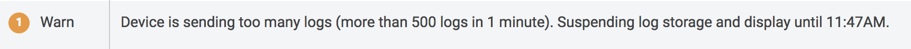

# Verbosity and filtering

FarmBot sends logs for nearly every action it takes. Sometimes seeing all of the logs can be helpful, for example when trying out new features or when debugging your system. Other times seeing only the most important "high level" logs is desirable, such as when you leave your FarmBot to work for a few weeks and you just periodically check in.

Every log that FarmBot sends has a *verbosity* of `1`, `2`, or `3`, which can be loosely associated with how important the log is and the level of detail that it reveals about how your FarmBot is operating. A more verbose log (verbosity `3`) is usually "lower level" and less important. A less verbose log (verbosity `1`) is usually "higher level" and more important.

You can filter logs by clicking FILTER (or, when log filters are currently active, FILTERS ACTIVE). The verbosity sliders allow you to choose to see more verbose or less verbose logs.

Setting a verbosity slider to `0` means you will not see any logs of that type in the logs table or in the status ticker. Setting a slider to `1` means you will see only the most important "high level" logs of that type. `2` means you will see most logs of that type including the most important "high level" logs as well as semi-important "medium level" logs. A setting of `3` means you will see every log of that type, many of which may be unimportant during normal operation.

The NORMAL preset sets all log types to verbosity level `1`, while the MAX sets all log types to verbosity level `3`, removing all filters.

# Logs Settings Menu

## Create logs for sequence

### Begin
Send a log message upon the start of sequence execution.

### Steps
Send a log message for each sequence step.

### Complete
Send a log message upon the end of sequence execution.

## Firmware logs
Firmware logs, if enabled, will clear after any page refreshes.

### Sent
Log all commands sent to firmware.

### Received
Log all responses received from firmware.



### Debug
Log misc firmware debug messages.

# Log Limits

In order to provide the best possible web application experience to all users, we have implemented the following limitations to the number of logs a FarmBot can store to the web app within a given time period.

|Time Period                   |Max Number of Logs            |
|------------------------------|------------------------------|
|1 minute                      |500
|1 hour                        |5,000
|1 day                         |50,000

If a log limit is reached, a cooldown period will begin where log storage and display is suspended until the next time period. For example, if the 1 minute limit is reached, logs will be suspended until the next minute. A warning log and toast notification will be displayed, indicating the suspension:



Once the cooldown period has ended, logs will resume being stored and displayed in the web application. An informational log and toast notification will indicate this:



