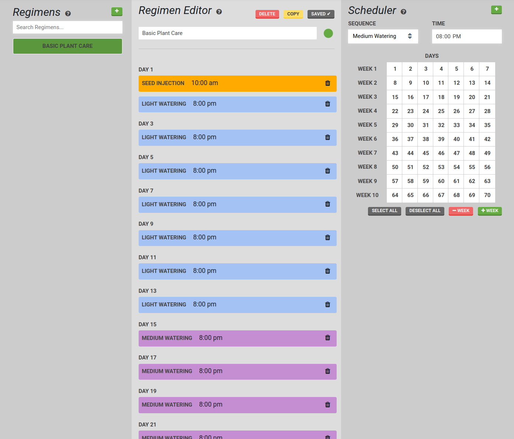
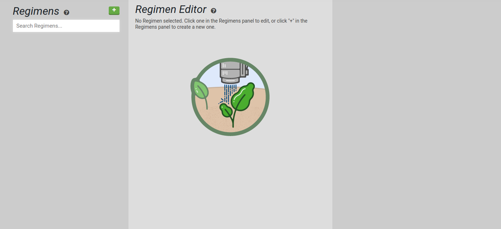
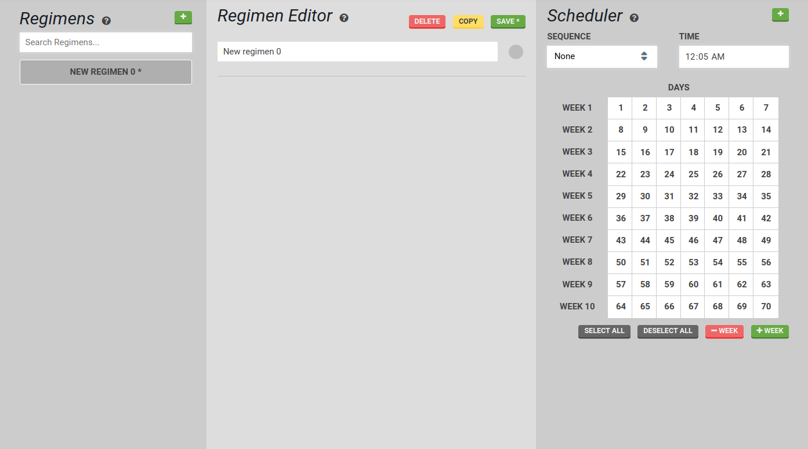
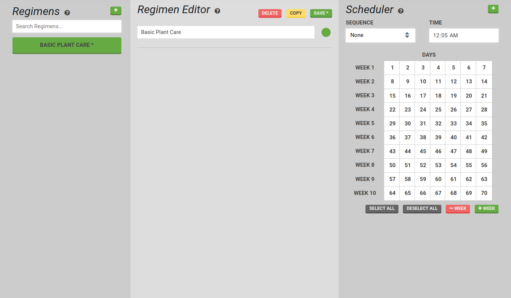
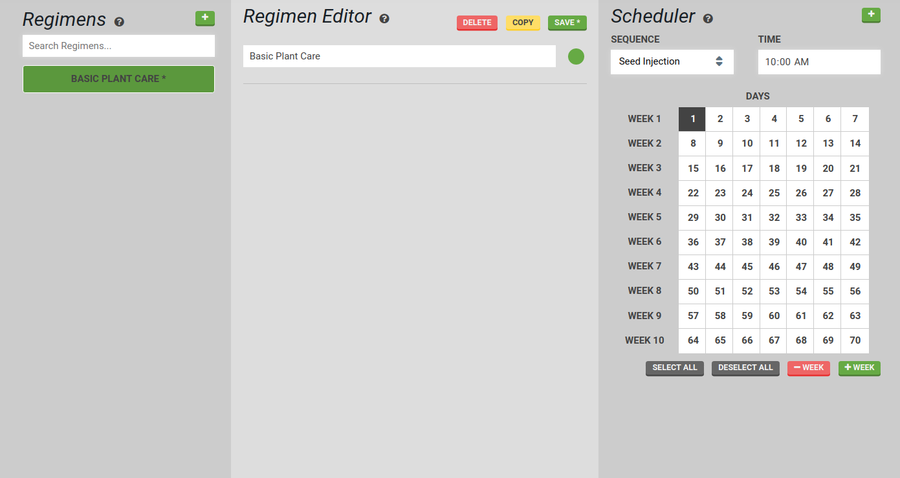
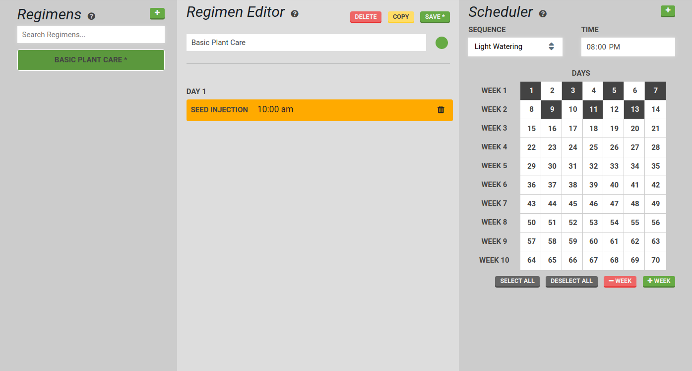
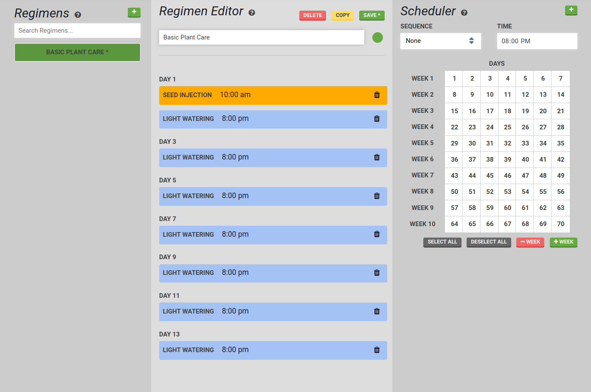
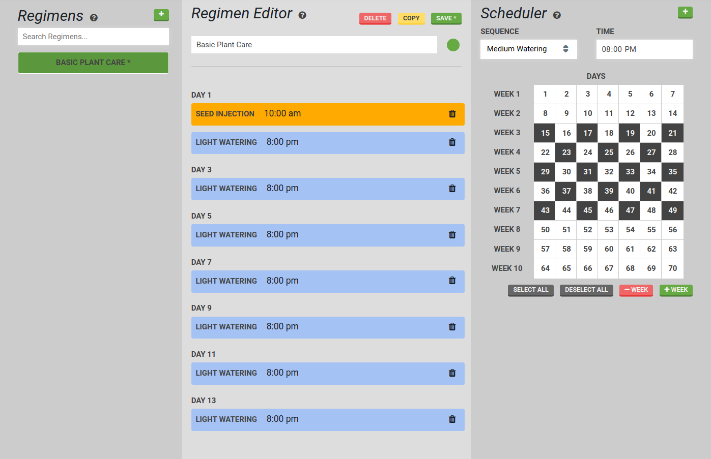

* toc
{:toc}

<iframe class="embedly-embed" src="//cdn.embedly.com/widgets/media.html?src=https%3A%2F%2Fwww.youtube.com%2Fembed%2Fvideoseries%3Flist%3DPLMhsMRlKjcNIYlDKDdKvPQuHqBjjS1ZGc&url=http%3A%2F%2Fwww.youtube.com%2Fwatch%3Fv%3D9Fy50NYnmX4&image=https%3A%2F%2Fi.ytimg.com%2Fvi%2F9Fy50NYnmX4%2Fhqdefault.jpg&key=f2aa6fc3595946d0afc3d76cbbd25dc3&type=text%2Fhtml&schema=youtube" width="854" height="480" scrolling="no" frameborder="0" allowfullscreen></iframe>

# Regimen Building

To explain the utility of the Regimen Builder, let's go through a practical example. Imagine you create three sequences for growing Cherry Tomatoes:
1. Seed Injection
2. Light Watering
3. Medium Watering

You decide to grow 10 tomato plants with these sequences starting on **March 1st**. To do this using the Event Scheduler, you create three Event Schedules:
1. Seed Injection will run on **March 1st**
2. Light Watering will run everyday from **March 2nd to March 21st**
3. Medium Watering will run everyday from **March 22nd to May 22nd**

Now imagine you want to grow 10 more tomato plants starting March 9th, and 10 more plants starting March 25th, and 10 more on April 19th. Using the Event Scheduler, you would need to tediously schedule your three sequences three more times each. In total, you will have to make 12 Event Schedules. This is what the Regimen Builder aims to streamline.

While the Event Scheduler works by scheduling an event on a *specific calendar day* such as **March 1st**, the Regimen Builder works by scheduling events on a *relative day* such as **Day 22** from when the regimen is started. Regimens are therefore a way to bulk re-schedule a set of events starting at any time.

Let's look at our tomatoes example again, this time using the Regimen Builder to reach the same outcome. First, we'll make a Regimen:
1. Seed Injection will run on **Day 1**
2. Light Watering will run everyday from **Day 2 to 21**
3. Medium Watering will run everyday from **Day 22 to 82**

We can then Schedule this Regimen to start on March 1st, March 9th, March 25th, and April 19th.

Using this method, we created one Regimen and four Event Schedules instead of the 12 Event Schedules from before. Plus, we can continue to re-use our Regimen and we'll save even more time. We can also change one Regimen to update all four scheduled instances of the Regimen at once. We alleviate the risk of forgetting one of our sequences or messing up a date calculation when we want to plant tomatoes again using the same method next season.

# Creating a Regimen

In the left **Regimens** panel, press the + button to create a new Regimen.

A new regimen will appear in the **Regimen Editor**.

 You can give it a name and a color.

In the **Scheduler**, select a sequence from the dropdown. Pick a time and day for it to run. For this example, we will run the **Seed Injection** sequence on day 1 at 10am. Press the + button in the **Scheduler** panel to add the scheduled sequence to the regimen.

You can see the scheduled sequence has been added to the **Regimen Editor**.

Next we will add some **Light Watering** to the regimen. For this example, we will perform light watering every other day at 8pm for the first two weeks.

You can see the scheduled sequence has been added to the **Regimen Editor**.

Next we will select the **Medium Watering** sequence and have it run every other day at 8pm for weeks 3 through 7.

After pressing the + button, our regimen is complete! Press Save to save the regimen.



# What's next?

 * [Farm Designer](../Web-App/farm-designer.md)
 * [Farm Events](../Web-App/farm-events.md)
