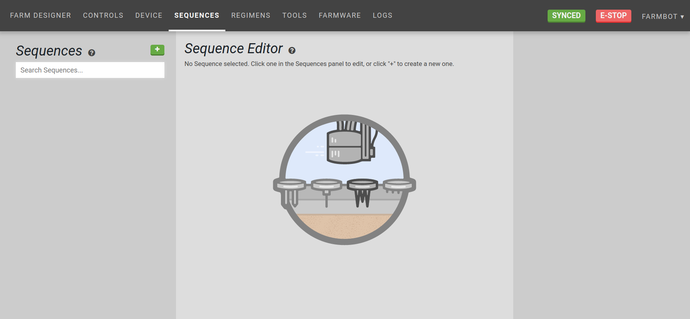

* toc
{:toc}

<iframe class="embedly-embed" src="//cdn.embedly.com/widgets/media.html?src=https%3A%2F%2Fwww.youtube.com%2Fembed%2Fvideoseries%3Flist%3DPLMhsMRlKjcNIYlDKDdKvPQuHqBjjS1ZGc&url=http%3A%2F%2Fwww.youtube.com%2Fwatch%3Fv%3DlGrY0e4zVEg&image=https%3A%2F%2Fi.ytimg.com%2Fvi%2FlGrY0e4zVEg%2Fhqdefault.jpg&key=f2aa6fc3595946d0afc3d76cbbd25dc3&type=text%2Fhtml&schema=youtube" width="854" height="480" scrolling="no" frameborder="0" allowfullscreen></iframe>

# Sequence building

The web app is a platform designed to give you unlimited control over how you use your FarmBot and therefore how you grow your food. Because nobody wants to sit on their computer all day controlling their FarmBot manually, we have designed several features to help you automate your farming operation.

The sequence builder allows you to combine the most basic operations of FarmBot into more complex actions composed of many different steps. When a sequence is initiated, FarmBot will execute all of the steps in the sequence one after the other until it is done.

# Sequence commands (aka 'steps')

These are the basic operations we can use in sequences that FarmBot can execute:
* Move Absolute - Moves the device to an absolute coordinate position at a speed. This is useful for moving to tool, plant, and home locations.
* Move Relative - Moves the device a specific distance in any direction at a speed, relative from the last position. This is useful for movements after a absolute movement to a dynamically loaded location. Eg: Moving in a square relative to a plant after the device moved absolutely to the plant.
* Write Pin - Writes a value to any pin on the Arduino. This is used for operating tools that use peripherals, such as the vacuum pump and water valve.
* Read Pin - Reads the value from any pin on the Arduino. This is used for [tool verification and sensors](../Extras/reading-pins.md).
* Wait - Causes a delay before executing the next operation in the sequence. This could be used to water for a certain amount of time.
* Send Message - Sends a message to the web app. This is useful for error and success notifications and debugging. `{{ x }}` can be used as a variable for FarmBot's current x axis position (`y` and `z` can also be used). `{{ pin13 }}` can be used to write the current value of pin 13 (pins 0 through 69 can also be used).
* Find Home - Perform a homing operation to set zero for one axis or all axes.
* If Statement - Executes another sequence if a condition is true. This is useful for error detection and smarter, condition based farming.
* Execute Sequence - Use existing sequences as steps in a new, larger sequence. This technique allows you to re-use smaller sequences in different combinations to create far more complex sequences that are easier to modify, manage, and mashup. You can then use the individual sequences in other ways without having to recreate them each time.
* Run Farmware - Run a [Farmware](../The FarmBot Web App/farmware.md). Input the name of a Farmware to run it, for example, `plant-detection`.
* Take Photo - Takes a picture with a USB webcam or the Raspberry Pi camera (select your camera in the [Device](doc:device#section-device) widget) and sends it to the web app.



# Building a sequence

The general overview of creating a sequence is:

1. In the **Sequences** panel, click +
2. In the **Sequence Editor** panel, enter a name for your sequence and assign it a color
2. Drag and drop blocks from the **Commands** panel into the **Sequence Editor** panel
3. For each operation, enter in your desired parameter values. Some parameters such as *speed* can use default values for your device and do not need to be entered in every time.
4. Reorder, copy, and delete operations as needed
5. Click Save

In the next sections, several sequences are built as examples.

# Create a tool mounting sequence

Let's create a sequence to mount the watering nozzle as an example.

First, add the [watering tool](https://genesis.farm.bot/docs/watering-nozzle) to the toolbay and follow the [Tools](../The FarmBot Web App/farm-designer/tools.md) instructions to add it to the web app.

Navigate to the **Sequences** page of the web app, and press the + button in the left column (**Sequences**)  to add a new sequence.

You will see the new sequence appear in the sequence editor in the middle column.

Give the sequence a descriptive name.

Begin the sequence with a movement to home. Add a Find Home command by clicking it or dragging it into the sequence from the commands (right) column.



Next, add a step to move above the tool we want mounted, in this case, the watering nozzle. Add a Move Absolute command by clicking it or dragging it into the sequence.

Select the `Watering Nozzle` (added in the tools page) in the `Import Coordinates From` dropdown.

We want to move to the location directly above the tool before descending down to connect to the tool, so we'll add a `100` mm Z-Offset.

Next we'll want FarmBot to descend directly down to make contact with the tool. Add another Move Absolute command as we did in the last step and select the `Watering Nozzle` in the `Import Coordinates From` dropdown as before. This time, there will not be an offset.

*(Alternatively, press the copy icon () in the existing Move Absolute step (second icon from the right in the step's info bar) and clear the offset.)*

At this point, FarmBot's UTM would be attached to the tool in the toolbay. The next step will be to pull the tool out of the toolbay. Add another Move Absolute command and select the `Watering Nozzle` as the coordinates, this time adding a `100` mm X-Offset.

That's it! Now press the SAVE button.

To recap, the steps are move to home, move directly above the tool, descend directly down to make contact with the tool, and move the tool out of the toolbay. Now you can use this sequence any time you would like to use the watering tool!

Don't forget to SYNC before pressing TEST to test your new sequence!



{%
include callout.html
type="info"
title="Additional considerations"
content="* It can be helpful to add an additional Move Absolute command at the end of the tool mounting sequence copying the inputs in the last step but with a positive z-offset. This can help prepare FarmBot for the next movement by moving above any nearby objects.
* It may be desirable to omit the `Find Home` at the beginning of the sequence if the sequence is being used within a larger sequence that already has a `Find Home` at the beginning."
%}

# Create a watering sequence

Now that we've created a sequence to mount the watering tool, we can create a sequence to use the tool. As an example, we have a Spinach plant at coordinates `(200, 960, 0)` that we would like to water.

1. **Mount the Watering Tool** - Mount the watering nozzle by using the Execute Sequence step and selecting the `Mount Watering Tool` sequence created in the previous section.
2. **Move to above the Spinach plant** - Move the watering nozzle above the plant to be watered (`(200, 960, 0)` in this example) by making use of the Z-Offset input in the Move Absolute step.
3. **Open the solenoid valve to start the flow of water** - Add a Write Pin step to write `Pin 8` with a value of `ON`  (The pin number should correspond to the pin you have attached the solenoid valve to on the RAMPS board. See the [peripherals widget instructions](https://software.farmbot.io/docs/controls#section-peripherals) in order to test valve operation.)
4. **Wait** - Use the Wait step to continue watering the Spinach plant for 4000 milliseconds (4 seconds).
5. **Cose the solenoid valve** - Use another Write Pin step to write `Pin 8` with a value of `OFF`, turning off the flow of water.

Press the SAVE button and then SYNC NOW at the top of the page to sync your new sequence with the device, and press TEST to try out your new sequence!

# Alternative watering sequence methods

The watering steps in the sequence shown above can be made into their own sequence, which increases re-usability and makes it easier to make changes to the watering action.

Then, the new water dispensing sequence can be added by using an Execute Sequence step after movement to each plant location.

As you can see in this sequence, we have imported coordinates from plant locations in the Move Absolute step. These plant locations are defined in the [Farm Designer](../The FarmBot Web App/farm-designer.md).

As always, don't forget to SAVE and SYNC NOW before pressing TEST to test the sequence!

# Sequence Editor Tips

## Rearranging steps
Click and drag a step in the sequence editor to the empty space above or below any other step to drop it into that new position.

## Execute sequence step shortcut
Drag existing sequences from the left **Sequences** panel into an open sequence in the sequence editor to add an Execute Sequence step with that sequence selected.

## Tooltips
Each step has a description and additional tips available by hovering over the  icon.
