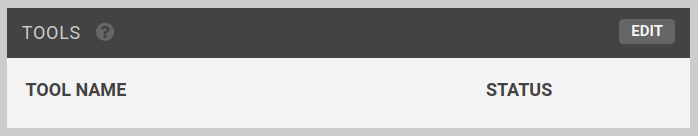
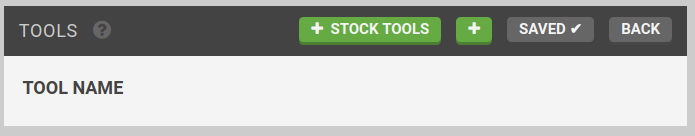
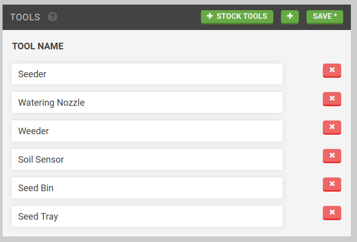

* toc
{:toc}

On this page you can specify the location of the tools in the tool bay so that FarmBot can use them with its Universal Tool Mount.

  
  
  

<figcaption class="caption">Click a widget in the image to learn more!</figcaption>

<iframe class="embedly-embed" src="//cdn.embedly.com/widgets/media.html?src=https%3A%2F%2Fwww.youtube.com%2Fembed%2Fvideoseries%3Flist%3DPLMhsMRlKjcNIYlDKDdKvPQuHqBjjS1ZGc&url=http%3A%2F%2Fwww.youtube.com%2Fwatch%3Fv%3DIcOyf28YJNk&image=https%3A%2F%2Fi.ytimg.com%2Fvi%2FIcOyf28YJNk%2Fhqdefault.jpg&key=f2aa6fc3595946d0afc3d76cbbd25dc3&type=text%2Fhtml&schema=youtube" width="854" height="480" scrolling="no" frameborder="0" allowfullscreen></iframe>

# Tools

Press the EDIT button to add a tool.

Press the Press the + button to add a tool, or the Press the + STOCK TOOLS button to add all of the standard tools.

Press the SAVE button to save.

# Toolbay

Press edit to add your tools to the toolbay. Fill out the X, Y, and Z coordinates of the tool, select a tool that you added in the [tools](#tools) widget, and press the + button to add the tool to the toolbay.

__Tip__: Use the [Move](controls.md#move) widget on the controls page to determine the location of your tool in the toolbay. The coordinates should correspond to where the UTM is making contact while directly above the tool in the toolbay. You may use the jog buttons to reach the location, and enter the coordinates displayed in the Move widget into the toolbay widget.

You can click the  button to fill the tool slot coordinate inputs with FarmBot's current coordinates.



__Tip__: Enter your seed bin location into a toolbay slot as well. The X and Y coordinates should follow the same pattern as the other tools. Determine the Z coordinate by mounting the seed injector tool you will be using to plant seeds and using the controls to move it carefully to a position that it will be able to pick up seeds from the bin.

Press save when done to save your tool locations.

# What's next?

 * [Sequences](sequences.md)
