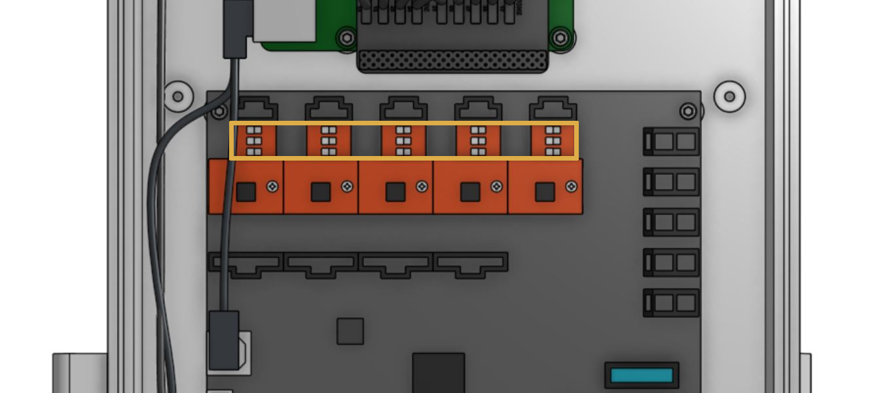

* toc
{:toc}

Microstepping allows the stepper drivers to position the stepper motor shaft *in between* full steps, which can allow for smoother and quieter movements. The RAMPS shield, Farmduino, and A4988 stepper drivers that come with stock FarmBot kits allow for full-step, 1/2 step, 1/4 step, 1/8 step, and 1/16 step settings. The microstepping setting for each stepper driver is set with jumper pins positioned below each driver. The tables below shows the available microstepping settings for both the A4988 and DRV8825 stepper drivers.



_Photo of the Microstepping switches locations (MS1, MS2, MS3) above the A4988 stepper drivers on the Farmduino v1.4_

Stock FarmBots are set to use full-steps by default (no microstepping), which means that one step pulse from the Arduino will move the motor shaft one full step. With the stock 200 step/revolution motors, this equates to 1/200 of a rotation. If you set the drivers to 1/2 step microstepping, then each step pulse from the Arduino will move the motor 1/2 of a step, or 1/400 of a revolution. This means that a full motor step would require two step pulses from the Arduino.

If you do use microstepping  you will need to make changes in the software settings match the hardware dip switch positions.

{%
include callout.html
type="success"
title="Microstepping requires other adjustments"
content="If you decide to experiment with microstepping, then you will need to increase most of the device settings to compensate for the switch from full-steps. For example, using 1/8 step microstepping means that each step pulse from the Arduino will move the motor 1/8 of a step, or 1/1600 of a rotation, so 8 step pulses will be needed to equal one full step. Therefore to maintain the same maximum speed as with full-steps, you would need to increase your max speed settings by 8 times. In fact, every single number input on the device settings widget will need to be updated except for the timeouts."
%}

# A4988 stepper drivers

|MS1                           |MS2                           |MS3                           |Microstepping                 |
|------------------------------|------------------------------|------------------------------|------------------------------|
|Low (no jumper)               |Low (no jumper)               |Low (no jumper)               |Full step
|High (jumper)                 |Low (no jumper)               |Low (no jumper)               |1/2 step
|Low (no jumper)               |High (jumper)                 |Low (no jumper)               |1/4 step
|High (jumper)                 |High (jumper)                 |Low (no jumper)               |1/8 step
|High (jumper)                 |High (jumper)                 |High (jumper)                 |1/16 step

# DRV8825 stepper drivers

|MODE 0                        |MODE 1                        |MODE 2                        |Microstepping                 |
|------------------------------|------------------------------|------------------------------|------------------------------|
|Low (no jumper)               |Low (no jumper)               |Low (no jumper)               |Full step
|High (jumper)                 |Low (no jumper)               |Low (no jumper)               |1/2 step
|Low (no jumper)               |High (jumper)                 |Low (no jumper)               |1/4 step
|High (jumper)                 |High (jumper)                 |Low (no jumper)               |1/8 step
|Low (no jumper)               |Low (no jumper)               |High (jumper)                 |1/16 step
|High (jumper)                 |Low (no jumper)               |High (jumper)                 |1/32 step
|Low (no jumper)               |High (jumper)                 |High (jumper)                 |1/32 step
|High (jumper)                 |High (jumper)                 |High (jumper)                 |1/32 step

_microstepping switch locations on the Farmduino v1.4_

