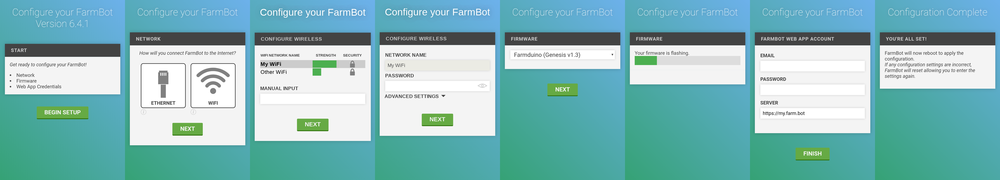



**Configurator** is a piece of software built into **FarmBot OS** that makes it easy to connect your FarmBot to a WiFi network and to your FarmBot web app account. You will not ever need to connect a keyboard and screen to the FarmBot or SSH in over an ethernet connection.

<iframe class="embedly-embed" src="//cdn.embedly.com/widgets/media.html?src=https%3A%2F%2Fwww.youtube.com%2Fembed%2Fvideoseries%3Flist%3DPLMhsMRlKjcNIYlDKDdKvPQuHqBjjS1ZGc&url=http%3A%2F%2Fwww.youtube.com%2Fwatch%3Fv%3DQu3hTC74Cyk&image=https%3A%2F%2Fi.ytimg.com%2Fvi%2FQu3hTC74Cyk%2Fhqdefault.jpg&key=f2aa6fc3595946d0afc3d76cbbd25dc3&type=text%2Fhtml&schema=youtube" width="854" height="480" scrolling="no" frameborder="0" allowfullscreen></iframe>

# Configure FarmBot

When the device boots up, it automatically starts up Configurator. Configurator checks for configuration data. Initially, there will not be any configuration data, so the device will not be able to connect to your home WiFi network or your FarmBot Web App account. In this case, Configurator will create its own WiFi network with an SSID named `farmbot-xxxx` (x representing numeric and letter symbols).

## Step 1: Connect to Configurator
1. Using your phone or laptop, connect to the `farmbot-xxxx` WiFi network.
2. Open up a web browser and navigate to [setup.farm.bot](http://setup.farm.bot), to access the Configurator page.



## Step 2: Enter credentials
From here, follow the on-screen form to enter:

### Network connection type
Select wireless (WiFi network) or wired (Ethernet) by pressing the corresponding icon. For network interface name and mac address, press the  icon.
  * For connection to a **WiFi network**:
    1. Select the name (SSID) of the network you would like your FarmBot to normally connect to (for example, your home WiFi network). Alternatively, enter the name of the WiFi network in the manual input box.
    2. Enter the password for the WiFi network. (_For other network settings, such as DNS or IP assignment, press `ADVANCED SETTINGS`._)
  * For connection to a **wired network**:
    1. _If you need to input additional network settings, such as DNS or IP assignment, press `ADVANCED SETTINGS`._ Otherwise, press the NEXT button.

### Hardware board / kit version
Use the dropdown menu to choose the firmware version to install based on what electronics were included with your FarmBot.

|FarmBot Version               |Electronics Board             |Firmware Name                 |
|------------------------------|------------------------------|------------------------------|
|Genesis v1.2                  |RAMPS                         |`RAMPS (Genesis v1.2)`
|Genesis v1.3                  |Farmduino                     |`Farmduino (Genesis v1.3)`
|Genesis v1.4                  |Farmduino                     |`Farmduino (Genesis v1.4)`

### Email and password for your web app account
Remember: you must have a **verified web app account** in order for the FarmBot to connect to the web app. See instructions for creating and verifying an account [here](../../Web-App/the-farmbot-web-app.md#registration).

If you are self-hosting the web application on your own servers, replace "https://my.farm.bot" with your custom server URL (advanced).

## Step 3: Submit configuration
Now press FINISH. FarmBot OS will now attempt to connect to the WiFi network and Web App account provided. This will terminate the connection between your smartphone or laptop and FarmBot OS, so you can now close the web browser tab that you were using to complete the configuration process

## Step 4: Check to see if FarmBot is online
* Use your phone, tablet, or laptop to connect to your home WiFi network.
* Navigate to [my.farm.bot](https://my.farm.bot) and watch the status ticker to see when FarmBot comes online and begins sending messages. This should happen within 2 minutes of completing configuration.
* Once FarmBot is initialized, try pressing one of the manual movement arrow buttons. You should see FarmBot responding to your commands and sending back messages.

If there is a problem with the configuration, such as an incorrect password, then the Configurator program will restart and you will see the `farmbot-xxxx` WiFi network again. If this happens, try configuring again or consult the [troubleshooting guides](../../Extras/troubleshooting.md).
