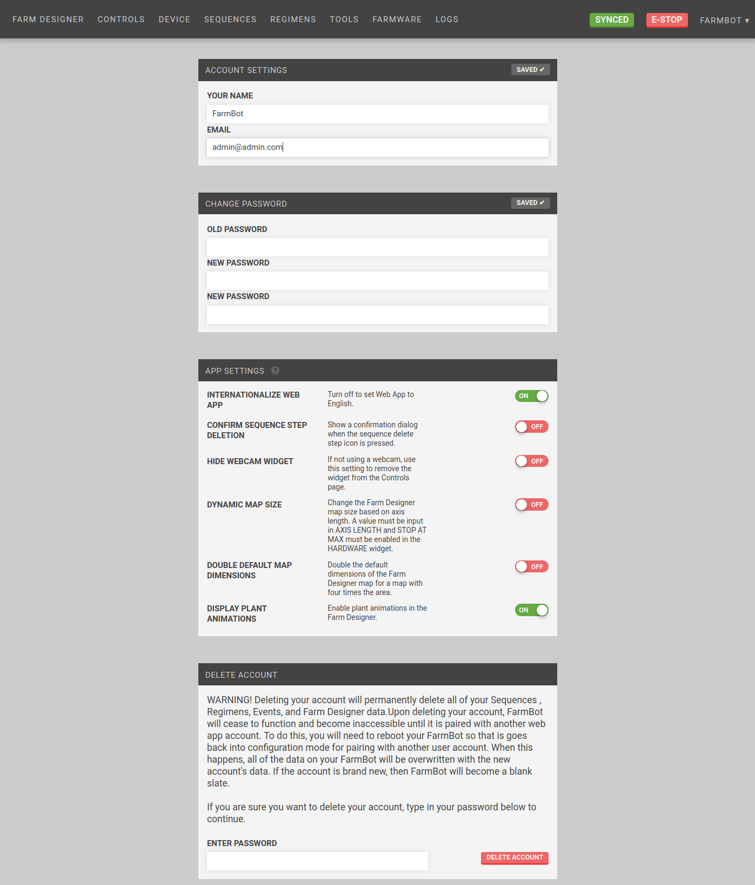

* toc
{:toc}

  
  
  
  
  

<figcaption class="caption">Click a widget in the image to learn more!</figcaption>

# Account Settings

Change your name (displayed in the top right of the app) and email (used for login, emailed log messages).

# Change Password

Select a new password.

# App Settings

Customize your web app experience.

## Internationalize web app
Disable use of language files to translate web app text.



## Confirm sequence step deletion
Show a confirmation dialog when the sequence delete step icon is pressed.

## Hide webcam widget
If not using a webcam, use this setting to remove the widget from the Controls page.

## Dynamic map size
Change the [Farm Designer](farm-designer.md)  map size based on axis length. A value must be input in `AXIS LENGTH` and `STOP AT MAX` must be enabled in the [Hardware](device.md#hardware-widget) widget.

## Double default map dimensions
Double the default dimensions of the [Farm Designer](farm-designer.md) map for a map with four times the area. ([FarmBot Genesis XL](https://farm.bot/))

## Display plant animations
Enable plant animations in the [Farm Designer](farm-designer.md).



# Delete Account

Permanently delete your account and all of its data.

# Export Data

Download all of your Web App account data. Exported data is delivered in JSON format to your email address as a file attachment.

# What's next?

 * [Logs](account/logs.md)
 * [Account Limitations](account/account-limitations.md)
