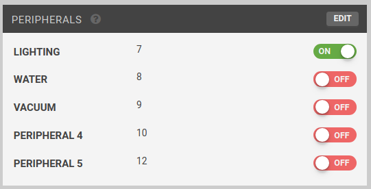
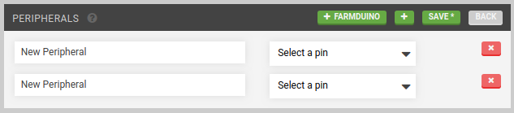

The **PERIPHERALS** widget allows you to manage FarmBot's peripherals and control them in real-time with toggle switches.

# Creating peripherals
To create a new peripheral, press EDIT, and then the <i class='fa fa-plus'></i> button. Provide a Label and Pin # to define the peripheral. Alternatively, press <i class='fa fa-plus'></i> FARMDUINO to add all of the [standard Farmduino peripherals](https://genesis.farm.bot/docs/farmduino-peripheral-pin-numbers).



When finished editing, press SAVE.

# Controlling peripherals
## Manual control
You can press a toggle switch to manually control a peripheral when FarmBot is connected and idle. If FarmBot is disconnected or busy, pressing a toggle switch will have no effect. Refer to the table below for all possible states of the toggle switches.

|When a toggle is              |The peripheral's state is     |Clicking the toggle will      |
|------------------------------|------------------------------|------------------------------|
|ON|**ON**                        |Turn the peripheral **OFF**
|OFF|**OFF**                       |Turn the peripheral **ON**
||Unknown                       |Turn the peripheral **OFF**
|ON|**ON**                        |Not have any effect (FarmBot is busy)
|OFF|**OFF**                       |Not have any effect (FarmBot is busy)
||Unknown                       |Not have any effect (FarmBot is not connected)



## Sequence based control
You can also control peripherals from [sequences](../sequences.md) by using the Control Peripheral command. For more information, see the [control peripheral command documentation](../sequences/sequence-commands.md#control-peripheral).

# Deleting peripherals
To delete a peripheral, press edit and then the peripheral's <i class='fa fa-times'></i> button. Finish editing by pressing back.



# What's next?

 * [Webcam Feeds](webcam-feeds.md)
