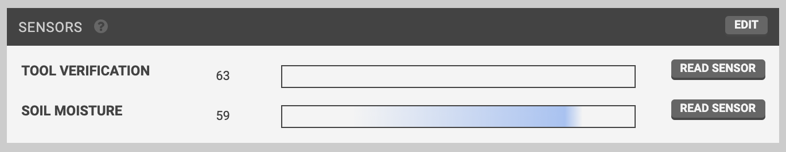

* toc
{:toc}

The **SENSORS** widget allows you to manage FarmBot's sensors and read them in real-time.

# Creating sensors
To create a new sensor, press EDIT, and then the <i class='fa fa-plus'></i> button. To define the sensor, provide a Label, choose a Pin #, and specify if the sensor is analog or digital. Alternatively, press <i class='fa fa-plus'></i> STOCK SENSORS to add all of the standard FarmBot sensors.



When finished editing, press SAVE.

# Reading sensors
## Manual readings
To manually read a sensor, press its READ SENSOR button. FarmBot will then read the sensor and display the value in the widget. Digital sensors will provide a value of either `0` or `1`, while analog sensors will provide a value between `0` and `1023`.

## Historical readings
Use the **SENSOR HISTORY** widget to view sensor readings from the past. Optionally, you can filter by **SENSOR**, **TIME PERIOD**, and/or **X**, **Y**, and **Z** coordinates. The **DEVIATION** field can be used to filter within a range of locations around the specified coordinates.

To clear out all current filters, press CLEAR FILTERS.

## Sequence based readings
You can also read sensors from [sequences](../sequences.md) by using the READ SENSOR command. For more information, see the [read sensor command documentation](../sequences/sequence-commands.md#read-sensor).

# Deleting sensors
To delete a sensor, press edit and then the sensor's <i class='fa fa-times'></i> button. Finish editing by pressing back.



