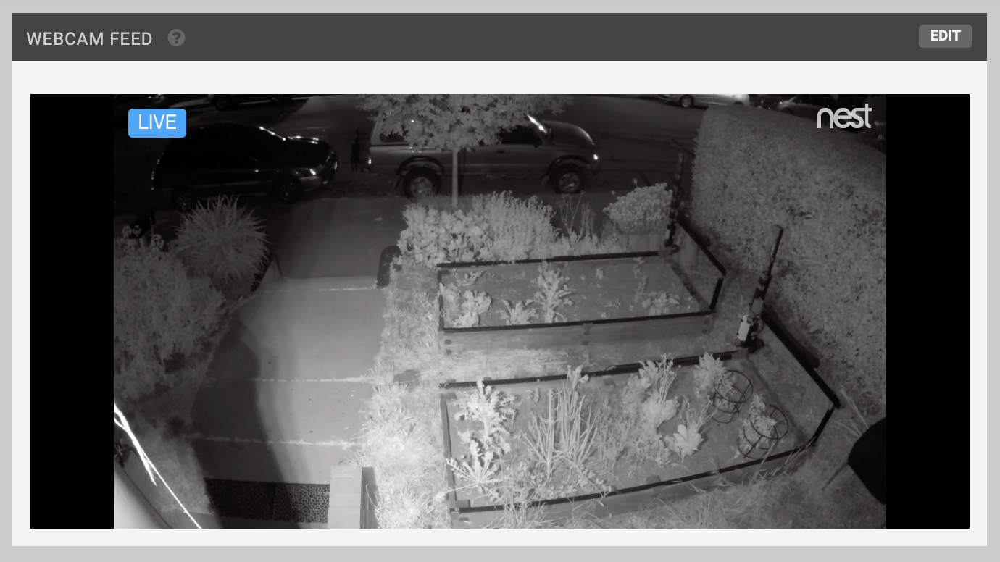
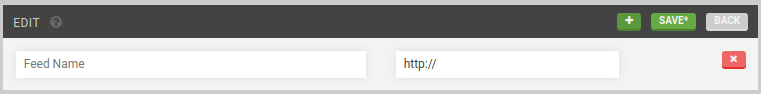
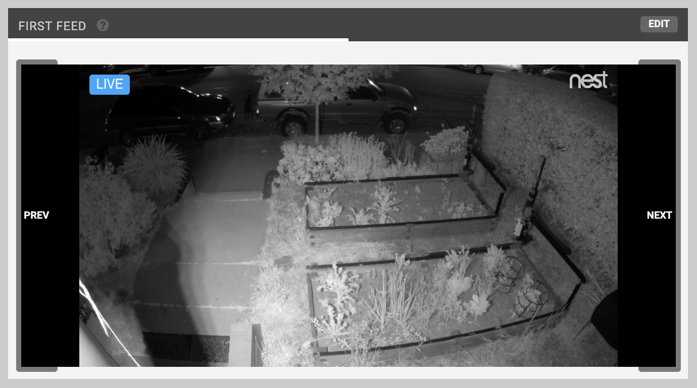

* toc
{:toc}

The **WEBCAM FEEDS** widget allows you to monitor your FarmBot from a distance with the use of an external camera system such as a Nest brand home security camera. Using a single camera, you could monitor the entire FarmBot bed while controlling it remotely, or, you could set up multiple webcams at different angles for viewing plants, etc.

# Adding a webcam feed
To add a webcam feed, press EDIT, and then the <i class='fa fa-plus'></i> button. Provide a Label and a publicly accessible URL (with `http://`) or IP address for your webcam stream.

Multiple webcam feeds can be added by pressing <i class='fa fa-plus'></i> for each new camera.

When finished editing, press SAVE.

# Viewing webcam feeds
The webcam widget will display one webcam feed at a time. If you have added multiple webcam feeds, you can cycle through them using the `PREV` and `NEXT` buttons on the left and right sides of the widget.

# Deleting webcam feeds
To delete a webcam feed, press edit and then the feed's <i class='fa fa-times'></i> button. Finish editing by pressing back.

# Hiding the widget
If you do not plan to use any webcams to monitor your FarmBot, use the **HIDE WEBCAM WIDGET** toggle in the [app settings area](../account.md) to remove the widget from the controls page.

# What's next?

 * [Sensors](sensors.md)
