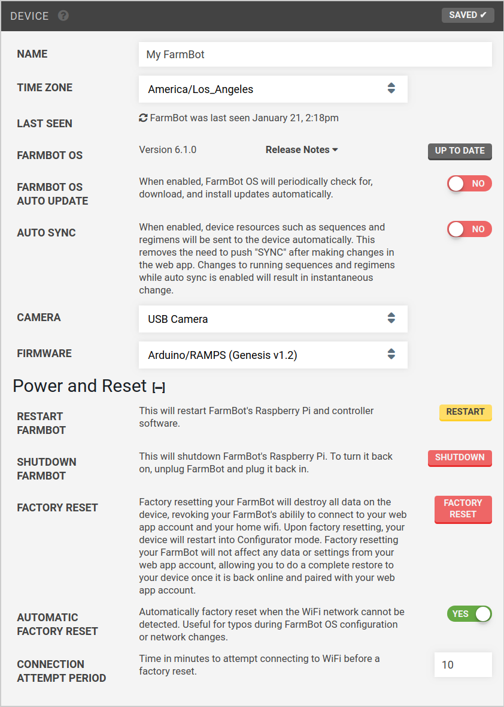

* toc
{:toc}

# Device
## Name
Give your FarmBot a fun name. For example: `Broccoli Overlord` 🥦🤖

## Time Zone
Set the device's timezone.



## Last Seen
View when FarmBot was last connected to the cloud. Refresh the time by pressing the <i class='fa fa-refresh'></i> icon.

## FarmBot OS
View the version of FarmBot OS that you have installed on your device, that version's release notes, and install updates if they are available using the UPDATE button. Note that the update button will display as UP TO DATE when there are no updates available.

## FarmBot OS auto update
When enabled, FarmBot OS will periodically check for, download, and install updates automatically.



## Auto sync
When enabled, device resources such as [sequences](dpoc:sequences), [regimens](../../Web-App/regimens.md), [events](../../Web-App/events.md), plant locations, and more will be synced with FarmBot automatically as soon as they are created, changed, or deleted. This setting is enabled by default to help make your FarmBot experience streamlined and efficient.

Disabling this setting may be useful when making many changes to your resources that are not ready to be executed by FarmBot immediately.

## Camera
Select the type of camera you are using in the camera selection dropdown. Choices are `USB Camera` and `Raspberry Pi Camera`. Defaults to `USB camera`. Test by using the take photo button in the [take photo](../../Web-App/farmware/take-photo.md) farmware.

## Firmware
Select the firmware to be used with your electronics board. Refer to [this table](../../Device/farmbot-os/configurator.md#hardware-board-kit-version) for more information on making a selection.

# Power and reset
## Restart FarmBot
This will restart FarmBot's Raspberry Pi and FarmBot OS.

## Shutdown FarmBot
This will shutdown FarmBot's Raspberry Pi. To turn it back on, unplug FarmBot and plug it back in.

## Factory reset
Factory resetting your FarmBot will destroy all data on the device, revoking your FarmBot's abilily to connect to your web app account and your home wifi. Upon factory resetting, your device will restart into Configurator mode. Factory resetting your FarmBot will not affect any data or settings from your web app account, allowing you to do a complete restore to your device once it is back online and paired with your web app account.

## Automatic factory reset
Automatically factory reset when the WiFi network cannot be detected. Useful for network changes. Disable this setting to allow FarmBot to wait indefinitely for the configured WiFi network to come back online if it disconnects.

## Connection attempt period
For use with automatic factory reset: set the time in minutes to attempt connecting to WiFi before a factory reset.

# Diagnostic reports
Please refer to the [diagnostic reports document](../device/diagnostic-reports.md) for more details.

# What's next?

 * [Hardware Settings](../device/hardware-settings.md)
