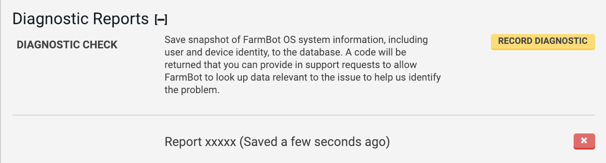

If you have been requested by a FarmBot staff person to create a **diagnostic report**, here is how to do it:

1. Navigate to the **[device page](https://my.farm.bot/app/device)** of the web app.
2. In the **device widget**, open up the **diagnostic reports** panel.
3. Click Record Diagnostic

This will create a snapshot of your FarmBot's system information (including user and device identity) and upload it to the web app's database. The report will then show up in your web browser with a 5-character **report code**, for example: `Report xxxxx`.

If requested, please provide the 5-character report code to a FarmBot staff person so that they may look up relevant data to help identify and fix any issues.

To delete old diagnostic reports, click the X button.
