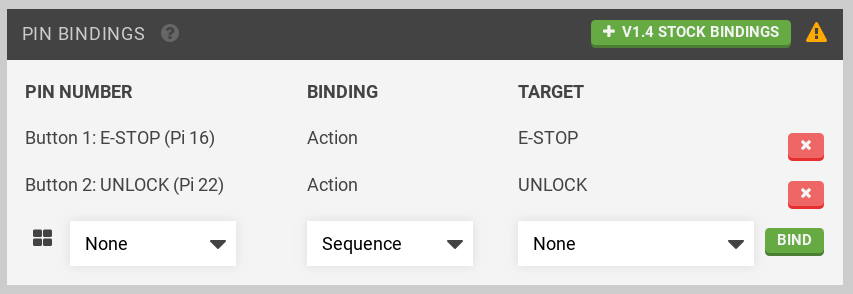
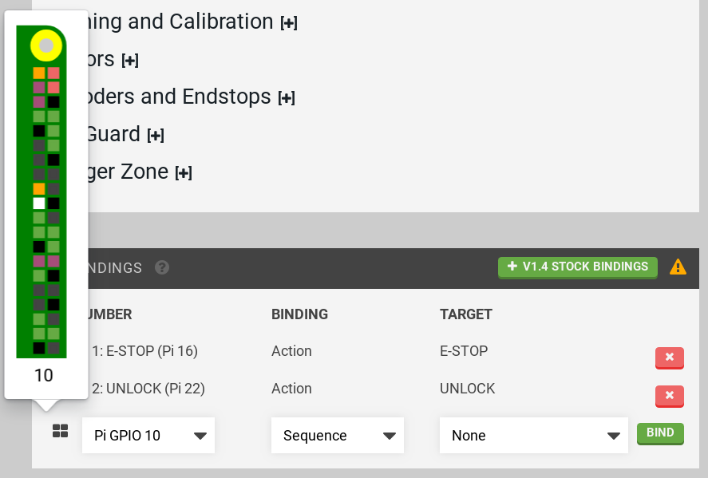
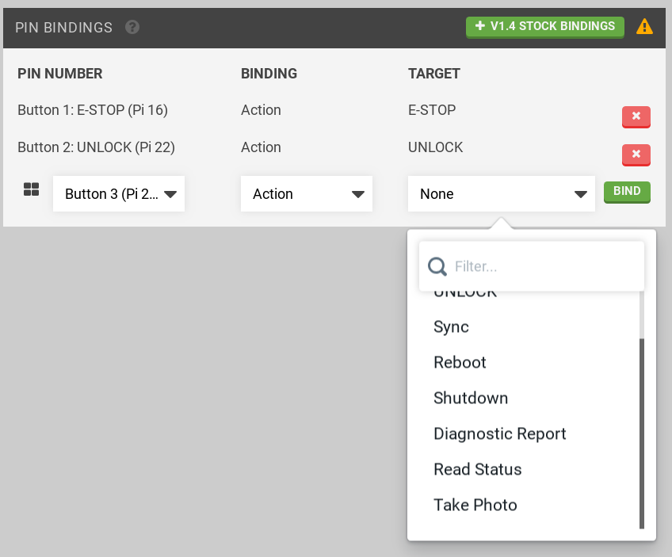

* toc
{:toc}



_v1.4 stock bindings shown_

Set or remove Raspberry Pi GPIO pin bindings to allow start of a sequence or an action by pressing a physical button (or by motion sensor output).

Select a Raspberry Pi GPIO pin number (open the GPIO diagram for assistance as shown below by pressing the  icon) and select a sequence in the drop down menu.

Alternatively, select an action:

When done press BIND to save the binding.

**Notes:**
 * Sequences must be synced to the device before use in a pin binding.
 * Buttons should be connected between the selected pin and +3.3v.
