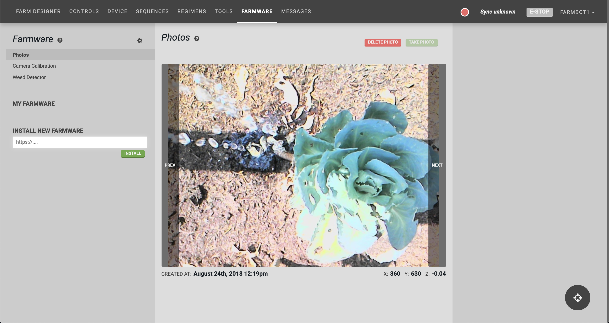

* toc
{:toc}

Farmware is our plugin system that allows for 3rd party developers to add custom functionality to FarmBot OS. Once a Farmware has been installed onto the FarmBot, it will show up in the list on the left side of the **Farmware page**. Selecting a Farmware from this list will load its options and controls into the middle column, as well as additional information in the right side column when available.

# Installing farmware

To install new Farmware, use the **INSTALL NEW FARMWARE** form in the left column. Installation is performed by entering the URL of the `manifest.json` file for the Farmware.

# Running farmware

Run a Farmware by selecting it from the list and using the buttons provided.

You can also run Farmware systematically by using the Run Farmware sequence command in your sequences.

# Advanced options

Press the  icon to open the Farmware advanced menu. To show first-party Farmware (pre-installed Farmware) in the Farmware list, enable the **SHOW IN LIST** setting. If a pre-installed Farmware is accidentally deleted, press the **REINSTALL** <i class='fa fa-download'></i> button.



# What's next?

 * [Take Photo](../Web-App/farmware/take-photo.md)
 * [Camera Calibration](../Web-App/farmware/camera-calibration.md)
 * [Weed Detection](../Web-App/farmware/weed-detection.md)
