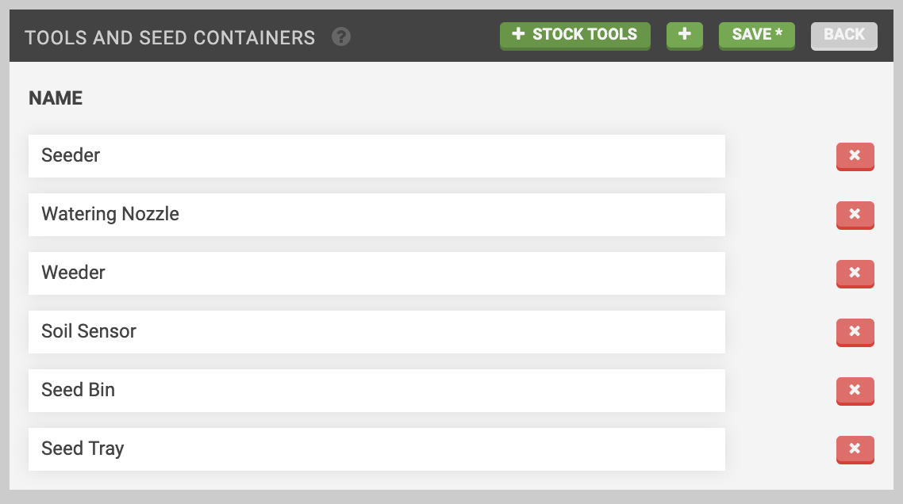

* toc
{:toc}

On the **tools page** you can manage all of your FarmBot's **tools**, **seed containers**, and **tool slots**.

<iframe class="embedly-embed" src="//cdn.embedly.com/widgets/media.html?src=https%3A%2F%2Fwww.youtube.com%2Fembed%2Fvideoseries%3Flist%3DPLMhsMRlKjcNIYlDKDdKvPQuHqBjjS1ZGc&url=http%3A%2F%2Fwww.youtube.com%2Fwatch%3Fv%3DIcOyf28YJNk&image=https%3A%2F%2Fi.ytimg.com%2Fvi%2FIcOyf28YJNk%2Fhqdefault.jpg&key=f2aa6fc3595946d0afc3d76cbbd25dc3&type=text%2Fhtml&schema=youtube" width="854" height="480" scrolling="no" frameborder="0" allowfullscreen></iframe>

# Creating tools and seed containers

To create a new tool or seed container, press edit and then the <i class='fa fa-plus'></i> button. Provide a Name to define the tool or seed container. Alternatively, press <i class='fa fa-plus'></i> STOCK TOOLS to add all of the standard tools and seed containers.

When finished editing, press SAVE.

# Deleting tools and seed containers
To delete a tool or seed container, press edit and then the <i class='fa fa-times'></i> button for the item you wish to delete. Finish editing by pressing back.



# What's next?

 * [Tool Slots](tools/tool-slots.md)
