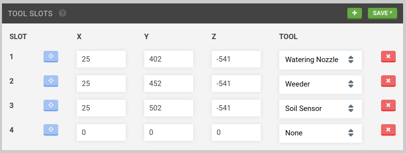
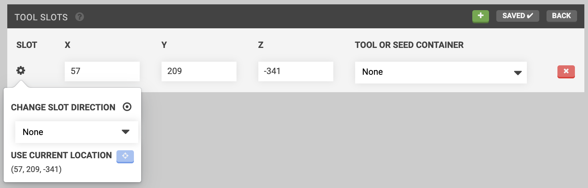
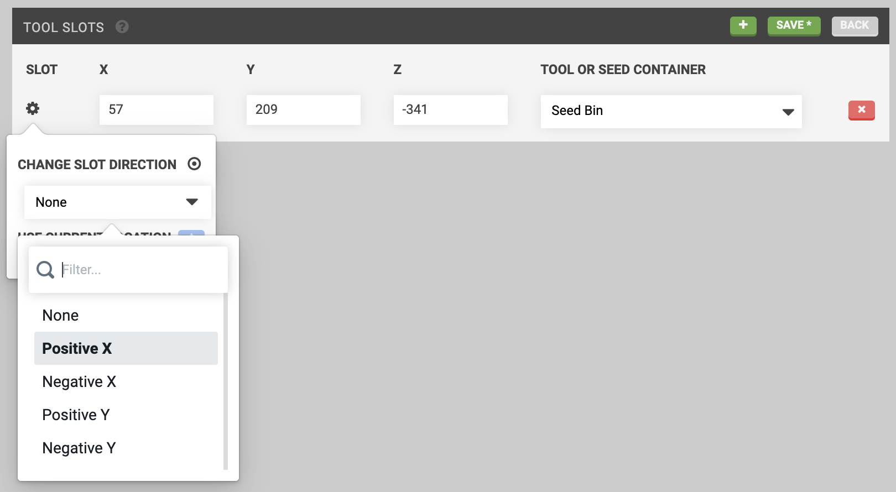
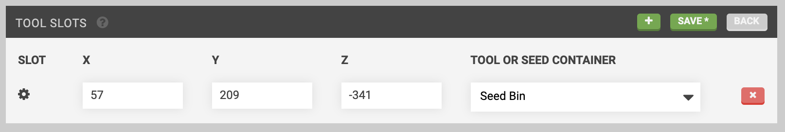
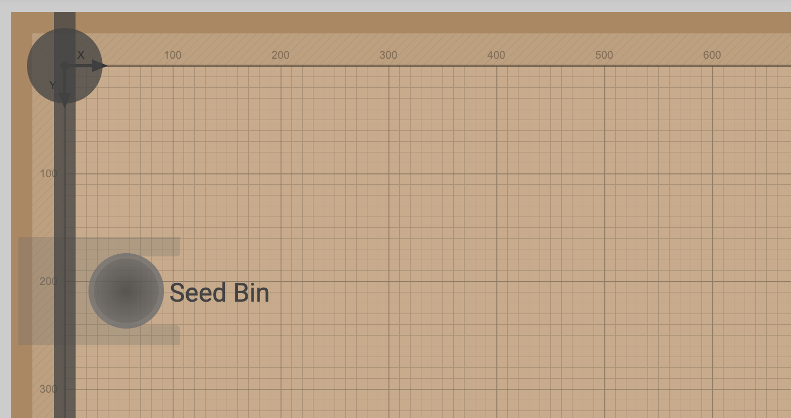

* toc
{:toc}

Once you've added all of your tools and seed containers, its time to load some or all of them into **tool slots**. Tool slots are locations within FarmBot's coordinate system that can hold a **tool** or **seed container**.

# Creating tool slots
To create a new tool slot, press edit and then the <i class='fa fa-plus'></i> button.

Next, provide **coordinates** for the tool slot.
  * _If you plan to load an **interchangeable tool** into the slot:_ Use coordinates for when FarmBot's UTM will fully mount the tool while it is still in the slot.
  * _If you plan to load a **seed container** into the slot:_ Use coordinates for when FarmBot's seed injector needle will be positioned to pick up a seed from the container.

To input accurate coordinates, use the manual controls to move FarmBot into the desired position (mounting the tool or picking up a seed). Then click **USE CURRENT LOCATION** <i class='fa fa-crosshairs'></i> in the slot's <i class='fa fa-gear'></i> menu to copy FarmBot's current coordinates into the **X**, **Y**, and **Z** input fields.

## Changing the slot direction
Most tool slots have a **slot direction**, which is the direction that the tool or seed container must be loaded and unloaded from. To specify a tool slot's direction, use the **CHANGE SLOT DIRECTION** dropdown located in the slot's <i class='fa fa-gear'></i> menu.



# Loading tool slots
Select a tool or seed container from the **TOOL OR SEED CONTAINER** dropdown to load it into the slot.

Press save when you are finished adding, editing, and loading tool slots.

**IMPORTANT:** Now that you have virtually loaded your tool slots, you must also load the **real** tools and/or seed containers into the **real** tool slots to match your **virtual** configuration. If you do not do this, FarmBot may perform undesirably. And don't forget: if you change things up in real life (remove a seed bin, for example), you must come back to this page in the app to update the virtual configuration to match.



# Viewing tools and tool slots in the farm designer
Once you are finished creating tool slots and loading them with tools and/or seed containers, navigate to the farm designer to view them on the map. Hovering over a tool will display its name, and clicking it will navigate you back to the tools page.

# Deleting tool slots
To delete a tool slot, press edit and then the <i class='fa fa-times'></i> button for the slot you wish to delete. Finish editing by pressing back.
