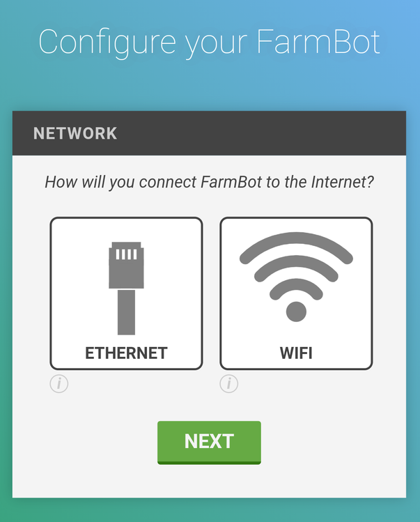
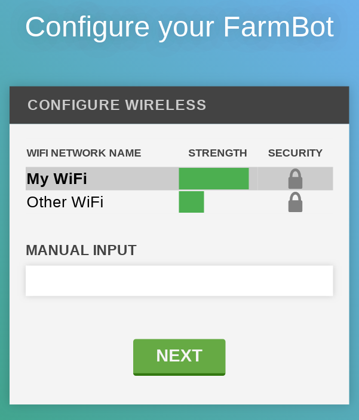
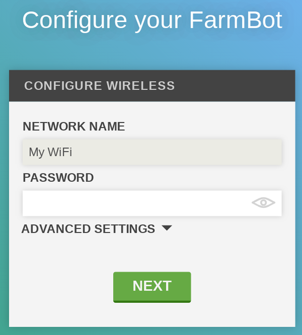
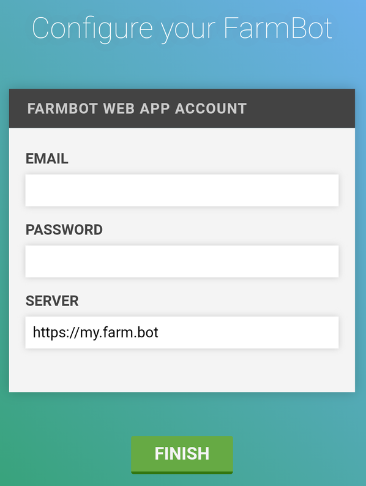

* toc
{:toc}

{%
include callout.html
type="info"
title="Configuration requires a web app account"
content="To complete configuration, you must have a **verified web app account**. See instructions for creating and verifying an account [here](../../Web-App/the-farmbot-web-app/creating-an-account.md).

We also recommend [choosing a FarmBot model](../../Web-App/the-farmbot-web-app/creating-an-account.md#choose-your-farmbot) from the message center before starting configuration. This will set the correct firmware version in your web app account, allowing FarmBot to fully initialize when it connects."
%}

**Configurator** is a piece of software built into **FarmBot OS** that makes it easy to connect your FarmBot to a **WiFi network** and your **web app account**.

When FarmBot boots up, it will automatically start up Configurator. Configurator will check for configuration data. Initially, there will not be any configuration data, so FarmBot will not be able to connect to your home WiFi network or your web app account. In this case, Configurator will create its own WiFi network named `farmbot-xxxx`. Use this WiFi network to provide FarmBot with the information it needs by using the step-by-step instructions below.

<iframe class="embedly-embed" src="//cdn.embedly.com/widgets/media.html?url=http%3A%2F%2Fwww.youtube.com%2Fwatch%3Fv%3DAOsF17Yxoi4&src=http%3A%2F%2Fwww.youtube.com%2Fembed%2FAOsF17Yxoi4%3Fstart%3D59&type=text%2Fhtml&key=f2aa6fc3595946d0afc3d76cbbd25dc3&schema=youtube" width="854" height="480" scrolling="no" frameborder="0" allow="autoplay; fullscreen" allowfullscreen="true"></iframe>

# Step 1: Connect to Configurator
1. Using your phone or laptop, connect to the `farmbot-xxxx` WiFi network.
2. Once connected, a laptop computer should automatically open up a **captive portal** with the configuration utility. You might be familiar with this experience from using WiFi at an airport, hotel, or cafe. If you're using a smartphone, you may need to click a notification once you're connected to the FarmBot network to open up the captive portal.





# Step 2: Choose a network type
Select **ETHERNET** for wired connections and **WIFI** for wireless connections by pressing the corresponding icon.



## WiFi connections
If you're connecting FarmBot with WiFi, select the **network name** (SSID) of the WiFi network you would like your FarmBot to normally connect to (for example, your home WiFi network). Alternatively, enter the name of the WiFi network into the manual input box. Then press NEXT.

Now enter the Password for the WiFi network and press NEXT. For other network settings such as DNS or IP assignment, press **ADVANCED SETTINGS** <i class='fa fa-caret-down'></i>

## Ethernet connections
There are not any required settings for ethernet connections, though if you need to input additional network configuration such as DNS or IP assignment, press **ADVANCED SETTINGS** <i class='fa fa-caret-down'></i>. Otherwise, press NEXT.

# Step 3: Enter your web app credentials
Enter the Email and Password you used when creating your web app account. Then press NEXT.

Remember: you must already have a **verified web app account** in order for the FarmBot to connect to the web app. See instructions for creating and verifying an account [here](../../Web-App/the-farmbot-web-app/creating-an-account.md).



# Step 4: Submit configuration
Press FINISH. FarmBot OS will now attempt to connect to the WiFi network and Web App account provided. This will terminate the connection between your smartphone or laptop and FarmBot OS, so you can now close the captive portal or web browser tab that you were using to complete the configuration process.

# Step 5: Check to see if FarmBot is online
* Use your phone, tablet, or laptop to connect to your home WiFi network.
* Navigate to [my.farm.bot](https://my.farm.bot) and watch the status ticker to see when FarmBot comes online and begins sending messages. This should happen within 2 minutes of completing configuration.
* Once FarmBot is initialized, try pressing one of the manual movement arrow buttons. You should see FarmBot responding to your commands and sending back messages.

{%
include callout.html
type="success"
title="Make sure you've chosen your FarmBot model"
content="If you haven't yet [selected a FarmBot model](../../Web-App/the-farmbot-web-app/creating-an-account.md#choose-your-farmbot) from the message center, then FarmBot will not know which firmware version to flash to the microcontroller. This will result in all movement commands failing. If this happens, make sure you choose a FarmBot model, or manually select a firmware option from the Device page and it will be flashed to the microcontroller."
%}

If there is a problem with the configuration, such as an incorrect password, then the Configurator program will restart and you will see the `farmbot-xxxx` WiFi network again. If this happens, try configuring again or consult the [troubleshooting guides](../../FarmBot-Software/troubleshooting.md).
