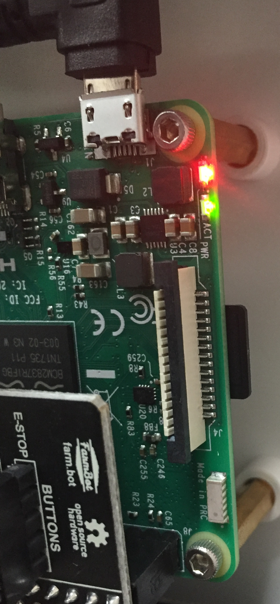

* toc
{:toc}

The Raspberry Pi has two LED lights that convey information about its status.

# Red (power) LED

|Red (power)                   |Status                        |Tips                          |
|------------------------------|------------------------------|------------------------------|
| (solid red)|OK                            |Good to go!
| (blinking red)|Low power                     |Try a more powerful power supply or a different cable.
|  (off)|No power / low power          |Plug in to a 5V, 3A power supply.

# Green (activity) LED

|Green (activity)              |Status                        |Tips                          |
|------------------------------|------------------------------|------------------------------|
| (solid green)|Busy                          |Working/booting
| (blinking randomly)|Busy                          |Working/booting
| (blinking consistently)|Network disconnected or emergency stopped|[Configure FarmBot](../farmbot-os/configurator.md), press UNLOCK in the Web App, or check that the network FarmBot is connected to is online.
| (off)|Ready                         |Waiting for the next task

# Electronics Box LEDs

In addition to the LEDs located on the Raspberry Pi, Genesis v1.4+ kits feature LEDs mounted on top of the electronics box.

## LED 1
This green LED indicates the **sync status** between FarmBot and the web app. It is connected to Raspberry Pi GPIO BCM pin 24.

|Green (sync)                  |Status                        |Tips                          |
|------------------------------|------------------------------|------------------------------|
| (solid green)|Synced                        |Ready
| (blinking slowly)|Needs sync                    |Will not execute any unsynced events or sequences
| (blinking quickly)|Syncing                       |
| (off)|Offline                       |Check the connection status LED

## LED 2
This blue LED indicates the **connection status** between FarmBot and the internet and web app. It is connected to Raspberry Pi GPIO BCM pin 25.

|Blue (connection)             |Status                        |Tips                          |
|------------------------------|------------------------------|------------------------------|
| (solid blue)|Connected                     |Working
| (blinking slowly)|Needs configuration           |[Configure FarmBot](../farmbot-os/configurator.md), press UNLOCK in the Web App, or check that the network FarmBot is connected to is online.
| (off)|Offline                       |Check your internet connection.  If you are connected to the internet but the Blue LED is off, one or more of your ports may be blocked. Get your network administrator to check the ports listed in the [Firewall is blocking network traffic](https://software.farm.bot/docs/connecting-farmbot-to-the-web-app#section-6-firewall-is-blocking-network-traffic) troubleshooting section.

## LED 3
This white LED is user controllable via the Control Peripheral sequence command. It is connected to Raspberry Pi GPIO BCM pin 12.

## LED 4
This white LED is user controllable via the Control Peripheral sequence command. It is connected to Raspberry Pi GPIO BCM pin 13.

## Button 1 LED
This red LED indicates if FarmBot is **E-STOPPED** or not. It is connected to Raspberry Pi GPIO BCM pin 17.

|Red (E-stop)                  |Status                        |Tips                          |
|------------------------------|------------------------------|------------------------------|
| (solid red)|Unlocked                      |Ready
| (off)|Locked                        |Check the Button 2 LED status

## Button 2 LED
This yellow LED indicates if FarmBot is **UNLOCKED** or not. It is connected to Raspberry Pi GPIO BCM pin 23.

|Yellow (unlock)               |Status                        |Tips                          |
|------------------------------|------------------------------|------------------------------|
| (blinking)|Locked                        |When safe to do so, press this button to unlock FarmBot.
| (off)|Unlocked                      |Ready

