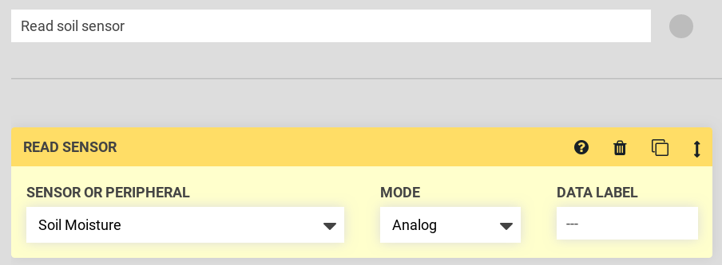
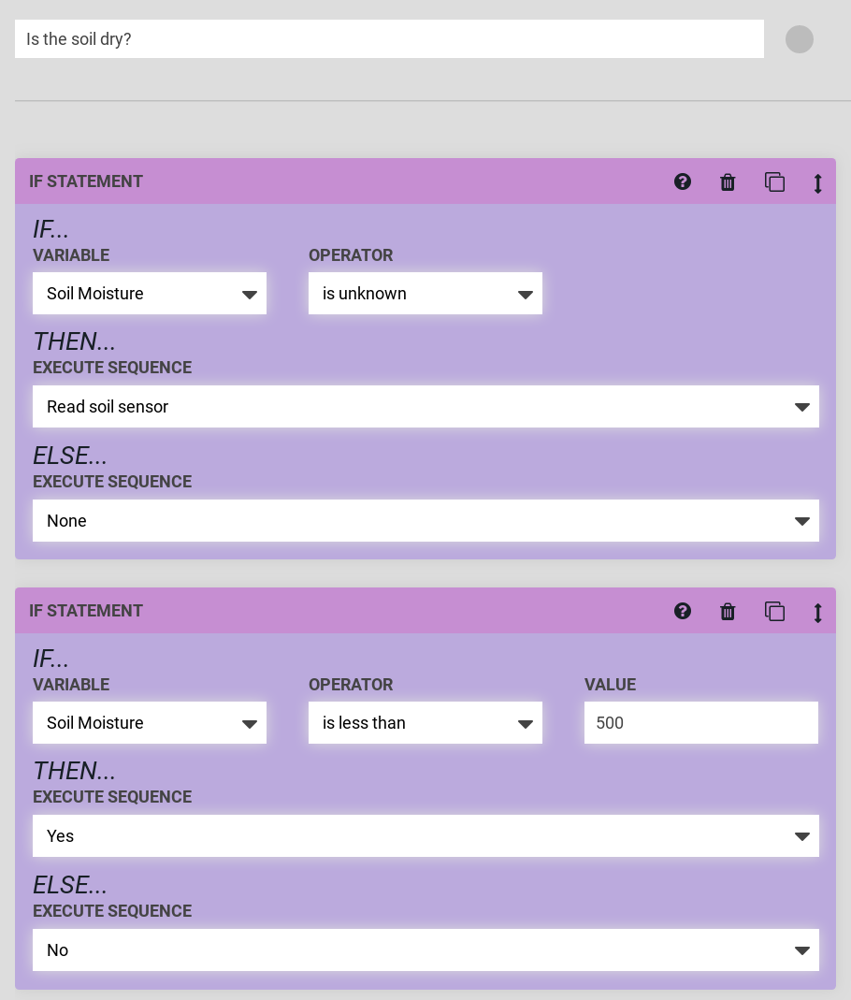

* toc
{:toc}





The soil sensor can be read in a similar fashion to the [tool verification pin](../how-do-i/verify-a-tool-has-been-mounted.md). This time, we will use the `Soil Moisture` sensor (pin 59, UTM pin **D**) in analog pin mode.

As before, a log message will be sent with the pin value. The value for the soil sensor will be about 250 in dry soil (or no soil), and about 850 in very wet soil (or water). You should verify these values for your soil sensor, and determine the value threshold at which you consider your soil to be dry by reading the value in soil areas with different moisture levels.

After you have calibrated your soil sensor, you can use the threshold you have determined to perform actions, such as water, using the If Statement as shown in the [previous section](../how-do-i/verify-a-tool-has-been-mounted.md).

