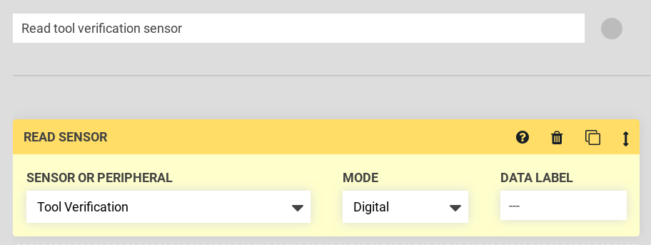
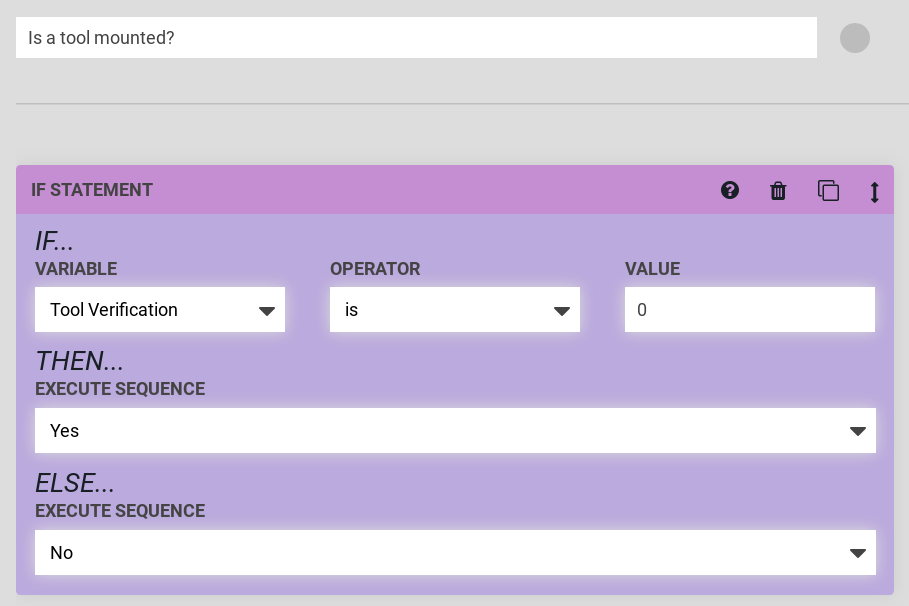
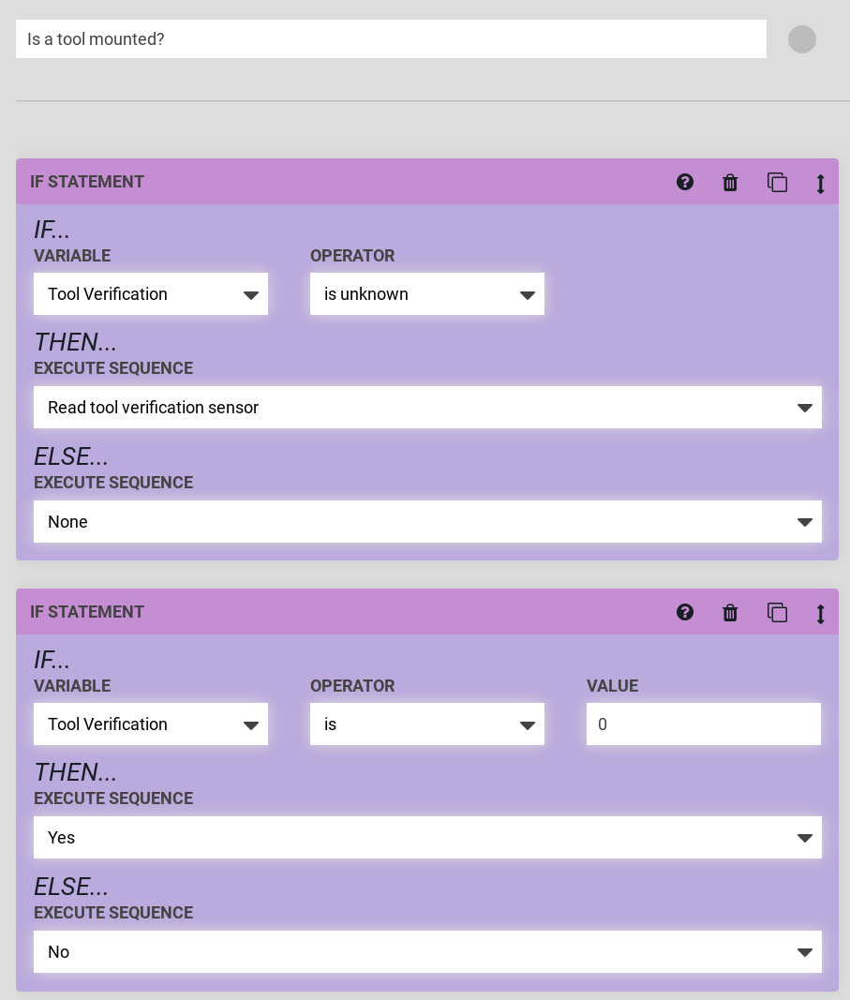

* toc
{:toc}





# Verify a tool has been mounted

FarmBot can determine if a tool is mounted to the [Universal Tool Mount](https://genesis.farm.bot/docs/utm) by reading the value of the `Tool Verification` sensor. The sensor is attached to UTM pin **C**, which is connected to digital input pin D63.

Using the sequence builder, you can read this sensor using a Read Sensor command on the `Tool Verification` sensor (pin 63) in digital mode.

When executed, a message will appear in the log with the pin value, `Tool Verification is 0` or `Tool Verification is 1`. The Farmbot firmware uses pull-up resistors for all input pins, so a value of `0` means that a tool is connected (pin D63 / UTM pin **C** is connected through the tool pin jumper to UTM pin **B** / ground) and a value of `1` means no tool is connected (pin D63 not connected to ground--UTM pins **B** and **C** are not connected together).

However, usually we will want to check if a tool is mounted before performing an action. We can use the If Statement for this purpose.

`Yes` and `No` in the example are sequences that send a message ("Yes" or "No"), but in practice you may want to perform an action with a tool instead of `Yes` and do nothing instead of `No`.

If the pin has not yet been read, the sequence above will error because the pin value is unknown. We can add another If Statement step before the value check as shown below. `Read tool verification sensor` is a sequence consisting of a Read Sensor command, as shown in the beginning of this section.

