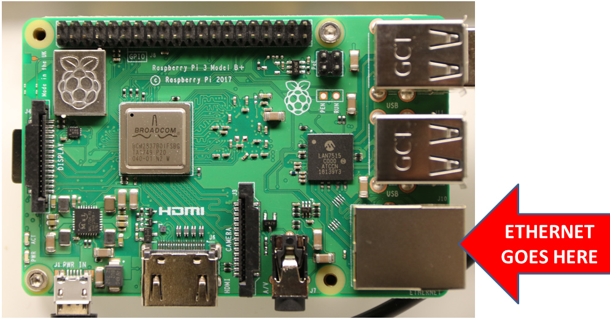

* toc
{:toc}

Your FarmBot needs to be connected to the internet and your device through the Web App. The connectivity popup should show a `code 31` diagnosis code which means that all the communications points are functional. A `code 31` means the nodes are communicating correctly and the points on the graphic should show green. Follow this troubleshooting guide if you are having trouble getting full connectivity to your FarmBot.

# 1. Use the connectivity tool
The connectivity tool is used to diagnose the communications within the FarmBot. To learn more about the Connectivity tool and to get access to the full list of connectivity codes check out this page: [Connectivity Diagnosis Codes](connectivity-codes.md)

# 2. Check your network for blocked ports

The most common issue preventing FarmBot communication is blocked ports.

For schools and corporate networks it is very common for the IT department to block ports that are not commonly used. Just because the FarmBot is connected to the internet doesn't mean the FarmBot will connect to the Web App because of these blocked ports. We have [specific instructions for your IT department](for-it-security-professionals.md) to help you connect your FarmBot to the internet if you suspect any ports are blocked.

FarmBot requires the following ports to be open on your network:

  * PORT: 5672 AMQP
  * PORT: 80 HTTP(S)
  * PORT: 443 HTTP(S)
  * PORT: 3002 WebSockets

On FarmBot Genesis v1.4 check the Blue LED communication light. You have blocked ports if the Blue LED is OFF and the Green LED is ON. (Only FarmBot Genesis v1.4 models have this diagnostic Green and Blue LEDs)



# 3. Use a wired Ethernet connection

The best and most reliable way to connect FarmBot to the internet is with a wired Ethernet connection. Simply connect an Ethernet cable between the Raspberry Pi and your router.

# 4. Use a Wi-Fi range extender

There are multiple ways users can use a Wi-Fi range extender and these are a few ideas that we have:
1) Use the Wi-Fi extender to extend the Wi-Fi network coverage so that the FarmBot can connect over Wi-Fi with a stronger signal. Sometimes the Wi-Fi signal needs some help and the Wi-Fi range extender will lend a hand to boost your Wi-Fi.

2) Use both the range extender and an Ethernet cord to plug into the Raspberry Pi on the FarmBot. This will work in case it is infeasible to run an Ethernet cord from the primary router all the way to the FarmBot.

There are many Range extender’s and Repeaters on the market and this one is just an example:

_Netgear Universal Wi-Fi Range Extender (WN3000RP)_

There are other resources, documentation and diagnostic Wi-Fi Apps available online to help with poor Wi-Fi signal. Check out this page by Netgear on [Wi-Fi Range Extenders](https://www.netgear.co.uk/home/discover/wifi-range-extender/)

# 5. Improve the Raspberry Pi Wi-Fi signal
The most common enemies of the Raspberry Pi Wi-fi are other Wi-Fi networks and other electronic devices. If you are in an area with lots of other heavy duty electrical equipment such as powerlines, transformers, microwaves, fridges, other appliances, radio equipment like baby monitors, or mobile phone towers, it may disrupt the Raspberry Pi Wi-Fi radio.

Here is a link with [more information on how you can improve the Wi-Fi signal](https://www.netspotapp.com/wifi-interference.html).

# Other networking issues

## Does FarmBot expose SSH (secure shell) access?
FarmBot does not expose SSH. The Linux distribution that FarmBot uses does not offer any useful utilities for an end user. (IE there is no apt-get, bash, top, init, etc) This is to make FarmBot more robust, secure and to make development easier. Development/debug builds do expose a console on the onboard UART port of the Raspberry Pi. Production builds expose logs on the UART port, but no interactive console.

## Does FarmBot support WPA-EAP (enterprise) networks?
Yes as of version 7.0, FarmBot supports most common implementations of WPA-EAP.
