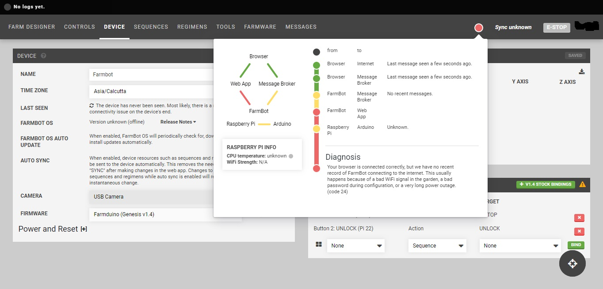
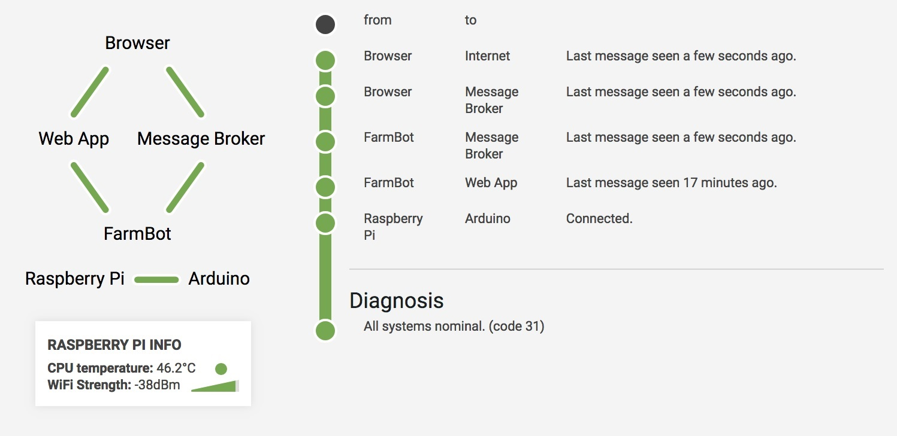

* toc
{:toc}

The connectivity tool is used to diagnose the status of communications between the nodes within the FarmBot. Communication must be established between the Browser, the Web App, Message Broker and the FarmBot. This tool will tell you where the communications are breaking down within the FarmBot system. In order for the FarmBot to operate properly all the points of communication need to be functioning.




|Color                         |Meaning                       |
|------------------------------|------------------------------|
|<span class="fa fa-circle" style="color: #65aa48;opacity: 1"></span> Green|Status OK
|<span class="fa fa-circle" style="color: #ffd500;opacity: 1"></span> Yellow|The status is unknown. There is no data available about the status of communication.
|<span class="fa fa-circle" style="color: #ed6765;opacity: 1"></span> Red|Status NOT OK. Take corrective action to resolve this communication disconnect

This is the list of the 32 possible diagnosis codes that will help you to troubleshoot the communications of your FarmBot:

# Code 0
```
There is no access to FarmBot or the message broker. This is usually caused by outdated browsers (Internet Explorer) or firewalls that block WebSockets on port 3002.
```

**Corrective Action**:

1. Update your internet browser to the most current version. Google Chrome is the preferred FarmBot Web App browser.
2. Check for blocked WebSockets in your firewall on port 3002.
3. Test your WebSockets using this website: https://www.websocket.org/echo.html

Note 1: Please note that we have experienced several difficulties with School firewalls.
In one particular school firewall, the IT department opened port 3002 for FarmBot operation but the port was automatically blocked again after a set timeout.

Note 2: This code will not show up on the blue communications LED. Blocked access to port 3002 will affect the browser rather than the device, so in this case, the "browser <=> broker" leg of the connectivity widget will be RED.

The tricky part is identifying root cause. A red "browser <=> broker" leg is almost always caused by blocked websocket access, but it is also possible that our broker is down.

So to summarize: A red browser<=>broker leg almost always means a port is blocked (if you discount the possibility of a broker outage, which is extremely rare), but different school networks block the port in different ways.

# Code 1
```
You are either offline, using a web browser that does not support WebSockets, or are behind a firewall that blocks port 3002. Do not attempt to debug FarmBot hardware until you solve this issue first. You will not be able to troubleshoot hardware issues without a reliable browser and internet connection.
```

**Corrective Action**:

1. Check to make sure that your device has an active internet connection.
2. Check to make sure that your internet browser supports WebSockets. FarmBot only supports Google Chrome and Firefox and these browsers both support WebSockets. FarmBot Inc. prefers the users choose chrome for the FarmBot Web App.
3. Check for blocked WebSockets in your firewall on port 3002.
Test your websockets using this website: https://www.websocket.org/echo.html

Note: Please note that we have experienced several difficulties with School firewalls.
In one particular school firewall, the IT department opened port 3002 for FarmBot operation but the port was automatically blocked again after a set timeout.

# Code 2
```
You are either offline, using a web browser that does not support WebSockets, or are behind a firewall that blocks port 3002. Do not attempt to debug FarmBot hardware until you solve this issue first. You will not be able to troubleshoot hardware issues without a reliable browser and internet connection.
```

**Corrective Action**: See [Code 1](#code-1)

# Code 3
```
You are either offline, using a web browser that does not support WebSockets, or are behind a firewall that blocks port 3002. Do not attempt to debug FarmBot hardware until you solve this issue first. You will not be able to troubleshoot hardware issues without a reliable browser and internet connection.
```

**Corrective Action**: See [Code 1](#code-1)

# Code 4
```
You are either offline, using a web browser that does not support WebSockets, or are behind a firewall that blocks port 3002. Do not attempt to debug FarmBot hardware until you solve this issue first. You will not be able to troubleshoot hardware issues without a reliable browser and internet connection.
```

**Corrective Action**: See [Code 1](#code-1)

# Code 5
```
You are either offline, using a web browser that does not support WebSockets, or are behind a firewall that blocks port 3002. Do not attempt to debug FarmBot hardware until you solve this issue first. You will not be able to troubleshoot hardware issues without a reliable browser and internet connection.
```

**Corrective Action**: See [Code 1](#code-1)

# Code 6
```
You are either offline, using a web browser that does not support WebSockets, or are behind a firewall that blocks port 3002. Do not attempt to debug FarmBot hardware until you solve this issue first. You will not be able to troubleshoot hardware issues without a reliable browser and internet connection.
```

**Corrective Action**: See [Code 1](#code-1)

# Code 7
```
You are either offline, using a web browser that does not support WebSockets, or are behind a firewall that blocks port 3002. Do not attempt to debug FarmBot hardware until you solve this issue first. You will not be able to troubleshoot hardware issues without a reliable browser and internet connection.
```

**Corrective Action**: See [Code 1](#code-1)

# Code 8
```
Your browser is connected correctly, but we have no recent record of FarmBot connecting to the internet. This usually happens because of a bad WiFi signal in the garden, a bad password during configuration, or a very long power outage.
```

**Corrective Action**:
1. Check the WiFi signal to the FarmBot. If you are having trouble with your internet connection please connect using an Ethernet cable or see our troubleshooting document for more information: https://software.farm.bot/docs/connecting-farmbot-to-the-internet
2. Judging by your network error code you entered a bad email or password while configurating and the device cannot connect to the server. Check to make sure that you have not entered a bad password during configuration. Also there is a chance that your local network does not allow access to AMQP, NTP and/or https://my.farm.bot.
2.1 AMQP is a blocked port issue (PORT: 5672). Unblock this port to resolve this issue.
2.2 For NTP issues the FarmBot users will see log entries that say "expired certificate" and the logs coming from the device will not have the correct time. If you have this issue contact FarmBot technical support.
2.3 For A user being able to access my.farm.bot from a desktop computer is not the same thing as a FarmBot being able to access my.farm.bot (this is a common error). Also, the WiFi could cut out after the Web App loads. Since it's a single page Web App, it is possible to navigate the site during network outages.

3. Check to make sure that your FarmBot has not been powered off due to a long power outage.
Note: Some older FBOS versions and specific FBOS config settings may result in a factory reset that the user did not anticipate.

# Code 9
```
Your browser is connected correctly, but we have no recent record of FarmBot connecting to the internet. This usually happens because of a bad WiFi signal in the garden, a bad password during configuration, or a very long power outage.
```

**Corrective Action**: See [Code 8](#code-8)

# Code 10
```
FarmBot and the browser are both connected to the internet (or have been recently). Try rebooting FarmBot and refreshing the browser. If the issue persists, something may be preventing FarmBot from accessing the message broker (used to communicate with your web browser in real-time). If you are on a company or school network, a firewall may be blocking port 5672.
```

**Corrective Action**:
1. Try rebooting FarmBot and refreshing the browser.
2. A firewall may be blocking port 5672 check this port so see if it is blocked. If you are a company or a school please have your IT professional review [this document](../troubleshooting/for-it-security-professionals.md).
3. On FarmBot Genesis 1.4 check the Blue LED communication light. You have blocked ports if the Blue LED is OFF and the Green LED is on. (Only FarmBot Genesis v1.4 models have this diagnostic Green and Blue LEDs)
Please review our [troubleshooting document](../troubleshooting/connecting-farmbot-to-the-internet.md).

# Code 11
```
FarmBot and the browser are both connected to the internet (or have been recently). Try rebooting FarmBot and refreshing the browser. If the issue persists, something may be preventing FarmBot from accessing the message broker (used to communicate with your web browser in real-time). If you are on a company or school network, a firewall may be blocking port 5672.
```

**Corrective Action**: See [Code 10](#code-10)

# Code 12
```
Arduino is possibly unplugged. Check the USB cable between the Raspberry Pi and the Arduino. Reboot FarmBot after a reconnection. If the issue persists, reconfiguration of FarmBot OS may be necessary.
```

**Corrective Action**:
1. Check the USB cable between the Raspberry Pi and the Arduino. It may have come loose during operation. It's one of those square peg USB cables, such as the kind you would see on a home ink jet printer. The flat end of the connector is in the RPi and the square connector goes into the Arduino.
Once the USB cable between the Raspberry Pi and the Arduino are reconnected, reboot the  FarmBot.
2. If you still get this code reconfiguration of FarmBot OS may be necessary. This would mean the user needs to hit the "FACTORY RESET" button on the device page https://my.farm.bot/app/device

# Code 13
```
FarmBot and the browser both have internet connectivity, but we haven't seen any activity from FarmBot on the Web App in a while. This could mean that FarmBot has not synced in a while, which might not be a problem. If you are experiencing usability issues, however, it could be a sign of HTTP blockage on FarmBot's local internet connection.
```

**Corrective Action**:
1. Check for HTTP blockage on port 80 HTTP(S) and port 443 HTTP(S).
2. On FarmBot Genesis 1.4 check the Blue LED communication light. You have blocked ports if the Blue LED is OFF and the Green LED is on. (Only FarmBot Genesis v1.4 models have this diagnostic Green and Blue LEDs)

# Code 14
```
Arduino is possibly unplugged. Check the USB cable between the Raspberry Pi and the Arduino. Reboot FarmBot after a reconnection. If the issue persists, reconfiguration of FarmBot OS may be necessary.
```

**Corrective Action**: See [Code 12](#code-12)

# Code 15
```
You are either offline, using a web browser that does not support WebSockets, or are behind a firewall that blocks port 3002. Do not attempt to debug FarmBot hardware until you solve this issue first. You will not be able to troubleshoot hardware issues without a reliable browser and internet connection.
```

**Corrective Action**: See [Code 1](#code-1)

# Code 16
```
You are either offline, using a web browser that does not support WebSockets, or are behind a firewall that blocks port 3002. Do not attempt to debug FarmBot hardware until you solve this issue first. You will not be able to troubleshoot hardware issues without a reliable browser and internet connection.
```

**Corrective Action**: See [Code 1](#code-1)

# Code 17
```
You are either offline, using a web browser that does not support WebSockets, or are behind a firewall that blocks port 3002. Do not attempt to debug FarmBot hardware until you solve this issue first. You will not be able to troubleshoot hardware issues without a reliable browser and internet connection.
```

**Corrective Action**: See [Code 1](#code-1)

# Code 18
```
You are either offline, using a web browser that does not support WebSockets, or are behind a firewall that blocks port 3002. Do not attempt to debug FarmBot hardware until you solve this issue first. You will not be able to troubleshoot hardware issues without a reliable browser and internet connection.
```

**Corrective Action**: See [Code 1](#code-1)

# Code 19
```
You are either offline, using a web browser that does not support WebSockets, or are behind a firewall that blocks port 3002. Do not attempt to debug FarmBot hardware until you solve this issue first. You will not be able to troubleshoot hardware issues without a reliable browser and internet connection.
```

**Corrective Action**: See [Code 1](#code-1)

# Code 20
```
You are either offline, using a web browser that does not support WebSockets, or are behind a firewall that blocks port 3002. Do not attempt to debug FarmBot hardware until you solve this issue first. You will not be able to troubleshoot hardware issues without a reliable browser and internet connection.
```

**Corrective Action**: See [Code 1](#code-1)

# Code 21
```
You are either offline, using a web browser that does not support WebSockets, or are behind a firewall that blocks port 3002. Do not attempt to debug FarmBot hardware until you solve this issue first. You will not be able to troubleshoot hardware issues without a reliable browser and internet connection.
```

**Corrective Action**: See [Code 1](#code-1)

# Code 22
```
You are either offline, using a web browser that does not support WebSockets, or are behind a firewall that blocks port 3002. Do not attempt to debug FarmBot hardware until you solve this issue first. You will not be able to troubleshoot hardware issues without a reliable browser and internet connection.
```

**Corrective Action**: See [Code 1](#code-1)

# Code 23
```
You are either offline, using a web browser that does not support WebSockets, or are behind a firewall that blocks port 3002. Do not attempt to debug FarmBot hardware until you solve this issue first. You will not be able to troubleshoot hardware issues without a reliable browser and internet connection.
```

**Corrective Action**: See [Code 1](#code-1)

# Code 24
```
Your browser is connected correctly, but we have no recent record of FarmBot connecting to the internet. This usually happens because of a bad WiFi signal in the garden, a bad password during configuration, or a very long power outage.
```

**Corrective Action**: See [Code 8](#code-8)

# Code 25
```
Your browser is connected correctly, but we have no recent record of FarmBot connecting to the internet. This usually happens because of a bad WiFi signal in the garden, a bad password during configuration, or a very long power outage.
```

**Corrective Action**: See [Code 8](#code-8)

# Code 26
```
FarmBot and the browser are both connected to the internet (or have been recently). Try rebooting FarmBot and refreshing the browser. If the issue persists, something may be preventing FarmBot from accessing the message broker (used to communicate with your web browser in real-time). If you are on a company or school network, a firewall may be blocking port 5672.
```

**Corrective Action**: See [Code 10](#code-10)

# Code 27
```
FarmBot and the browser are both connected to the internet (or have been recently). Try rebooting FarmBot and refreshing the browser. If the issue persists, something may be preventing FarmBot from accessing the message broker (used to communicate with your web browser in real-time). If you are on a company or school network, a firewall may be blocking port 5672.
```

**Corrective Action**: See [Code 10](#code-10)

# Code 28
```
Arduino is possibly unplugged. Check the USB cable between the Raspberry Pi and the Arduino. Reboot FarmBot after a reconnection. If the issue persists, reconfiguration of FarmBot OS may be necessary.
```

**Corrective Action**: See [Code 12](#code-12)

# Code 29
```
FarmBot and the browser both have internet connectivity, but we haven't seen any activity from FarmBot on the Web App in a while. This could mean that FarmBot has not synced in a while, which might not be a problem. If you are experiencing usability issues, however, it could be a sign of HTTP blockage on FarmBot's local internet connection.
```

**Corrective Action**:
1. Try Syncing the FarmBot
2. Check for HTTP blockage on FarmBot's local internet connection
3.On FarmBot Genesis 1.4 check the Blue LED communication light. You have blocked ports if the Blue LED is OFF and the Green LED is on. (Only FarmBot Genesis v1.4 models have this diagnostic Green and Blue LEDs)

# Code 30
```
Arduino is possibly unplugged. Check the USB cable between the Raspberry Pi and the Arduino. Reboot FarmBot after a reconnection. If the issue persists, reconfiguration of FarmBot OS may be necessary.
```

**Corrective Action**: See [Code 12](#code-12)

# Code 31
```
All systems nominal.
```

**No corrective action required.** All the points of communication are functioning.



