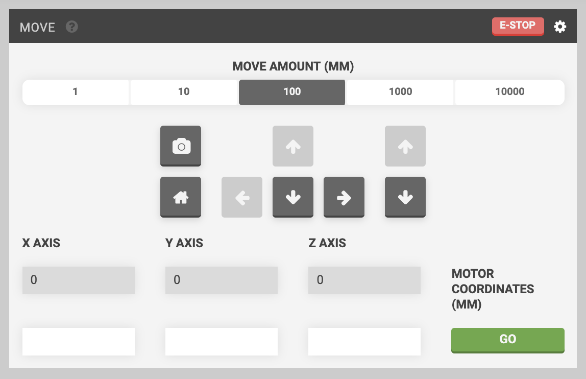
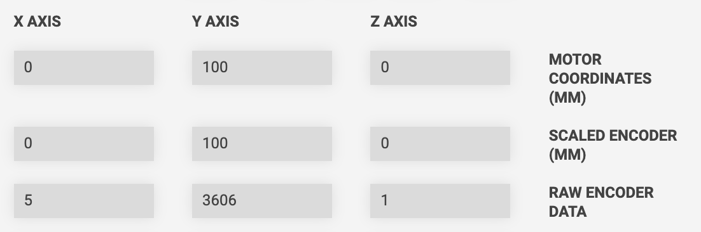
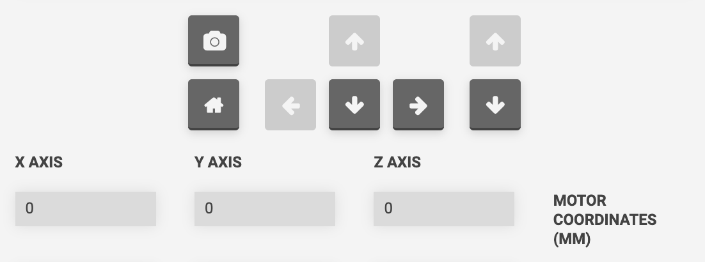
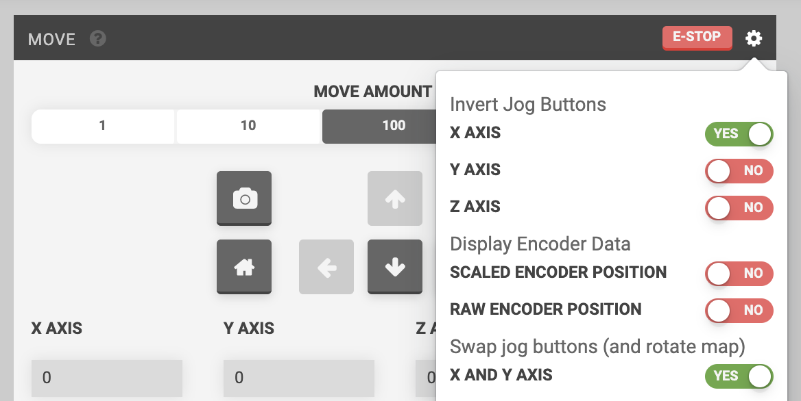
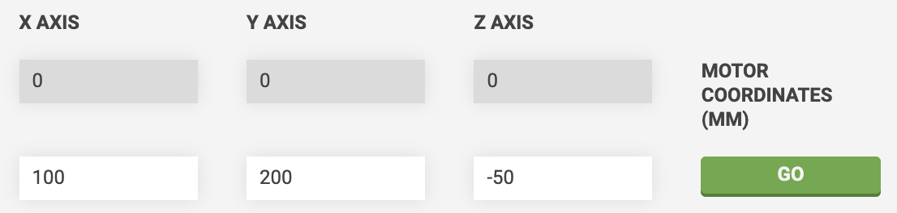

The **MOVE** widget allows you to view FarmBot's current position and manually move it in real-time.

# Viewing the current position
The current position of your FarmBot (**MOTOR COORDINATES (MM)**) is shown in the gray fields directly below the **X-AXIS**, **Y-AXIS**, and **Z-AXIS** labels. This information is updated in real-time.

If you have encoders on your FarmBot, you can also view **SCALED ENCODER (MM)** data, as well as **RAW ENCODER DATA** for each axis. Toggle the display of this additional information from the (cog) menu in the top right of the widget.

# Movements
There are three types of movements you can perform with this widget: **relative movements**, **absolute movements**, and **finding home**.

## Relative movements
Move FarmBot a **relative distance** from the current location in any direction by using the arrow buttons. The default **MOVE AMOUNT** is `100mm`, though you can also select `1`, `10`, `1000`, and `10000mm` amounts.

Depending on your [hardware settings](../device/hardware-settings.md), you may not be able to move to negative coordinates or past the specified axis maximums. When this is true, some arrow buttons may be disabled. In the example below, because FarmBot is at the home position (0, 0, 0), half of the arrow buttons are disabled to allow only movements *away* from the home position and not *through* it.

### Matching the virtual controls to your real-life perspective
Depending on how you usually view your FarmBot, you may need to change which direction each arrow button sends your FarmBot so that the virtual controls match your real-life perspective. For example, if you usually view your FarmBot from the front (looking at the FarmBot logo on the tool head), you would want the <i class='fa fa-arrow-left'></i> button to send FarmBot in the `negative Y` direction. If you usually view your FarmBot from the side with the electronics box, you would want the <i class='fa fa-arrow-left'></i> button to send FarmBot in the `negative X` direction.

You can change the direction along each axis that the arrow buttons send your FarmBot by using the Invert Jog Button toggles in the (cog) menu in the top right of the widget. You can also swap the X and Y axis buttons, which will also rotate the map in the farm designer by 90 degrees.

### Sequence based relative movements
You can also perform relative movements from [sequences](../sequences.md) by using the Move Relative command. For more information, see the [move relative command documentation](../sequences/sequence-commands.md#move-relative).

## Absolute movements
Move FarmBot to an **absolute position** by typing in new coordinates to the white input fields for the **X-AXIS**, **Y-AXIS**, and **Z-AXIS** and then pressing GO. This will instruct FarmBot to move to the new position. Note that FarmBot will operate all axes at once to get to the new position as fast as possible.

If you do not type in a new value for any of the axes, then FarmBot will maintain its current position along that axis and only move the needed axis or axes.

### Sequence based absolute movements
You can also perform absolute movements from [sequences](../sequences.md) by using the Move To command. For more information, see the [move to command documentation](../sequences/sequence-commands.md#move-to).

## Finding home
The <i class='fa fa-home'></i> button will instruct FarmBot to **_find_ the home position** for all axes in the order Z, Y, X. Note that FarmBot must have [home-finding hardware](../../Device/arduino-firmware/stall-detection.md) such as encoders or endstops in order to _find_ the home position.

If you do not have home-finding hardware, you can change the behavior of the <i class='fa fa-home'></i> button to instead instruct FarmBot to **_go to_ the home position**. This will instruct FarmBot to go to `(0, 0, 0)` as though you had used the move absolute input fields. Change the home button behavior by setting the **PERFORM HOMING (FIND HOME)** setting to OFF in the (cog) menu of the widget. Note that the _go to home_ behavior will move all three axes at once.

### Sequence based homing
You can also perform homing from [sequences](../sequences.md) by using the Find Home command. For more information, see the [find home command documentation](../sequences/sequence-commands.md#find-home).

# Other controls
## E-stop
If you ever need to immediately halt your FarmBot, press the E-STOP button in the app's main header. To perform any further movements after e-stopping, you will first need to UNLOCK the device.

## Take photo
The <i class='fa fa-camera'></i> button will take a photo at FarmBot's current location. Photos can be viewed on the [take photo farmware](../farmware/take-photo.md) page.

### Sequence based photo taking
You can also take photos from [sequences](../sequences.md) by using the Take Photo command. For more information, see the [take photo command documentation](../sequences/sequence-commands.md#take-photo).

# What's next?

 * [Peripherals](peripherals.md)
