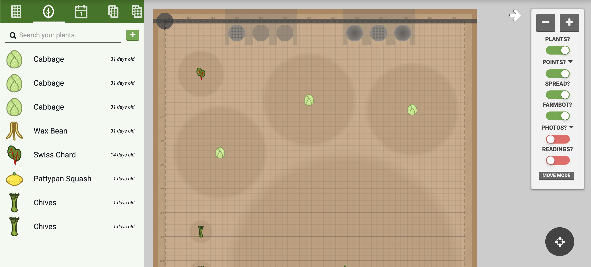
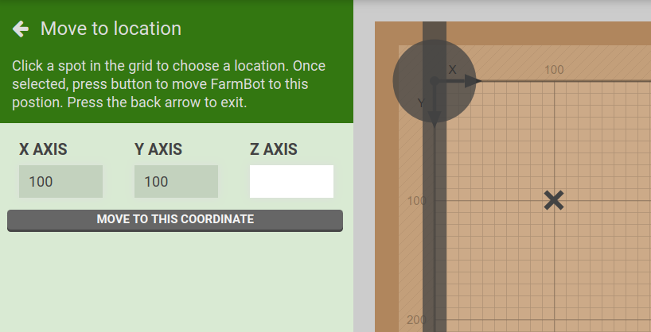
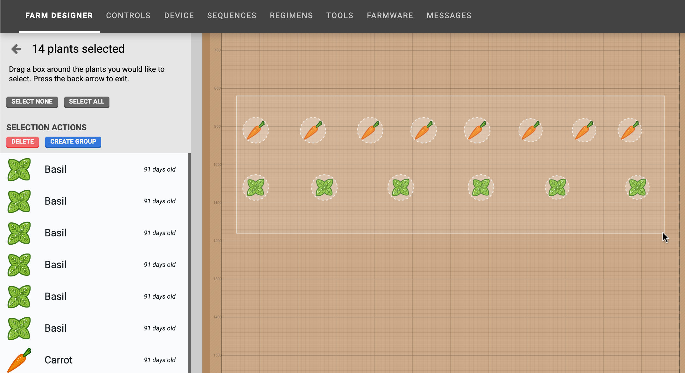
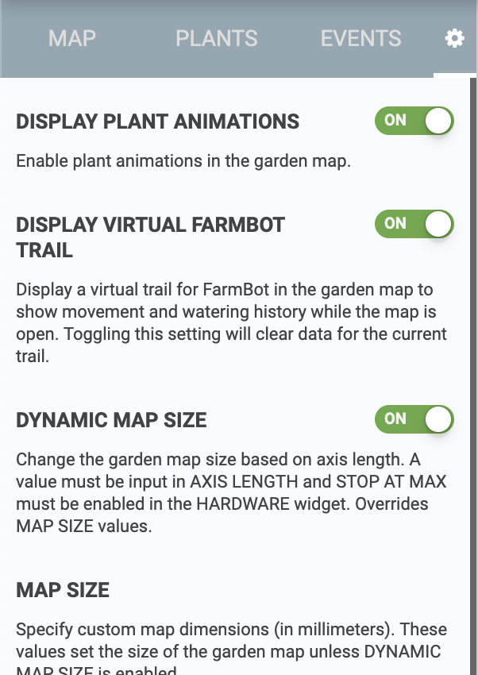

* toc
{:toc}

The **farm designer** allows you to graphically design the layout of your garden, monitor your FarmBot's position, and visualize data such as photos, plant spread, and points.

<iframe class="embedly-embed" src="//cdn.embedly.com/widgets/media.html?src=https%3A%2F%2Fwww.youtube.com%2Fembed%2Fvideoseries%3Flist%3DPLMhsMRlKjcNIYlDKDdKvPQuHqBjjS1ZGc&url=http%3A%2F%2Fwww.youtube.com%2Fwatch%3Fv%3DGVb4fYaqy2M&image=https%3A%2F%2Fi.ytimg.com%2Fvi%2FGVb4fYaqy2M%2Fhqdefault.jpg&key=f2aa6fc3595946d0afc3d76cbbd25dc3&type=text%2Fhtml&schema=youtube" width="854" height="480" scrolling="no" frameborder="0" allowfullscreen></iframe>

# Map menu

Click the white <i class='fa fa-arrow-left'></i> button in the top right of the map to open up the **map menu**. Here you will find <i class='fa fa-minus'></i> and <i class='fa fa-plus'></i> buttons to zoom in and out of the map, as well as a toggles to turn on and off map layers:

* **PLANTS?** will toggle the display of the plant icons
* **POINTS?** will toggle the display of points, such as weeds
* **SPREAD?** will toggle the display of gray spread indicators (spread is an estimate of how much space a plant will need)
* **FARMBOT?** will toggle the display of the virtual FarmBot gantry and tool head, tools, slots, and some tool/peripheral animations
* **PHOTOS?** will toggle the display of photos taken by FarmBot's onboard camera. See [camera calibration](../Web-App/farmware/camera-calibration.md) if photos are not positioned, scaled, or rotated correctly.

# Move to location mode

Pressing the MOVE MODE button in the map menu will enter a **move to location** mode. Click any spot within the map grid to mark it with an <i class='fa fa-times'></i>. Then press MOVE TO THIS COORDINATE to send FarmBot to the selected position. You can optionally enter a new coordinate for the **Z-AXIS**.

# Multi-select mode

To select multiple plants, click anywhere in the map and drag the mouse cursor to create a **box selection**. All plants located within the box will be displayed in the **select plants** panel. You may then click individual plants in the map to add or remove them from the selection.

# Settings

There are a handful of options in the **settings panel** that you can use to customize how the farm designer map is displayed and used. Each setting has a description in the app.

# What's next?

 * [Plants](../Web-App/farm-designer/plants.md)
 * [Groups](../Web-App/farm-designer/groups.md)
 * [Gardens](../Web-App/farm-designer/gardens.md)
 * [Events](../Web-App/farm-designer/events.md)
 * [Points](../Web-App/farm-designer/points.md)
 * [Weeds](../Web-App/farm-designer/weeds.md)
