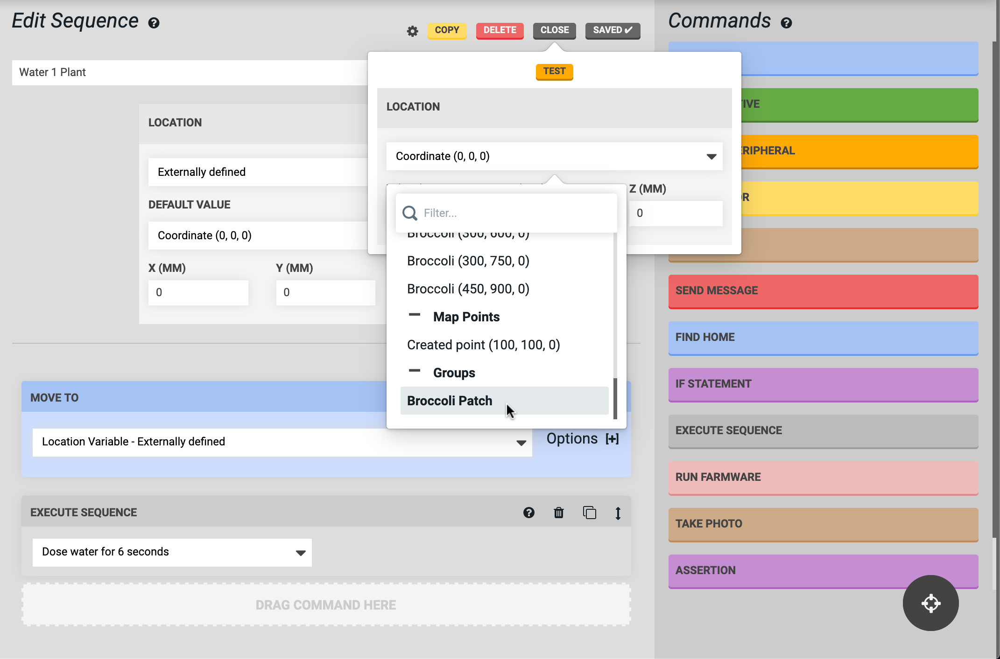

* toc
{:toc}

**Groups** allow you to organize the plants in your garden so you can easily run sequences to perform farming operations on many plants, rather than just individual plants. To create and edit groups, navigate to the **groups panel** on the farm designer page.

# Creating a group
To create a group, click the <i class='fa fa-plus'></i> button on the groups panel. This will open up the [multi-select mode](../../Web-App/farm-designer.md#select-mode) in the farm designer. Click and hold anywhere in the map and then drag the mouse cursor to create a **box selection** of the plants you wish to add to the group. Then click CREATE GROUP.

# Editing a group
Upon creating a group, the **edit group** panel will be opened. From here, you can change the **GROUP NAME** and make further edits. When you are finished editing, press the <i class='fa fa-arrow-left'></i> to save your changes and go back to the list of all groups.

## Sort by
The **SORT BY** method will change the ordering that FarmBot uses when traveling to each plant in the group when the group is used in a sequence. A dashed line will be shown in the map visualizing the path. Sorting options include `X/Y, Ascending`, `X/Y, Descending`, `Y/X, Ascending`, `Y/X, Descending`, and `Random Order`. We encourage you to play around with this option to find the most efficient path FarmBot can take.



## Adding group members
To add a plant to the group, click its icon in the farm designer map.

## Removing group members
To remove a plant from the group, click its icon in the **GROUP MEMBERS** list. When mousing over icons in this list, the corresponding icon in the map will be highlighted, allowing you to ensure you're removing the correct plant.

# Using groups
Once you're happy with your group, try it in a sequence! Simply create a sequence with an [externally defined location variable](../../Web-App/sequences/externally-defined-variables.md):

Then use the TEST button, making sure to select your group:

Once you've verified that FarmBot is operating how you intend, you can run this sequence over your group of plants with an EXECUTE SEQUENCE command in another sequence, or in a regimen, or an event!

# Deleting a group
To delete a group, click the DELETE GROUP button. Note that you cannot delete a group that is in-use by a sequence, regimen, or event.

# What's next?

 * [Gardens](gardens.md)
