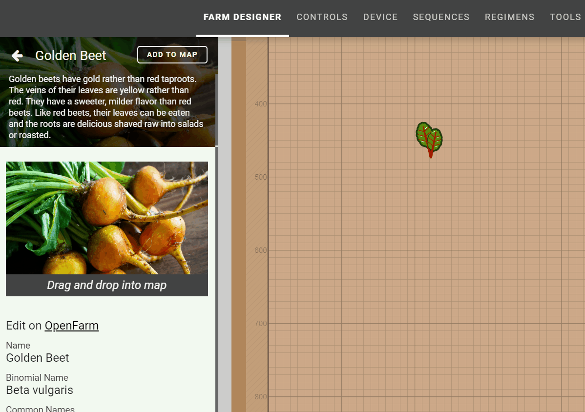
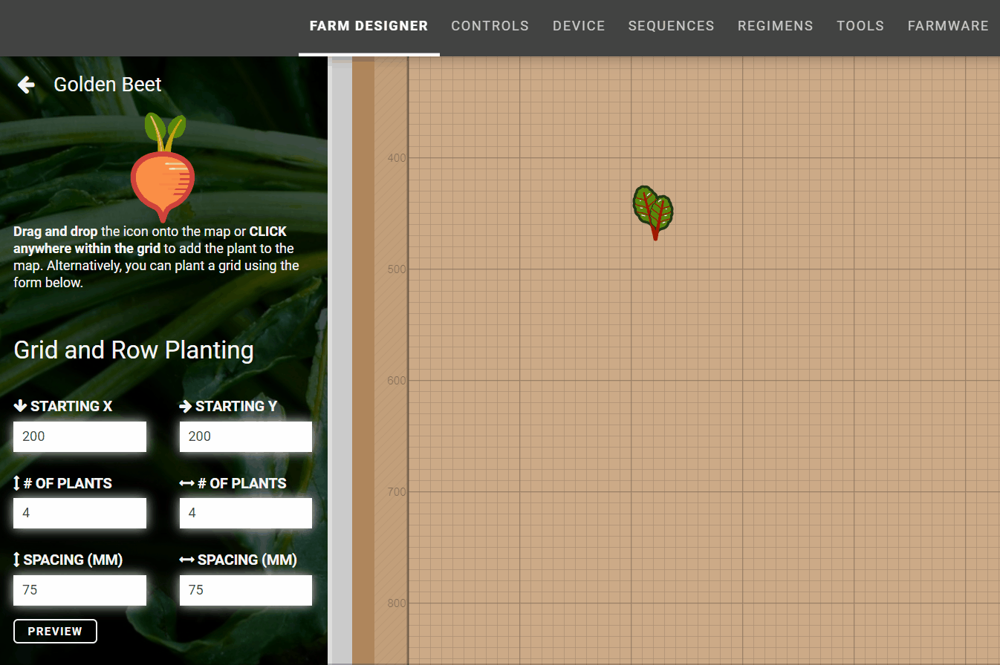
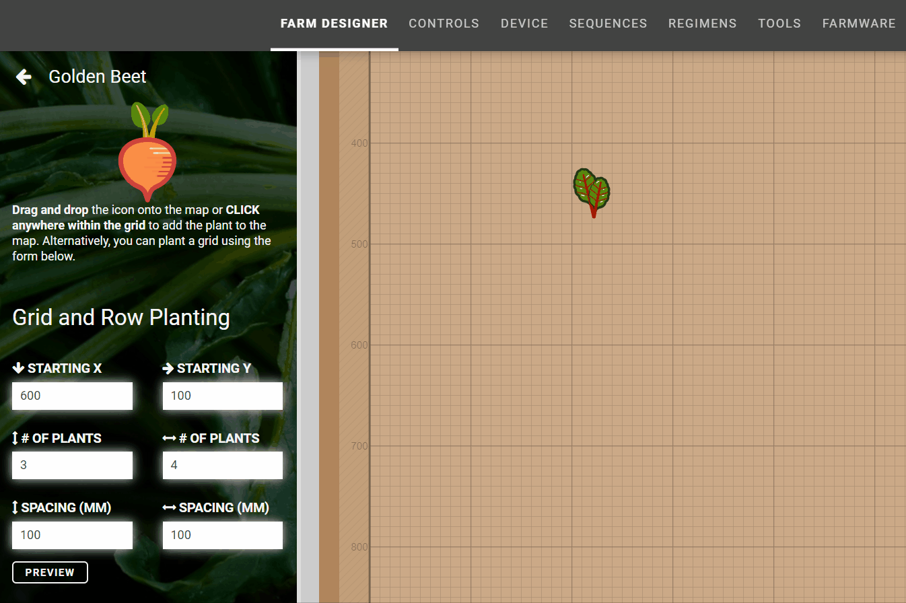
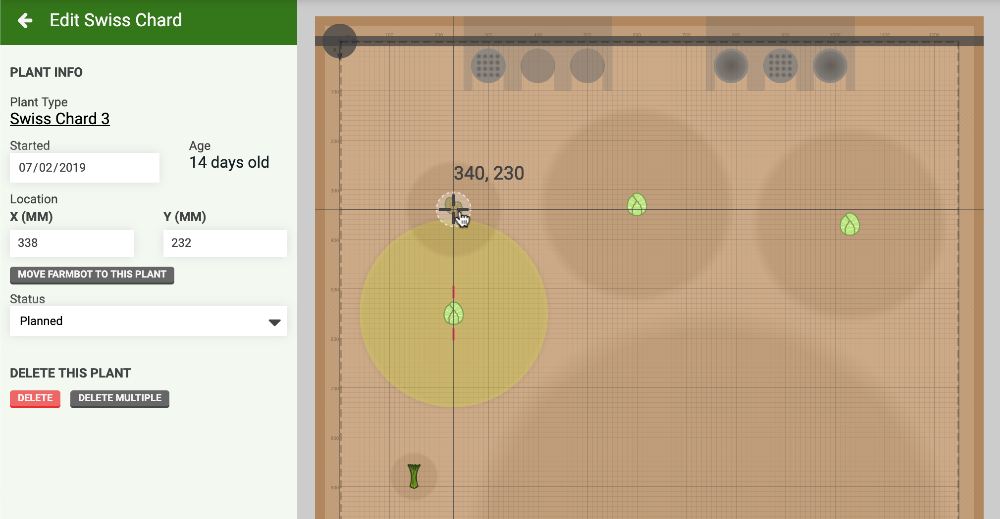

* toc
{:toc}

You can view all of your plants in the **plants panel** list, as well as in the map as a virtual representation of your FarmBot bed.

# Adding plants

To add a plant, click the <i class='fa fa-plus'></i> button in the plants panel. This will bring up the **choose a crop** panel where you can type in the name of the **crop** you would like the add to your garden. We recommend searching for more generic common crop names rather than specific varieties and cultivars, for example, "Mushrooms".

Once you've found the crop that you'd like to add, click it to bring up the **crop details panel**. Here you'll find information (from [OpenFarm](https://openfarm.cc)) about the crop including a brief description, an image, the scientific name, expected spread, spacing suggestions, and more.

From here, there are three methods by which you can add plants to your garden, which we'll discuss in the following subsections.

## Drag and drop
Drag and drop the crop image into the **map** to create a **plant** in your **garden**.



 Alternatively, click the `ADD TO MAP` button and drag and drop the **crop icon** into the map.

## Click to add
Whenever the `ADD TO MAP` panel is open, clicking on the map will add another plant to that location.

## Grid and row planting
From the `ADD TO MAP` panel, use the form to create a **grid** or **row** of plants. Simply specify the starting plant's coordinates, and the number of plants and spacing you want in each direction. Then press `PREVIEW` to preview the grid or row in the map. If you are happy with the results, press `SAVE` to add the plants, otherwise press `CANCEL`.



# Editing plants

To edit a plant, click the plant icon in the map or click the plant item in the plants list panel. This will open the **plant details panel**, allowing you to change plant settings such as when the plant was **started** and its **status**.

To change the plant's location, you can either enter new coordinates in the **X** and **Y** location input fields, or click and drag the plant to a new location in the map. When dragging, visual helpers will appear to help guide plant placement:

 * The current coordinate location will appear as `X, Y`.
 * Cross-hairs will appear to help with grid alignment.
 * Short light red dashes will appear around other plants in the map when they are horizontally or vertically aligned with the current plant.
 * The current plant's spread will appear, along with other plants' spreads if the plants are close by. If the current plant's spread overlaps with another plant's spread, the other plant's spread will turn colors indicating the degree of overlap. Green indicates a nearby plant spread, yellow is slightly overlapping, and red is severely overlapping.

# Deleting plants

To delete a plant, click on it to bring up the plant details panel. Then press the DELETE button. Press the DELETE MULTIPLE button to bring up the **multi-select panel** for deleting multiple plants at once, or taking other actions on the selection.

# What's next?

 * [Groups](../farm-designer/groups.md)
