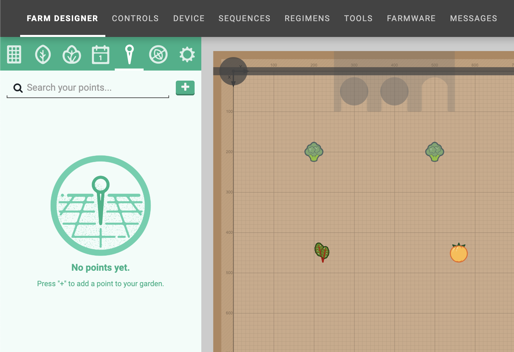
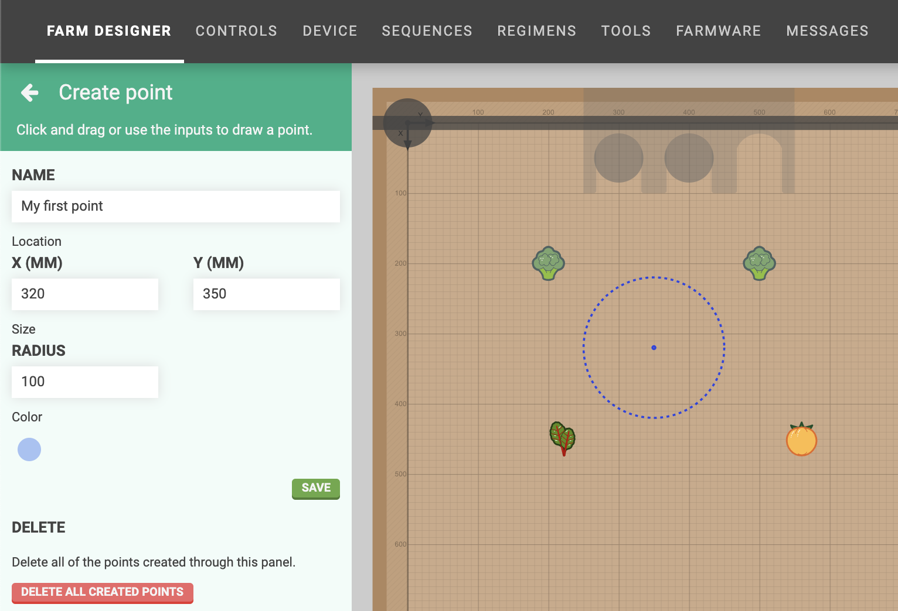
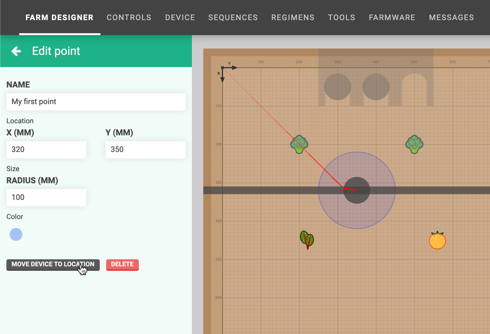
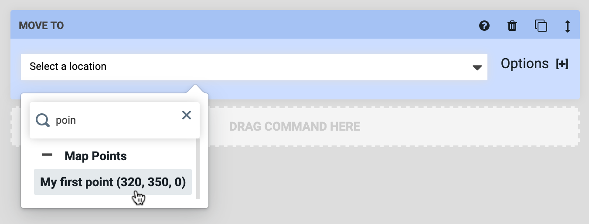

* toc
{:toc}

If you would like to create custom locations in your garden for FarmBot to travel to that are _not_ plants, tool slots, or the home location, you can use **points**. Example uses of the points feature include:

* Points for FarmBot to move to that are out of the way when you're harvesting
* Points in each corner of the bed to serve as alternative "home" positions
* Points for FarmBot to travel to for daily photos

# Adding points
To add a point, click the <i class='fa fa-plus'></i> button in the points panel.

This will open the **create point** panel where you can provide the **name**, **X and Y coordinates**, **radius**, and **color** for the point. You can also click and drag in the map to define the coordinates and radius. Click SAVE to save the point.

# Editing points
To edit a point, click it in the points list or in the map (when the points panel is opened). This will open the **edit point** panel, allowing you to change anything about the point. Changes will be saved when you press the <i class='fa fa-arrow-left'></i> button.

# Moving to a point
There are two ways to move FarmBot to a point. The first way is by clicking MOVE DEVICE TO LOCATION from the edit point panel.

The second way is from sequences. Simply select the point from the dropdown in a Move To command or location variable.

# Deleting points
To delete a point, click on it to open up the edit point panel. Then press the DELETE button.



# What's next?

 * [Weeds](../farm-designer/weeds.md)
