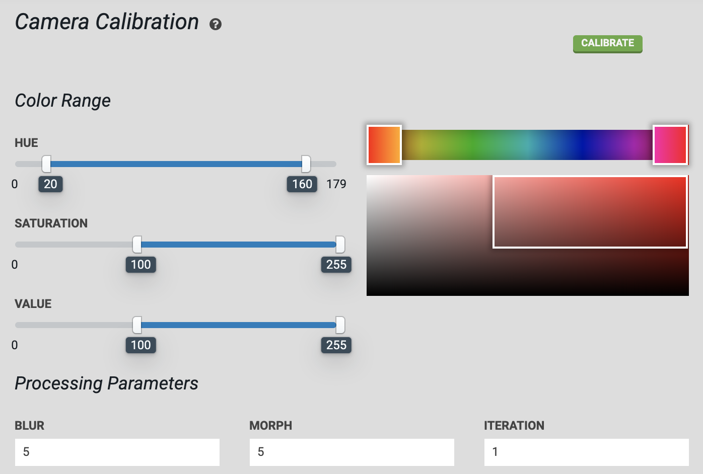
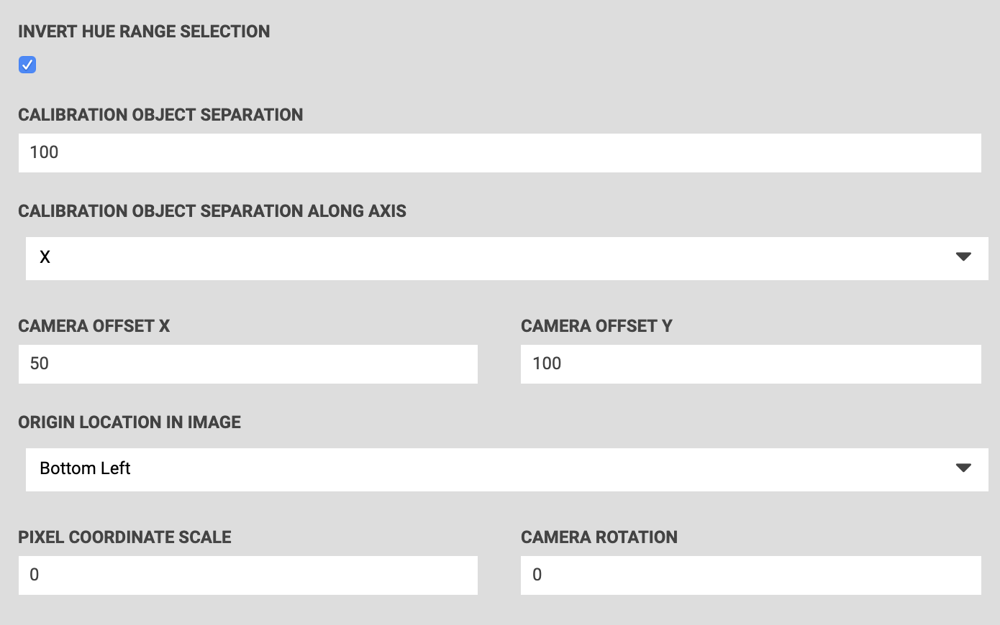

* toc
{:toc}



Camera calibration works by using the distance between and orientation of calibration objects placed in the garden bed. Calibration only needs to be performed once.

# Calibrate the camera

Place two [red objects](https://genesis.farm.bot/docs/miscellaneous#red-markers) on the surface of the soil in your garden bed. The objects should be bright red, and preferably round. They can be placed anywhere in the bed, but they need to be placed *square* with FarmBot's coordinate system and in a location where FarmBot's camera can be moved directly overhead.

Measure the distance from the center of one object to the center of the next. The objects can be separated as far apart as they can while still remaining within the field of view of the camera. `100` to `200`mm is a good starting point. Input the distance in millimeters into the **CALIBRATION OBJECT SEPARATION** field in the **Camera Calibration** settings section.

Select the axis along which the calibration objects are placed. If you placed them in the direction of the tracks, select `X` in the **CALIBRATION OBJECT SEPARATION ALONG AXIS** drop down menu. If you placed them in the direction of the gantry, select `Y`.

For the **ORIGIN LOCATION IN IMAGE** setting, look at a photo you have taken with FarmBot's camera (take one using the [take photo](../farmware/take-photo.md) farmware if you haven't already). Determine which direction home is in the image, and select the corner of the image that corresponds to that direction. It can help to view a photo taken when FarmBot was at home (0, 0, 0). If a corner of the image does not correspond to the origin, try rotating the camera until one does.

The **HUE** color range slider should be set to approximately `20` to `160`, with the **INVERT HUE RANGE SELECTION** checkbox marked. This will select a hue range that includes various shades of red.

Move FarmBot directly over the calibration objects you have placed, and move the z-axis as high as it will go. Press the calibrate button. Once calibration is finished, refresh the page to view the resulting image, as well as the resulting values for **PIXEL COORDINATE SCALE** and **CAMERA ROTATION**.

If more than the two red objects are detected in the image, adjust the **HUE**, **SATURATION**, and **VALUE** parameters until the two red objects are the only objects detected in the image. Detected regions of the image are outlined in green and circled in blue. Each new calibration will replace the previous calibration values.

The scan image button can be used to run camera calibration on an image already taken instead of taking a new photo.

After camera calibration, photos taken of the garden should line up with the grid when shown in the Farm Designer. If locations such as plants appear offset in photos when compared to the corresponding map locations, `CAMERA OFFSET` can be adjusted until they match.



# What's next?

 * [Weed Detection](../farmware/weed-detection.md)
