* toc
{:toc}

Below are descriptions of all the commands you can use in a sequence. When using the web app, hover over the <i class='fa fa-question-circle'></i> icon in the top right of any sequence step to view usage information.

# Move to
The Move To command moves FarmBot to an absolute coordinate position. To use this command, first choose a location from the **LOCATION** dropdown. Options include:

  * Custom coordinates
  * Location variables
  * Tool and seed container locations
  * Plant locations
  * Map points

## Custom coordinates
When choosing the **custom coordinates** option, three input fields will be revealed allowing you to specify the exact X, Y, and Z coordinates you want FarmBot to move to.

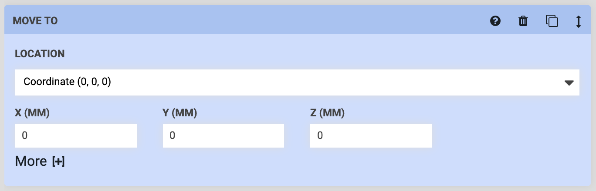

## Location variables
When choosing a **location variable**, a variable form will be added to the sequence header. Upon selecting a variable value in the sequence header, the dropdown selections in all Move To steps set to that variable will be updated. See the [variables](variables.md) documentation for more information.

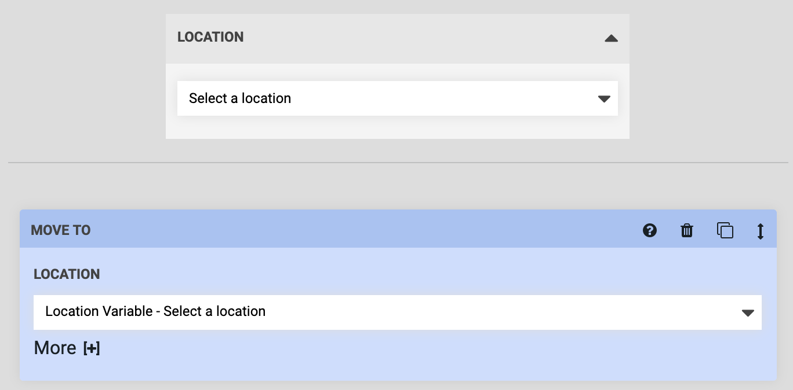

## Other locations
When choosing a tool or seed container location, a plant location, or a map point, those resources will then become _in-use_, meaning that they cannot be deleted until you remove them from your sequence. If you update their coordinates, your sequence steps will be automatically updated.

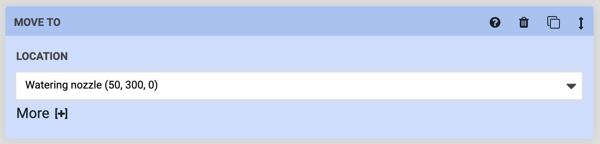

## Advanced options
Within the **More [+]** dropdown, you will find options for adding **offsets** to the location and changing the **speed** at which FarmBot performs this movement. In the example below, an **X-OFFSET** of `100` will pull the Watering Nozzle tool out of the tool slot by 100mm. Meanwhile, the **SPEED (%)** option has been set to `50`, meaning FarmBot will perform this movement at 50% of the maximum speed it normally moves at.

You can add offsets for multiple axes at once, and also use negative offsets. The default values for all offsets are `0`, while the default speed is `100%`. By default, the app will only load the **More [+]** dropdowns in an open state if you've changed any of the offset or speed values from the defaults. If you would like the **More [+]** dropdowns to always load in an open state, enable **OPEN OPTIONS BY DEFAULT** from the <i class='fa fa-gear'></i> menu in the sequence header.

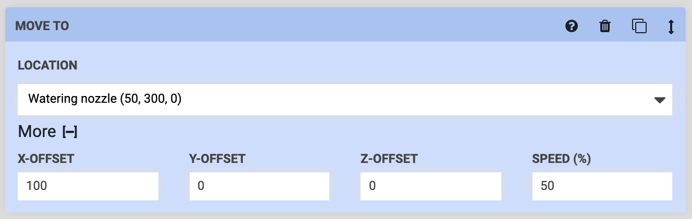

# Move relative
The Move Relative command moves FarmBot a specific distance in any direction, relative from the current position. This is command is best used *after* a Move To command. For example, you could use several Move Relative commands to water in a square *after* the FarmBot has Moved To a plant's location.

You can move relative along multiple axes at once, and in both negative and positive directions. The **SPEED (%)** option allows you to slow down the movement for delicate operations, as a percentage of the maximum speed FarmBot normally moves at.

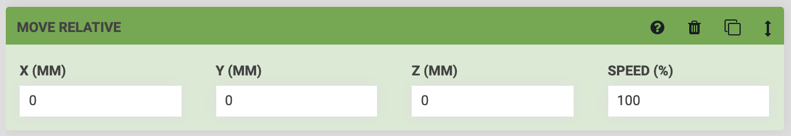

# Control peripheral
The Control Peripheral command allows you to control **peripherals** such as the vacuum pump, solenoid valve, and lights. To use this command, first select a peripheral from the **PERIPHERAL** dropdown. Options include:

  * All of the peripherals you have defined in the [peripherals widget on the controls page](../controls/peripherals.md)
  * The Box LEDs, if you have any included with your FarmBot version

Next, select the **MODE** which you would like to control the peripheral with. You can choose either `Digital` or `Analog`.

Last, specify what value you would like the peripheral to be **SET TO**. The digital mode allows for turning the peripheral **ON** and **OFF**, while the analog mode allows for controlling the peripheral with PWM (pulse width modulation) to any value between `0` and `255`.

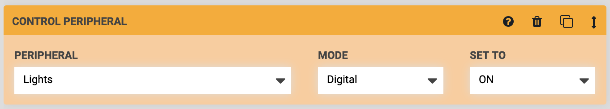

## Advanced options
In the **sequence editor options menu** ( icon next to the copy sequence button), there is an option to **SHOW PINS**. Enabling this setting will show additional options in the **PERIPHERAL** dropdown for all of the Arduino's raw **pins**. If you have hooked up custom peripherals to any of the Digital Out or Analog Out pins on your electronics board, this is one way you can control them from a sequence like any other peripheral.



# Read sensor
The Read Sensor command instructs FarmBot to read the value of a **sensor**. For example, you would use this command to measure the soil moisture content with the soil moisture sensor. To use this command, first select a sensor from the **SENSOR** dropdown. Options include:

  * All of the sensors you have defined in the [sensors widget on the controls page](../controls/sensors.md)
  * All of the peripherals you have defined in the [peripherals widget on the controls page](../controls/peripherals.md)

Next, select the **MODE** which you would like to read the sensor with. You can choose either `Digital` or `Analog`. Use digital for a `0` (LOW) or `1` (HIGH) response, and analog for a reading between `0` and `1023` for 0-5V. For additional information and examples, see our document on [reading pins](../../FarmBot-Software/how-do-i/measure-soil-moisture.md).

Last, optionally provide a **DATA LABEL** to allow your recorded sensor reading to be more searchable at a later date.

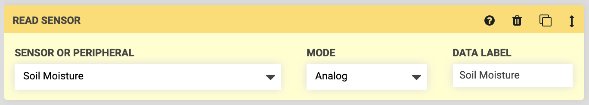

## Advanced options
In the **sequence editor options menu** ( icon next to the copy sequence button), there is an option to **SHOW PINS**. Enabling this setting will show additional options in the **SENSOR OR PERIPHERAL** dropdown for all of the Arduino's raw **pins**. If you have hooked up custom sensors to any of the Digital In or Analog In pins on your electronics board, this is one way you can read them from a sequence like any other sensor.



# Wait
The Wait command causes a delay before executing the next step in the sequence. This could be used to hold the solenoid valve open for FarmBot to water a plant for `2000` milliseconds (2 seconds), for example.

The maximum time allowed is 3 minutes (`180,000` milliseconds). If you need to have FarmBot wait for longer, use multiple steps.

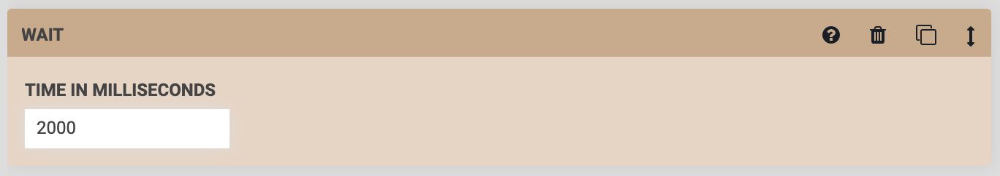

# Send message
The Send Message command instructs FarmBot to send a message. This is useful for error and success notifications and debugging. To use this command, simply type in the **MESSAGE** you would like FarmBot to send, choose a **TYPE**, and select the channels you would like the message to be sent to.

`{{ x }}` can be used as a text variable for FarmBot's current x-axis position (`y` and `z` can also be used). `{{ pin13 }}` can be used to write the current value of pin 13 (pins 0 through 69 can also be used).

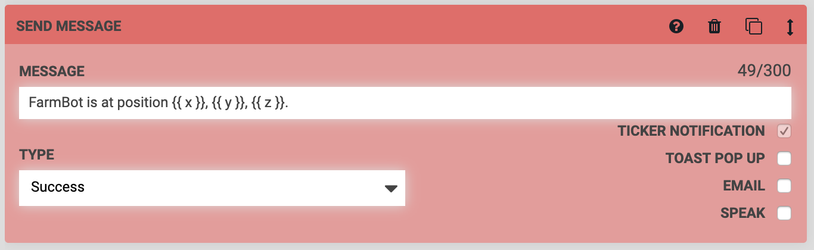

# Find home
The Find Home command instructs FarmBot to perform a homing operation to set zero for one axis or all three axes. If you choose to **FIND ALL**, FarmBot will find home for each axis one at a time in the order: z-axis, y-axis, x-axis. Note that you must have [stall detection](../../Device/arduino-firmware/stall-detection.md) or [endstops](../../Device/arduino-firmware/endstops.md) enabled along each axis you wish to find home for.

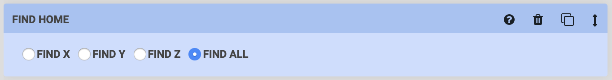

# Set zero
The Set Zero command instructs FarmBot to set the current location along an axis to `0`, also known as the `Home` position for that axis. If you choose to **ZERO ALL**, FarmBot will set all axes to zero.

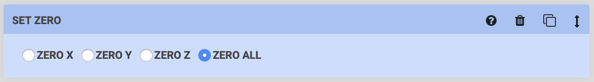

# Calibrate
The Calibrate command instructs FarmBot to perform a calibration of the chosen axis. If you choose to **CALIBRATE ALL**, FarmBot will calibrate each axis one at a time in the order: z-axis, y-axis, x-axis. Note that you must have [stall detection](../../Device/arduino-firmware/stall-detection.md) or [endstops](../../Device/arduino-firmware/endstops.md) enabled along each axis you wish to calibrate.

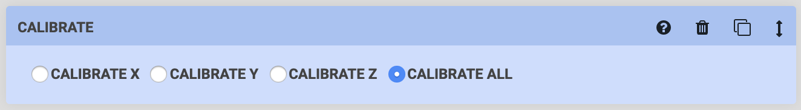

# If statement
The If Statement command allows FarmBot to check if a condition is true or false and take an action based on the results. This allows for smarter, condition based farming, and for gracefully handling errors and failures.

If the condition that FarmBot checks is true, you can instruct FarmBot to execute another sequence or do nothing, in which case FarmBot will continue to the next step in the current sequence. If the condition that FarmBot checks is false, you can also instruct FarmBot to execute another sequence or do nothing.

In the example below, FarmBot will check **_IF..._** the **VARIABLE** (`Soil moisture`) `is less than` the **VALUE** (`500`). If that condition is true, **_THEN..._** FarmBot will execute a sequence to `Water the plant`. **_ELSE..._** (if the condition is not true), FarmBot will do nothing (ie: continue to the next step in the current sequence).

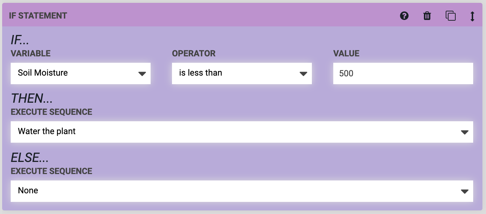

# Execute sequence
The Execute Sequence command uses *existing sequences* as *steps* in a *new, larger sequence*. This allows you to re-use smaller, simpler sequences in different combinations to create far more complex sequences that are easier to modify, manage, and mashup later because of their modularity.

For example, you could make a sequence to `Mount the watering nozzle`, another sequence to `Water the plant`, and a third sequence to `Unmount the watering nozzle`. Then, in a new sequence, you could use three Execute Sequence commands (one for each of the smaller sequences) to execute all the steps needed to water the plant.

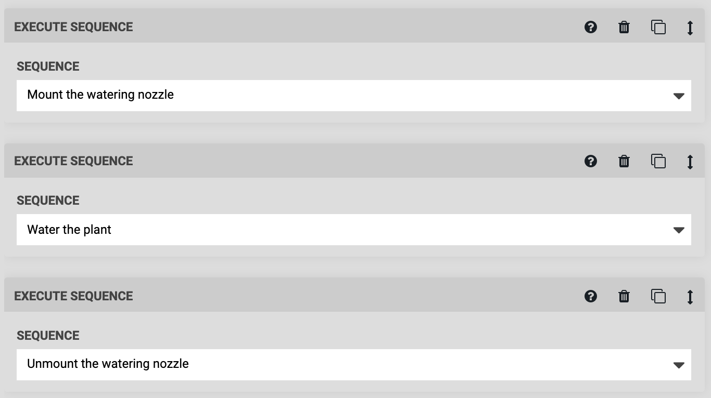



# Run farmware
The Run Farmware command instructs FarmBot to run a [farmware](../farmware.md). To use the command, select which farmware you would like to run from the **PACKAGE NAME** dropdown. Or, select `Manual Input` and type in the name of the package, for example, `plant-detection`.

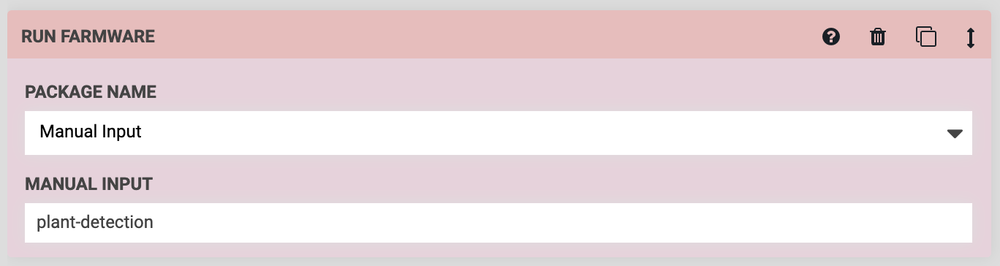

# Take photo
The Take Photo command instructs FarmBot to take a photo with the USB camera or the Raspberry Pi camera (whichever is selected in [device settings](../device/device-settings.md)). After taking the photo, FarmBot will upload it to the web app, along with the coordinates from where the photo was taken, and the date and time.

You can view the photos taken on the farmware page and in the farm designer.

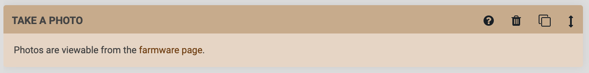

# Mark as
The Mark as command instructs FarmBot to **MARK** an object (such as a plant) **AS** having some property (for example, being `Planted`). Using this command allows FarmBot to systematically update resources as it works with them.

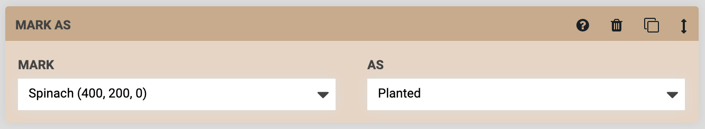

# Assertion



The Assertion command allows FarmBot to test if a condition is true or false for automated testing purposes. For example, you could set up a FarmBot to move back and forth repeatedly along an axis, and check the position after each movement. This type of test is useful for high-cycle hardware testing, and for continuous integration testing of software changes.

Assertions must be written in **Lua**, and will be evaluated against a Lua 5.2 interpreter. In the event that a **TEST FAILS**, FarmBot can either `Continue` execution, `Recover and continue`, `Abort and recover`, or just `Abort` execution altogether. The **RECOVERY SEQUENCE** allows you to reset FarmBot to a known state after a failure, send a message, or perform any other desired operations.

# What's next?

 * [Building a Sequence](building-a-sequence.md)
