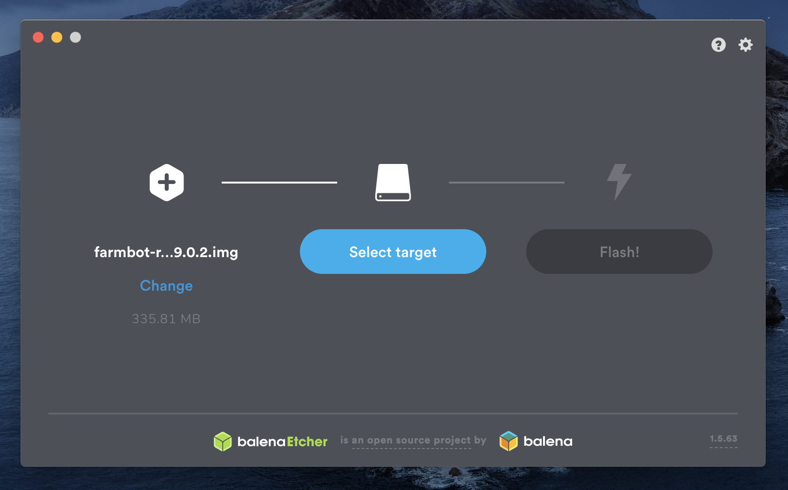

* toc
{:toc}

The Raspberry Pi runs a custom operating system named **FarmBot OS**, allowing FarmBot to:

  * Communicate with the web application over WiFi or ethernet so that it can synchronize (download) sequences, regimens, farm designs, events, and more; upload logs and sensor data; and accept real-time commands.
  * Communicate with the Farmduino to send G and F commands and receive sensor and encoder data.
  * Take photos with a USB or Raspberry Pi camera, and upload the photos to the web application.
  * Get configured over WiFi, mitigating the need to plug in a mouse, keyboard, or screen.

# Installation



## Step 1: Download FarmBot OS
Download the latest FarmBot OS `.img` file with the **DOWNLOAD** buttons below or at [os.farm.bot](http://os.farm.bot).

<iframe src="https://my.farm.bot/os" width="100%" height="500px" style="border: none; border-radius: 3px;"></iframe>

## Step 2. Write FarmBot OS onto the microSD card
You must use a **`.img` writing tool** to write **FarmBot OS** onto the **microSD card**. We recommend downloading and installing **[Etcher](https://etcher.io/)** for this purpose.

Once you have Etcher installed, connect the microSD card to your computer using a **card reader**. You may need to use the **microSD card to SD card adapter** included with your kit. Select the FarmBot OS `.img` file you downloaded in Step 1, the microSD card drive as the **target** (it should show up as a `7.9 GB partition`) and then press **Flash!**  to write the file to the card.



## Step 3. Insert the microSD card into the Raspberry Pi
Insert the **microSD card** into the **Raspberry Pi**. The card slot location will differ depending on the FarmBot kit you have.

Genesis kits

For Genesis kits, the card slot is located on the back side of the Pi 3, on the right-hand edge. You do not need to remove the Raspberry Pi from the electronics box to insert the card; we have left enough access room.

</img>

Express kits

For Express kits, the card slot is located on the front side of the Pi Zero, on the left-hand edge.

</img>

## Step 4. Plug in the power source
Plug your FarmBot's power supply into a wall outlet. You should now see a solid red  LED and a steadily flashing green  LED on the Raspberry Pi, indicating that the Pi has adequate power and is busy booting up. Refer to the [status LEDs](../FarmBot-OS/farmbot-os/status-leds.md) page for more information, especially if your LEDs are not lit up as described above.

# What's next?

 * [Configurator](../FarmBot-OS/farmbot-os/configurator.md)
 * [Status LEDs](../FarmBot-OS/farmbot-os/status-leds.md)
 * [Data Usage](../FarmBot-OS/farmbot-os/data-usage.md)
 * [OTA Updates](../FarmBot-OS/farmbot-os/ota-updates.md)
