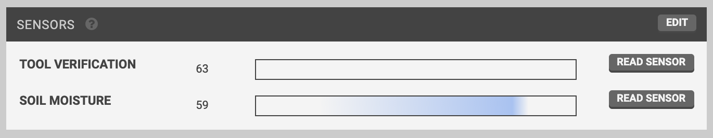
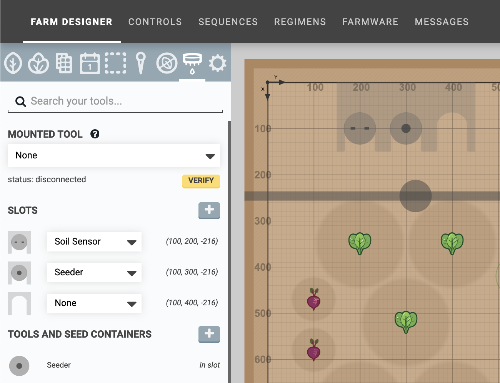
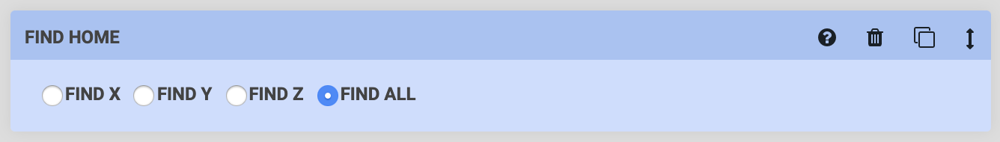
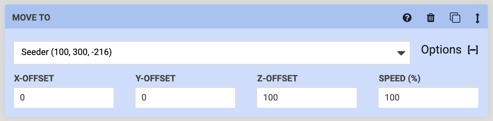
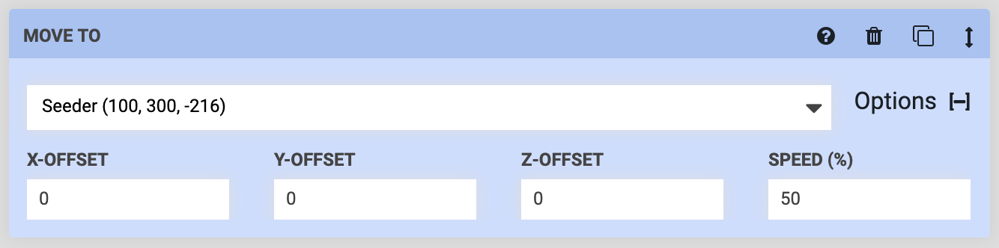
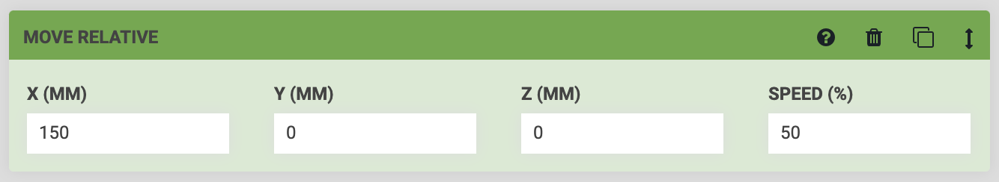
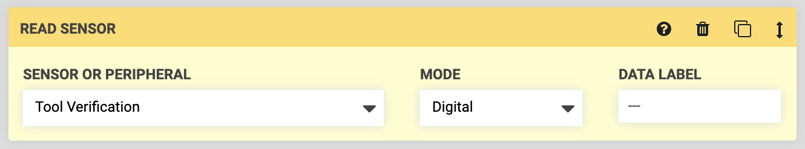
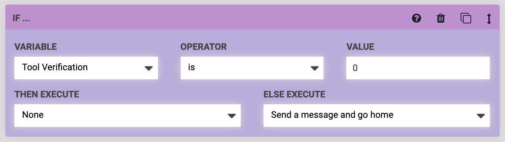
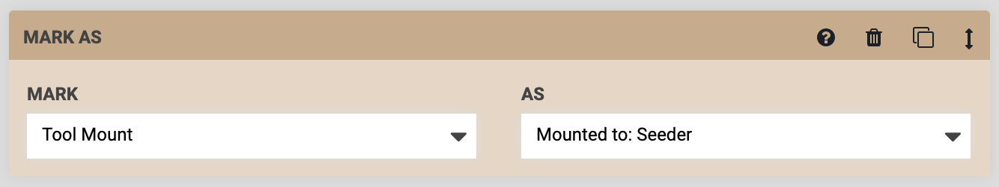

* toc
{:toc}

Before we get started, make sure you and your FarmBot meet the following prerequisites:

* Your FarmBot has a **UTM** and **interchangeable tooling**. This is included with all FarmBot Genesis kits, but not with FarmBot Express kits.
* Your FarmBot is fully assembled. The UTM must be wired up according to the [pin mapping table](https://genesis.farm.bot/FarmBot-Genesis-V1-5/tools/utm#pin-mapping) and your tools according to their wiring instructions.
* Your FarmBot is powered up, connected to the web app, and can move along each axis without error.
* You are familiar with [building sequences](../../The-FarmBot-Web-App/sequences.md) with [sensors](../../The-FarmBot-Web-App/controls/sensors.md) and [tools](../../The-FarmBot-Web-App/farm-designer/tools.md).

# Step 1: Add the tool verification sensor

Ensure you have added the **TOOL VERIFICATION** sensor by checking the SENSORS widget on the Controls page. If you do not see the sensor, add it using [these instructions](../../The-FarmBot-Web-App/controls/sensors.md#creating-sensors).

# Step 2: Load tools into slots

Ensure you have loaded your **tools** into **slots** by checking the **tools panel** on the Farm Designer page. If you do not see any tools in slots, add them using [these instructions](../../The-FarmBot-Web-App/farm-designer/tools.md). Then check to make sure your **real-life** configuration matches your **virtual** configuration.

# Step 3: Build a tool mounting sequence

Our tool mounting sequence will not only instruct FarmBot to mount a tool and pull it out of the slot, it will also use the tool verification sensor to verify that the tool has been correctly mounted. The sequence should have the following steps:

**Step 1:** Start the sequence off with a FIND HOME command. This will ensure your FarmBot mounts the tool with the greatest level of precision.

**Step 2:** MOVE TO above the location of the tool you wish to mount by selecting the tool in the dropdown and using a positive **Z-OFFSET**.

**Step 3:** MOVE TO the exact tool location to mount it. We recommend slowing down the **SPEED** of this movement to about 50%.

**Step 4:** MOVE RELATIVE 150mm in the **DIRECTION** of the slot's opening to pull the tool out of the slot. This will likely be in the `Positive X` or `Negative X` direction. As with the previous movement, we recommend setting the **SPEED** of this command to 50%.

**Step 5:** Use a READ SENSOR command to read the Tool Verification sensor using the Digital **MODE**. This will allow FarmBot to check if the tool has been successfully mounted.

{%
include callout.html
type="info"
title="What happens behind-the-scenes"
content="When this command is executed, FarmBot will send a log message with the sensor value, `Tool Verification is 0` or `Tool Verification is 1`. The FarmBot firmware uses pull-up resistors for all input pins, so a value of `0` means that a tool is connected (pin D63 / UTM pin **C** is connected through the tool pin jumper to UTM pin **B** / ground) and a value of `1` means no tool is connected (pin D63 not connected to ground--UTM pins **B** and **C** are not connected together)."
%}

**Step 6:** Use an If Statement command to determine what to do next. In this example, if the tool verification is `0` (the tool is connected), then FarmBot will simply continue onto the next steps in the sequence.

If the tool verification is `1` (the tool is not connected) then FarmBot will execute a sequence to send a message that it failed to pick up the tool, and then it will go home. What you instruct FarmBot to do in both scenarios is up to you!

**Step 7:** Now that the tool has been successfully mounted to the UTM, use a MARK AS command to **MARK** the `Tool Mount` **AS** `Mounted to: the tool`. This will make FarmBot understand what the previous steps in the sequence accomplished, and allow the user interface in the web app to show the correct tool mounted to the UTM as it moves throughout the map.

# Step 4: Build a tool dismounting sequence

Now that you've built a tool mounting sequence, you can probably guess that a tool _dismounting_ sequence will be very similar, but mostly reversed:

**Step 1:** Start the sequence off with a FIND HOME command. This will ensure your FarmBot dismounts the tool with the greatest level of precision.

**Step 2:** MOVE TO in front of the slot you wish to return the tool to by using an **X-OFFSET**.

**Step 3:** MOVE TO the tool's location (without offsets) with a **SPEED** of 50% to put the tool back in the slot.

**Step 4:** MOVE RELATIVE in the positive **Z** direction to fully dismount the tool.

**Step 5:** Use MARK AS to let FarmBot know the `Tool Mount` is `Not Mounted` to anything.

**Step 6:** MOVE TO the home position (0, 0, 0) to prepare FarmBot for the next task.

# Troubleshooting

Below are likely ways these sequences can fail, and suggested solutions:

* If FarmBot is having trouble precisely and smoothly mounting or dismounting the tool, adjust the **slot coordinates** until FarmBot moves to the exact locations required. Also ensure that your toolbays are aligned with the FarmBot axes.
* If the tool is mounted but the tool verification check is failing, you likely have an electrical connection issue. Check the UTM cable's connections at the UTM and the electronics box, as well as the wiring of the tool. Check to make sure the UTM's electrical contacts are able to touch the electrical contacts of the tool, and there is no "stickiness" in the spring mechanism. Ensure there is no debris, and gently clean everything if there is.
