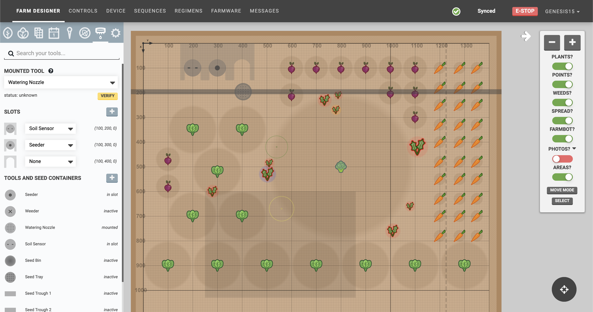
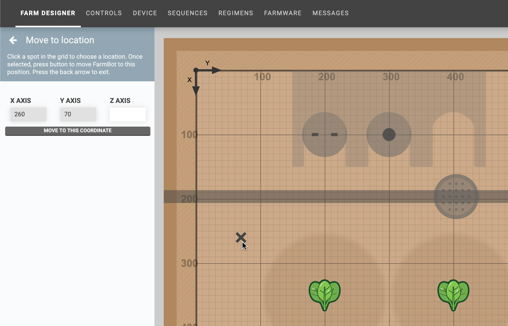

The **farm designer** allows you to graphically design the layout of your garden, monitor your FarmBot's position, and visualize data such as photos, plant spread, and points.

<iframe class="embedly-embed" src="//cdn.embedly.com/widgets/media.html?src=https%3A%2F%2Fwww.youtube.com%2Fembed%2Fvideoseries%3Flist%3DPLMhsMRlKjcNIYlDKDdKvPQuHqBjjS1ZGc&url=http%3A%2F%2Fwww.youtube.com%2Fwatch%3Fv%3DGVb4fYaqy2M&image=https%3A%2F%2Fi.ytimg.com%2Fvi%2FGVb4fYaqy2M%2Fhqdefault.jpg&key=f2aa6fc3595946d0afc3d76cbbd25dc3&type=text%2Fhtml&schema=youtube" width="854" height="480" scrolling="no" frameborder="0" allowfullscreen></iframe>

# Map menu
Click the white <i class='fa fa-arrow-left'></i> button in the top right of the map to open up the **map menu**. Here you will find <i class='fa fa-minus'></i> and <i class='fa fa-plus'></i> buttons to zoom in and out of the map, as well as a toggles to turn on and off map layers:

|Layer                         |Description                   |
|------------------------------|------------------------------|
|**PLANTS**                    |The plant icons (not including weeds or spread)
|**POINTS**                    |Points created in the [points panel](farm-designer/points.md)
|**WEEDS**                     |Weed icons and their spread
|**SPREAD**                    |The spread of plants and weeds
|**FARMBOT**                   |The FarmBot gantry, UTM or tool head, slots, tools, seed containers, peripheral state visualizations, and axis limit lines
|**PHOTOS**                    |Photos taken by FarmBot's onboard camera. See [camera calibration](farmware/camera-calibration.md) if photos are not positioned, scaled, or rotated correctly.
|**AREAS**                     |Areas defined by [group filters](farm-designer/groups.md#filtering-by-location).

# Move mode
Pressing the MOVE MODE button in the map menu will open the **move to location** panel. Click any spot within the map grid to mark it with an <i class='fa fa-times'></i>. Then press MOVE TO THIS COORDINATE to send FarmBot to the selected position. You can optionally enter a new coordinate for the **Z-AXIS**.

# Select mode
To select multiple plants, click anywhere in the map and drag the mouse cursor to create a **box selection**. All plants located within the box will be displayed in the **select** panel. Alternatively, you may press the SELECT button located in the map menu, and then use the box-selection technique.

Once the select panel is open, you can click-to-add additional plants to the selection, or click an already selected plant to remove it from the selection. Once you are satisfied with your selection, use one of the **SELECTION ACTIONS**.

You may also change the **SELECTION TYPE** to allow for selecting other objects in the map, such as weeds or points.

# What's next?

 * [Plants](farm-designer/plants.md)
 * [Groups](farm-designer/groups.md)
 * [Gardens](farm-designer/gardens.md)
 * [Events](farm-designer/events.md)
 * [Points](farm-designer/points.md)
 * [Weeds](farm-designer/weeds.md)
 * [Tools](farm-designer/tools.md)
