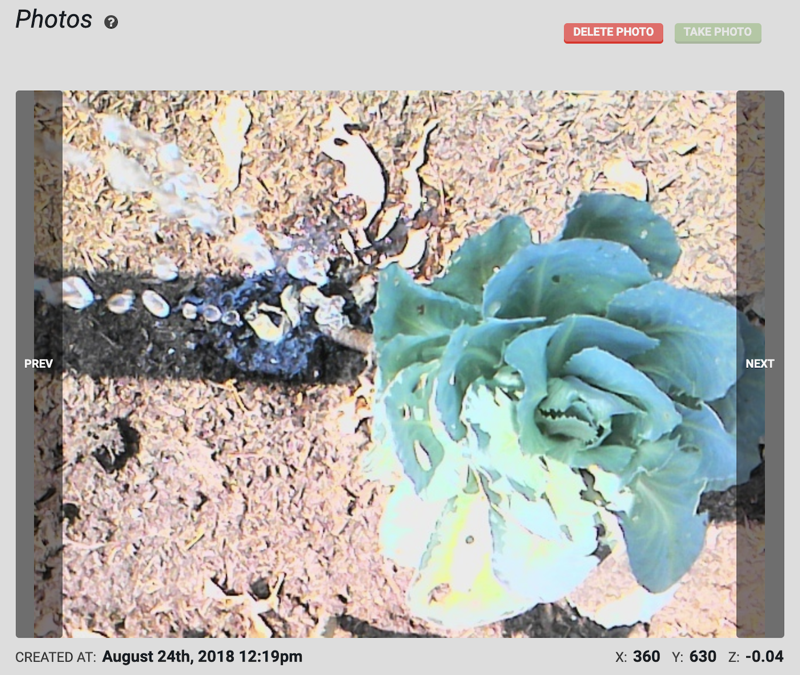

* toc
{:toc}



<iframe class="embedly-embed" src="//cdn.embedly.com/widgets/media.html?url=http%3A%2F%2Fwww.youtube.com%2Fwatch%3Fv%3DRYQyYA4ZwF8&src=http%3A%2F%2Fwww.youtube.com%2Fembed%2FRYQyYA4ZwF8&type=text%2Fhtml&key=f2aa6fc3595946d0afc3d76cbbd25dc3&schema=youtube" width="854" height="480" scrolling="no" frameborder="0" allow="autoplay; fullscreen" allowfullscreen="true"></iframe>

To take a photo, press the take photo button. Once FarmBot takes the photo, it will upload it to the web app along with the coordinates of where the photo was taken, as well as the date and time.

Once you have taken multiple photos, use the `PREV` and `NEXT` buttons to navigate through your images. To delete a photo, press the delete photo button.

> 📘
>
> The default camera is a USB camera. If you would like to use a Raspberry Pi camera, use the camera selection dropdown menu in the **Device** widget on the [Device](../../The-FarmBot-Web-App/settings/farmbot-settings.md#device) page.

# What's next?

 * [Camera Calibration](camera-calibration.md)
