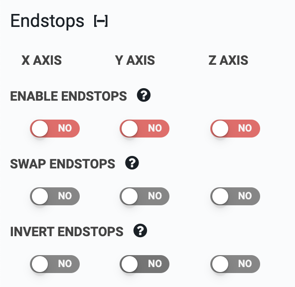

* toc
{:toc}

**Endstops**, sometimes called **limit switches**, are small switches or sensors that are used to tell a machine if it has reached an end position (home or an axis maximum).

Because both rotary encoders and back-current sensing stepper drivers can [detect the home position and axis maximums](../../FarmBot OS/arduino-firmware/stall-detection.md) as well, they make the use of endstops **largely unnecessary**. That's why endstops are not included with our kits.

Nonetheless, our firmware and electronics boards do support the use of endstops for the DIY builders who need to be able to home their devices but do not want to pay for rotary encoders and the full stall detection and position tracking capabilities that they provide.

# Enable endstops
If using endstops instead of rotary encoders, enable them here. If you do not have endstops hooked up, do not enable this setting.

# Swap endstops
This switches the zero end of an axis to the other end of the axis. This allows you to set your home (0, 0, 0) position to any of the eight corners of FarmBot's working volume. You might need to use this setting in combination with **INVERT MOTORS**, **INVERT ENCODERS**, and **NEGATIVE COORDINATES ONLY** to set your FarmBot coordinate system exactly how you want it.

# Invert endstops
This switches endstop operation from normally open (NC) to normally closed (NC).
