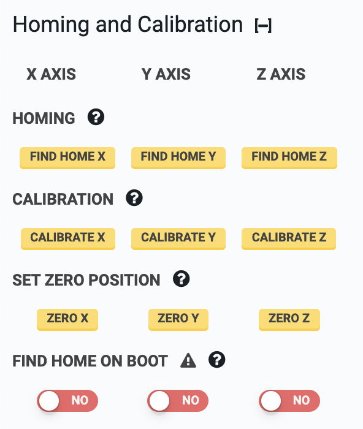

* toc
{:toc}

# Homing
Homing an axis instructs FarmBot to find the home (minimum) position by moving towards home until an endstop, rotary encoder, or stepper driver signals that the end of the axis has been reached. Homing can only be performed if endstops or encoders are enabled. See [Calibration and Homing](../../FarmBot Software/how-to-guides/calibrate-and-home-farmbot.md) for further details.

To home an axis, click the HOME X, HOME Y, or HOME Z buttons. To home all three axes, you can use the :fa-home: button in the controls widget (assuming that that button is set to its default behavior).



# Calibration
Calibrating an axis instructs FarmBot to find the maximum position and then find the minimum (home) position while measuring the distance between the two positions, which is the length of the axis. Calibration can only be performed if either endstops, encoders, or stall detection are enabled.



# Set zero position
Pressing the Zero X, Zero Y, and Zero Z buttons allows you to *manually* set FarmBot's current location as zero for that axis. This is used for *manually* setting the Home position (0, 0, 0) when you do not have endstops or encoders enabled.

However, because stock FarmBots have encoders, it is recommended to instead use the [Homing](#section-homing) function for *automatically* finding the Home position of each axis and setting that position to zero.

So in general, the Set Zero buttons should not be regularly used because it does not make sense to change your zero position once you have your garden growing, and because all FarmBots should have either encoders or endstops enabled which allows for automatically finding and setting the Home position.

These buttons may come in handy though when playing around with experimental sequences or exploring alternate coordinate system configurations for your FarmBot.

# Find home on boot
Enabling this setting will run a homing command for each axis upon boot. This is most useful for allowing FarmBot to recover and resume operations after a power outage. Note that this requires encoders or endstops to be enabled.

# Stop at home
Enabling software limits for an axis will prevent FarmBot from moving through zero. For example, if an axis is normally moving in positive coordinates, then the software limit will prevent it from moving through zero into negative coordinates. If an axis has **NEGATIVE COORDINATES ONLY** enabled, then it normally moves in negative coordinates and the software limit will prevent it from moving through zero into positive coordinates.



# Stop at max
If values are inputted using the **AXIS LENGTH** setting, FarmBot will stop at the axis maximum.

# Negative coordinates only
This setting will allow movements to only occur in negative coordinates for the chosen axis. This is most useful for the z-axis if you want your home position to be at the highest point and for FarmBot to move down into negative coordinates.

# Axis length
With these inputs you can manually specify the length in mm of each axis. This is useful if you want to limit your FarmBot's movements along an axis with software rather than a physical hardware stop such as a belt clip or an endstop. For example: you may occasionally want to prevent movements at the far end of your garden because you put a seasonal garden gnome there, but you don't want to adjust the belts and belt clips. You must enable **STOP AT MAX** for FarmBot to stop at the values inputted.



