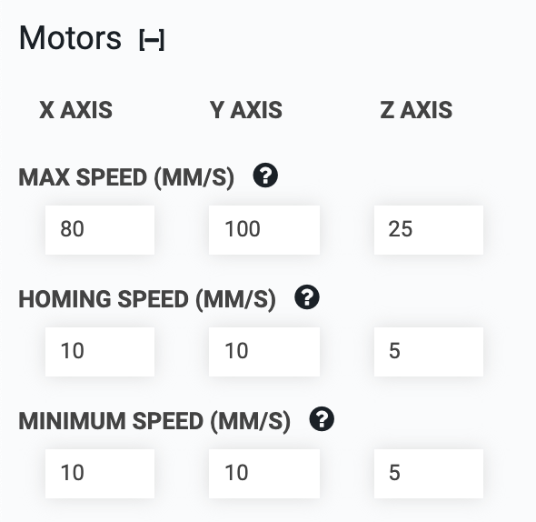

* toc
{:toc}




# Max speed
This setting controls the maximum speed in motor steps per second that FarmBot will reach after accelerating.

We recommend using a value between 200 and 1,000 steps/s for each axis. Start with a slower speed and work your way up as you become more comfortable operating your FarmBot. If your FarmBot begins to stutter or stall at higher speeds, reduce the max speed. To achieve higher speeds you may need to adjust some of your hardware, tune your stepper drivers, and/or adjust some additional software parameters such as **ACCELERATE FOR**. Remember though that FarmBot has 24 hours in the day to complete its tasks, so moving rapidly is not necessary.

<details><summary>Convert Motor Speed into Linear Speed with these equations</summary>

### For belt-driven axes (X and Y)
```
Linear Speed = Motor Speed / Motor Resolution x Microstepping x Pulley Size x Belt Pitch
```

### For leadscrew-driven axes (Z)
```
Linear Speed = Motor Speed / Motor Resolution x Microstepping x Leadscrew Lead
```

### For stock FarmBot kits
  * **Motor Resolution** = 200 steps/revolution
  * **Microstepping** = 1 (full steps)
  * **Pulley Size** = 20 teeth/revolution
  * **Belt Pitch** = 2mm/tooth
  * **Leadscrew Lead** = 8mm/revolution

### Examples

For a Motor Speed of 500 steps/second on the stock belt-driven (X and Y) axes, the equation works out to:
```
Linear Speed (mm/second) = 500 / 200 x 1 x 20 x 2 = 100 mm/s
```

For a Motor Speed of 500 steps/second on the stock leadscrew-driven (Z) axis:
```
Linear Speed (mm/second) = 500 / 200 x 1 x 8 = 20 mm/s
```


</details>

# Homing speed
This setting controls the speed in steps per second at which FarmBot will move for coordinates past home during homing and calibration. The recommended default value for each axis is 50 steps/s.

# Minimum speed
This setting controls the minimum speed in steps per second that FarmBot will move. The recommended default value for each axis is 50 steps/s.

# Accelerate for
This setting controls the number of steps used for the acceleration and deceleration periods of each movement. The recommended default value for each axis is 500 steps. If your FarmBot stutters or stalls during acceleration, you should increase the value of **ACCELERATE FOR** so that FarmBot uses more steps to accelerate and decelerate.

# Steps per mm
This setting tells FarmBot how many motor steps it takes to move 1mm along an axis. The default value is 5 steps/mm for the belt-driven (X and Y) axes, and 25 steps/mm for the leadscrew-driven (Z) axis.

<details><summary>Steps per mm is calculated with these equations</summary>

### For belt-driven axes (X and Y)
```
Steps per mm = Motor Resolution x Microstepping / Pulley Size / Belt Pitch
```

### For leadscrew-driven axes (Z)
```
Linear Distance = Motor Resolution x Microstepping / Leadscrew Lead
```

### For stock FarmBot kits
  * **Motor Resolution** = 200 steps/revolution
  * **Microstepping** = 1 (full steps)
  * **Pulley Size** = 20 teeth/revolution
  * **Belt Pitch** = 2mm/tooth
  * **Leadscrew Lead** = 8mm/revolution

For the stock belt-driven (X and Y) axes, the equation works out to:
```
Steps per mm = 200 x 1 / 20 / 2 = 5 steps/mm
```

For the stock leadscrew-driven (Z) axis:
```
Steps per mm = 200 x 1 / 8 = 25 steps/mm
```


</details>

# Always power motors
Enabling this setting will keep power applied to the motors at all times. This is most useful to prevent the z-axis from slipping down due to the force of gravity when FarmBot is idle. It can also be used to help prevent animals or children from moving one of FarmBot's axes when it is idle.

# Invert motors
This inverts the direction that the motors move for the chosen axis. Changing this setting will usually require you to change the setting of **INVERT ENCODERS** as well. You also might need to use this setting in combination with **INVERT ENDPOINTS** and **NEGATIVE COORDINATES ONLY** to set your FarmBot coordinate system exactly how you want it.

# Enable second x-axis motor
This should be enabled for standard FarmBots that use two motors to drive the x-axis (gantry).

# Invert the second x-axis motor
This setting changes the direction of the second x-axis motor in case it is wired backwards.
