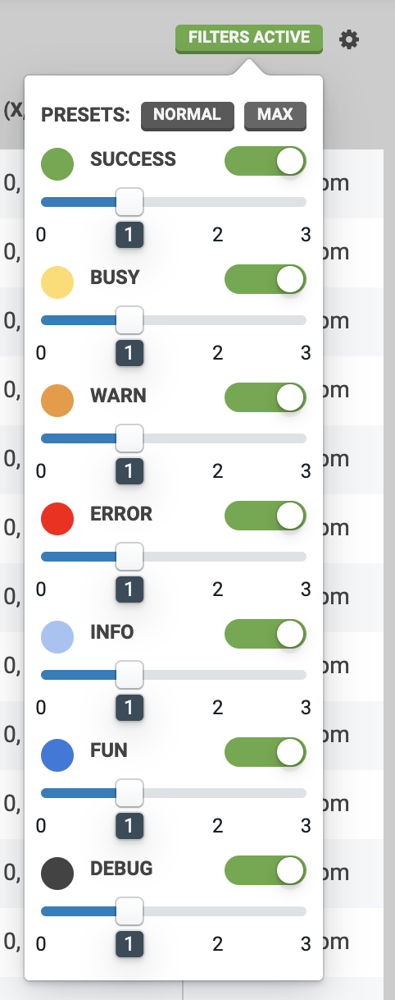
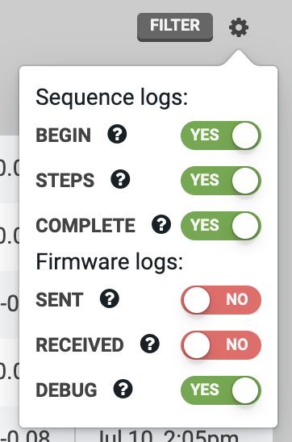

* toc
{:toc}

During operation, FarmBot will generate **logs**. Logs are short messages that FarmBot will send to the web app server and your web browser so you can monitor operation and investigate when things have gone wrong.

<iframe class="embedly-embed" src="//cdn.embedly.com/widgets/media.html?url=http%3A%2F%2Fwww.youtube.com%2Fwatch%3Fv%3D46VgOoTvx4o&src=http%3A%2F%2Fwww.youtube.com%2Fembed%2F46VgOoTvx4o&type=text%2Fhtml&key=f2aa6fc3595946d0afc3d76cbbd25dc3&schema=youtube" width="854" height="480" scrolling="no" frameborder="0" allow="autoplay; fullscreen" allowfullscreen="true"></iframe>

# Log types
There are several **log types**, each with their own color, that indicate the type of message being sent.

|Log Type                      |Meaning                       |
|------------------------------|------------------------------|
|<i class="fa fa-circle"></i> **SUCCESS**|FarmBot has successfully completed a task. **Example:** *Synced*
|<i class="fa fa-circle"></i> **BUSY**|FarmBot is busy working on a task. **Example:** *Syncing*
|<i class="fa fa-circle"></i> **WARN**|A situation may require your attention or make FarmBot unresponsive. **Example:** *Emergency locking and powering down*
|<i class="fa fa-circle"></i> **ERROR**|An error or emergency stop has occurred. **Example:** *Movement failed*
|<i class="fa fa-circle"></i> **INFO**|General information about what FarmBot is doing. **Example:** *Starting Water All Plants Sequence*
|<i class="fa fa-circle"></i> **FUN**|Logs that are just for fun :rabbit:
|<i class="fa fa-circle"></i> **DEBUG**|Verbose information relevant to software development and troubleshooting. **Example:** *Network interface needs configuration: wlan0*
|<i class="fa fa-circle"></i> **ASSERTION**|Results of ASSERTION commands. (advanced)

# Verbosity and filtering
FarmBot sends logs for nearly every action it takes. Sometimes seeing all of the logs can be helpful, for example when trying out new features or when debugging your system. Other times seeing only the most important "high level" logs is desirable, such as when you leave your FarmBot to work for a few weeks and you just periodically check in.

Every log that FarmBot sends has a **verbosity** of `1`, `2`, or `3`, which can be loosely associated with how important the log is and the level of detail that it reveals about how your FarmBot is operating. A more verbose log (verbosity `3`) is usually "lower level" and less important. A less verbose log (verbosity `1`) is usually "higher level" and more important.

You can filter logs by clicking FILTER (or, when log filters are currently active, FILTERS ACTIVE). The verbosity sliders allow you to choose to see more verbose or less verbose logs.

Setting a verbosity slider to `0` means you will not see any logs of that type in the logs table or in the status ticker. Setting a slider to `1` means you will see only the most important "high level" logs of that type. `2` means you will see most logs of that type including the most important "high level" logs as well as semi-important "medium level" logs. A setting of `3` means you will see every log of that type, many of which may be unimportant during normal operation.

The **PRESETS** for NORMAL and MAX set all log types to verbosity level `1` and `3` respectively.

# Logs settings menu
You can customize whether or not FarmBot sends some types of logs or not by using the options in the <i class="fa fa-cog"></i> menu. Each option is described in the tooltip shown when the <i class="fa fa-question"></i> icon is clicked.



# Log limits
In order to provide the best possible web application experience to all users, we have implemented the following limitations to the number of logs a FarmBot can store to the web app within a given time period.

Time Period | Max Number of Logs
--- | ---
1 minute | 250
1 hour | 5,000
1 day | 25,000

If a log limit is reached, a **cooldown period** will begin where log storage and display is suspended until the next time period. For example, if the 1 minute limit is reached, logs will be suspended until the next minute. A warning log and toast notification will be displayed, indicating the suspension:



Once the cooldown period has ended, logs will resume being stored and displayed in the web application. An informational log and toast notification will indicate this:



